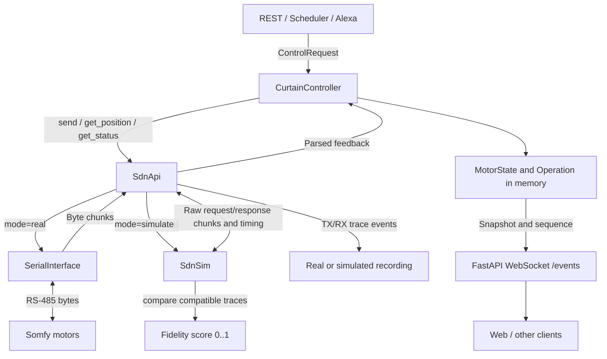
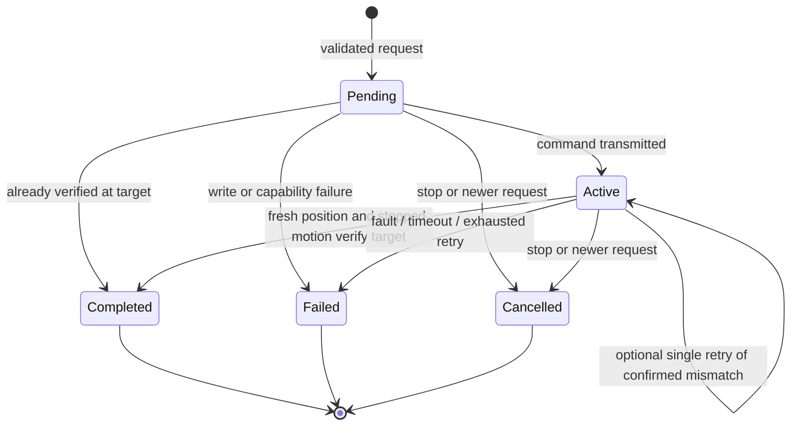
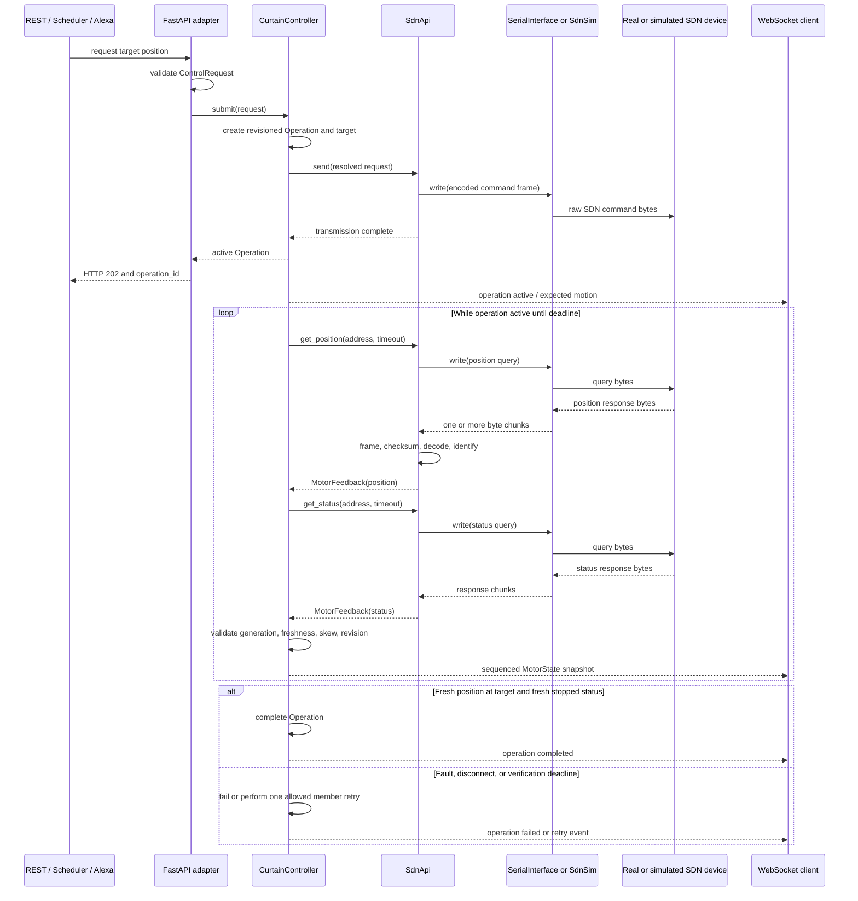
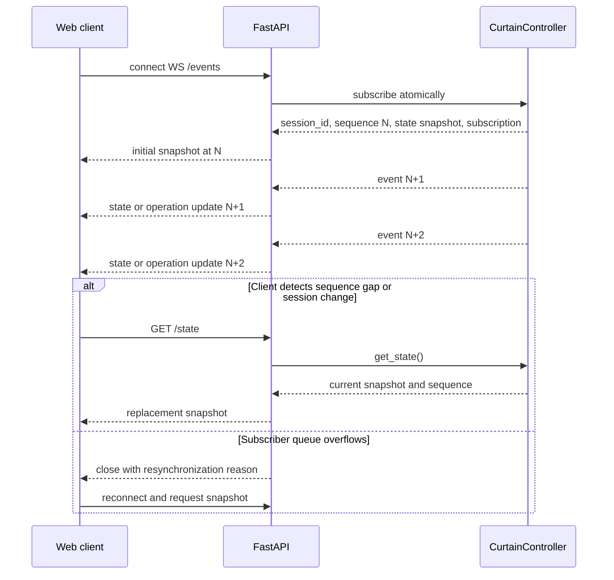
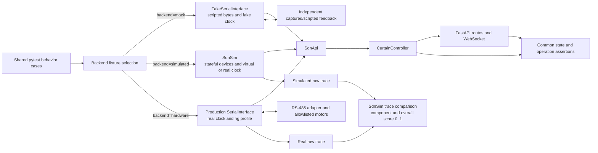
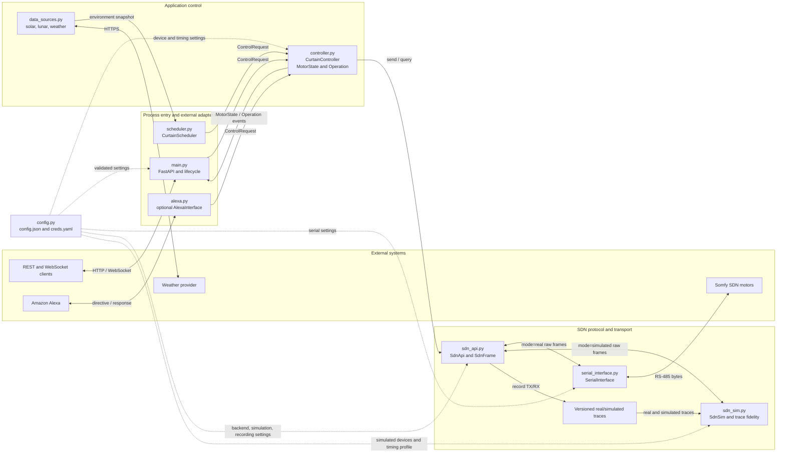
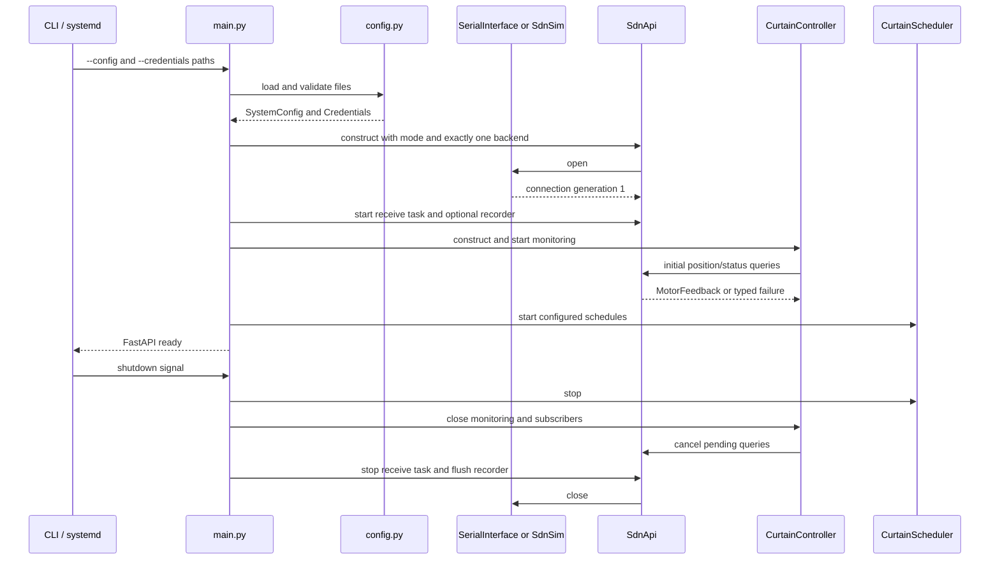

# main.py Curtain Control Program Specification
### Brad Larson
### 2026-10-02

## Table of Contents

- [Introduction](#introduction)
- [Creator Interview](#creator-interview)
  - [Creator Interview Transcripts](#creator-interview-transcripts)
    - [Existing-program review and migration requirements](#existing-program-review-and-migration-requirements)
- [Specification Description](#specification-description)
- [Program Generation Process](#program-generation-process)
- [Program Generation Report](#program-generation-report)
  - [Initial specification creation](#initial-specification-creation)
  - [Structure simplification](#structure-simplification)
  - [State and Test Backend Review](#state-and-test-backend-review)
  - [Module Communication Visualizations](#module-communication-visualizations)
  - [SDN Protocol Definition](#sdn-protocol-definition)
  - [JavaScript-compatible SdnMsg](#javascript-compatible-sdnmsg)
  - [SDN Version Compatibility Matrix](#sdn-version-compatibility-matrix)
  - [SDN Compatibility Recommendations](#sdn-compatibility-recommendations)
  - [SDN Simulator and Fidelity Comparison](#sdn-simulator-and-fidelity-comparison)
- [Program](#program)
  - [Program Description](#program-description)
    - [SDN](#sdn)
      - [SDN protocol](#sdn-protocol)
        - [SDN document and JavaScript compatibility matrix](#sdn-document-and-javascript-compatibility-matrix)
      - [Structure Analysis and Simplification](#structure-analysis-and-simplification)
      - [Requirements and Current Assessment](#requirements-and-current-assessment)
      - [Pydantic Data Models](#pydantic-data-models)
      - [System State Review and Required Corrections](#system-state-review-and-required-corrections)
      - [SDN Interface and Protocol](#sdn-interface-and-protocol)
        - [SdnMsg requirements and dependencies](#sdnmsg-requirements-and-dependencies)
        - [SdnSim simulator, recording, and fidelity scoring](#sdnsim-simulator-recording-and-fidelity-scoring)
      - [Controller Monitoring and Verification](#controller-monitoring-and-verification)
      - [Command, Feedback, and Live-State Communication](#command-feedback-and-live-state-communication)
      - [REST and Live State](#rest-and-live-state)
      - [Testing and Code Generation](#testing-and-code-generation)
      - [Mocked, Simulated, and Real Communication Backends](#mocked-simulated-and-real-communication-backends)
  - [Use Cases](#use-cases)
  - [Program Structure](#program-structure)
    - [Module Architecture](#module-architecture)
    - [Inter-module Communication Contract](#inter-module-communication-contract)
    - [Startup and Shutdown Communication](#startup-and-shutdown-communication)
  - [API Contract](#api-contract)
  - [JSON Configuration](#json-configuration)
  - [SDN Protocol Compatibility](#sdn-protocol-compatibility)
  - [System-Control Data Sources](#system-control-data-sources)
  - [Scheduling](#scheduling)
  - [Alexa Control](#alexa-control)
  - [Program Environment](#program-environment)
- [Prompts](#prompts)
- [Functional Requirements](#functional-requirements)
- [Tests](#tests)
  - [Unit Tests](#unit-tests)
  - [Integration Tests](#integration-tests)
  - [End-to-End Tests](#end-to-end-tests)
- [General Program Structure](#general-program-structure)
  - [Dependency-injected application services](#dependency-injected-application-services)
  - [Local configuration boundary](#local-configuration-boundary)
- [Program Capabilities](#program-capabilities)
- [Issues](#issues)
  - [Open Issues](#open-issues)
  - [Resolved Issues](#resolved-issues)

## Introduction

`main.py` shall replace the existing Node.js CurtainControl server with a Python FastAPI service for operating Somfy SDN curtains through either a real RS-485 serial adapter or the required `SdnSim` backend. It preserves the existing device commands, SDN packet format, serial settings, and scheduled-operation capability. It deliberately excludes the existing static HTML, jQuery, and Socket.IO browser interface.

The service is started with the path to one JSON configuration file as a required command-line argument. That file is the sole persistent source of configuration; the program shall not require, connect to, or depend on an external SQL database. The FastAPI HTTP API is the programmatic control surface for automation clients and administration.

Inputs are command-line options, the JSON configuration document, HTTP API requests, time/celestial events, and raw bytes from the selected real or simulated SDN backend. Outputs are validated HTTP responses, SDN frames written to the selected backend, optional versioned traces/fidelity reports, structured logs, and scheduling activity.

## Creator Interview

### Creator Interview Transcripts

#### Existing-program review and migration requirements

**Date**: 2026-10-02  
**Creator**: Brad Larson  
**Interviewer**: Codex  

**Transcript**:

**Q:** What behavior does the existing program provide?  
**A:** It controls Somfy SDN curtains and groups over RS-485, presents web and Socket.IO controls, stores motors and groups in MySQL, and has scheduling support.

**Q:** What implementation change is required?  
**A:** Convert the Node server to a Python FastAPI server with similar functionality.

**Q:** What is the storage change?  
**A:** Remove the dependency on an external SQL database. System configuration is in a JSON file specified as a command-line parameter.

**Q:** Should the existing UI be retained?  
**A:** No interface is required. The new server is headless.

**Q:** How should the small Python project be organized?  
**A:** Use `main.py` and a small set of support classes for serial communication, SDN commands, system control, data sources, scheduling, and optional Alexa control.

**Q:** How should runtime dependencies and credentials be handled?  
**A:** Declare runtime packages in `requirements.txt`. Store secrets in a separate `creds.yaml` file with restricted read access on Raspberry Pi; do not put secrets in `config.json` or source control.

**AI text generation instructions expansion table:**

| Instruction topic | Evidence / answer | Resulting specification |
|---|---|---|
| Purpose, inputs, outputs, and processing | The existing server handles SDN commands, serial I/O, configuration, and scheduling. | Implement a headless FastAPI service using local JSON configuration and an RS-485 transport. |
| Storage | The creator requires a JSON file named at the command line and no external SQL database. | Load, validate, and atomically persist one local JSON configuration document; do not include a database driver. |
| User interface | The creator specified no interface. | Do not serve static files, browser pages, or Socket.IO. Expose documented HTTP APIs only. |

## Specification Description

This document directs implementation and verification of `main.py` and its support modules. It is the source of truth for the new Python service. The server provides REST control and a WebSocket state-event stream for external clients, including a future web interface. Serving the legacy browser UI or using Socket.IO is not required.

When a requirement conflicts with undocumented legacy behavior, this specification takes precedence. The existing JavaScript source is reference material for compatible SDN commands and data fields, not for carrying forward defects.

## Program Generation Process

For each implementation iteration, the generation agent shall:

1. Read this specification and inspect relevant existing implementation and tests.
2. Plan the smallest coherent change, mapping it to requirement IDs.
3. Implement typed Python code, documentation, and tests together.
4. Run formatting, linting if configured, and the applicable unit/integration tests.
5. Record the change, results, risks, and unresolved items in the Program Generation Report.
6. Do not add SQL, browser assets, Socket.IO, or undocumented hardware behavior without an explicit specification update.

The agent shall use dependency injection or a transport abstraction so protocol and API tests run without physical serial hardware. It shall never send test commands to physical curtains unless an explicitly configured integration environment is being used.

## Program Generation Report

### Initial specification creation

- **Date**: 2026-10-02
- **Request**: Create a program specification for a FastAPI replacement of the Node CurtainControl server, using a command-line JSON configuration file and no UI or external SQL database.
- **Status**: Specification created; implementation has not started.

Future reports shall include the request, plan, requirement mapping, changed files, test commands/results, critique, and whether another iteration is needed.

### Structure simplification

- **Date**: 2026-10-02
- **Request**: Apply the small-project structure analysis and expand the test table with names, descriptions, and SDN interfaces tested.
- **Decision**: Consolidate monitoring/state/verification in `CurtainController`, use distinct command/query methods in `SdnApi`, implement the basic movement/feedback subset first, and initially organize tests into four files. The required simulator later adds `test_sdn_sim.py` as a fifth file.
- **Status**: Specification updated; implementation and runtime tests remain to be generated.

### State and Test Backend Review

- **Date**: 2026-10-02
- **Request**: Support real and mocked hardware/communication tests and resolve system-state shortcomings.
- **Decision**: Define communication health, field freshness, feedback identity, coherent verification, stop/group outcomes, session-aware live events, and initially two explicit test backends using the same production controller/protocol stack. The simulator decision below subsequently expands this to mock, simulated, and real backends.
- **Status**: Specification changes implemented; runtime code and physical test execution remain future implementation work.

### Module Communication Visualizations

- **Date**: 2026-10-02
- **Request**: Add clear visualizations of program structure and communication between design modules.
- **Decision**: Define the allowed dependency graph, inter-module message contracts, startup/shutdown order, command/feedback sequence, live-state resynchronization, and mock/real test topology with Mermaid diagrams.
- **Status**: Specification diagrams and supporting communication rules added; implementation remains to be generated.

### SDN Protocol Definition

- **Date**: 2026-10-04
- **Request**: Define the SDN message format, USB-to-RS485 transmission process, every documented command and return value, and verify the definition against the Node implementation.
- **Decision**: Record the documented Somfy format and its differences from the Node encoder. This decision was subsequently superseded by the JavaScript-compatibility decision below.
- **Status**: SDN wire format, Node comparison, command/response table, and implementation constraints added; golden-frame and real-hardware verification remain implementation work.

### JavaScript-compatible SdnMsg

- **Date**: 2026-10-04
- **Request**: Specify an `SdnApi.SdnMsg` function equivalent to the JavaScript `SomfyMsg`, with the JavaScript implementation controlling any conflict with protocol documentation.
- **Decision**: Make `SdnMsg` the pure, compatibility-critical frame builder. Preserve the JavaScript encoder's source-address order and lack of source-byte inversion, while using documentation to validate requirements not decided by the implementation. Express the format with named offsets, masks, enums, and explicit byte-order rules using Python standard-library primitives rather than implementation-dependent bit fields.
- **Status**: Function contract, dependencies, compatibility rules, and verification requirements added; implementation remains future work.

### SDN Version Compatibility Matrix

- **Date**: 2026-10-04
- **Request**: Extend the SDN document comparison to identify whether JavaScript aligns with the older profile, newer guide, both, or neither.
- **Decision**: Classify observable JavaScript behavior separately from declaration-only enum constants and the defective receive parser.
- **Status**: Compatibility matrix added under the SDN protocol definition.

### SDN Compatibility Recommendations

- **Date**: 2026-10-04
- **Request**: Recommend a resolution for every compatibility issue, prioritizing reliable communication and JavaScript behavior proven by routine open/close control.
- **Decision**: Use conservative serialized transport; preserve JavaScript wire behavior only for exercised movement paths; adopt mutually aligned rules next; and disable unresolved lock, setup, reset, and device-management functions pending profile-specific documentation and hardware captures.
- **Status**: Recommended approach added to every compatibility-matrix row, with unresolved conflicts explicitly identified.

### SDN Simulator and Fidelity Comparison

- **Date**: 2026-10-04
- **Request**: Require a selectable `SdnSim` backend whose byte responses and timing model real devices, record real and simulated executions, and score their fidelity from 0 to 1.
- **Decision**: Select exactly one real or simulated backend when constructing `SdnApi`; keep the production codec/controller path unchanged; record monotonic raw TX/RX traces for both; and compare comparable traces using explicit sequence, wire, value, timing, and outcome component scores.
- **Status**: Simulator architecture, trace schemas, scoring rules, configuration, diagrams, and mock/simulator/hardware tests added; calibration still requires real hardware captures.

## Program

### Program Description

The program is a long-running FastAPI process deployed near the RS-485 adapter (for example, on a Raspberry Pi). At startup it parses the configuration-file argument, validates the JSON document, selects the configured real or simulated SDN backend, and starts scheduled actions. Real mode opens the configured serial device; simulated mode opens no operating-system serial port. HTTP callers can inspect configuration and issue curtain actions. Both modes run the same `SdnApi`, controller, scheduler, and API behavior against raw SDN frames.

Quality attributes are safety (reject malformed or unsupported commands before serial writes), predictable configuration, observable failures, and testability without hardware.

#### SDN

The SDN subsystem shall transmit commands, read motor feedback, and verify requested movements. Serial write success means only that a command was sent. A movement operation completes when fresh reported position/status confirms its target. Once completed, the operation ends; subsequent physical-keypad movement is observed and reported without moving the curtain back automatically.

##### SDN protocol

This protocol definition is based on [Sonesse 30 RS485 profile](Documents/sonesse-30-rs485_profile.pdf), [ST30 RS485 profile](Documents/st30-rs485.pdf), [Somfy RS485 Decode](Documents/Sonfy%20RS485%20Decode.docx), and Somfy's [SDN Integration Guide rev. 004](https://service.somfy.com/downloads/bui_v4/sdn-integration-guide-rev.004.pdf). The device documents describe an asynchronous half-duplex master/slave bus. The controller is the master; motors are slaves and normally respond only to a master request. Each motor has a three-byte NodeID, and a configured group has a three-byte GroupID.

**USB-to-RS485 serial connection.** Connect the Raspberry Pi to the SDN data bus through an isolated USB-to-RS485 adapter that supports two-wire half-duplex communication and automatic transmit/receive direction, or configure direction control if the adapter requires it. The motor documentation identifies the data conductors as RS485 `+`, signal ground, and RS485 `-`; connect them according to the adapter and installation wiring documentation. The program opens the adapter device (normally `/dev/ttyUSB0`) at 4800 baud, 8 data bits, odd parity, one stop bit (`4800 8O1`), NRZ, with no software transformation of UART bit order. The UART sends each byte least-significant bit first automatically.

The program shall wait until the bus is idle before writing. Use the more conservative device-specific interval of at least 100 ms between master messages unless verified hardware testing establishes a shorter safe value; this also exceeds the general SDN master-request delay. A complete frame must be supplied to the serial driver in one ordered write so the inter-character gap remains below 1 ms. The adapter must release the half-duplex bus after transmission so a motor can reply. Reads may return partial or multiple messages and therefore feed the incremental parser rather than assuming one read equals one frame.

**Logical message format.** An SDN message contains 11 fixed bytes plus zero to 21 DATA bytes, for a documented total of 11 to 32 bytes. There is no start/end synchronization byte. Frame length and bus inactivity delimit the message.

| Logical byte(s) | Field | Format and meaning |
|---|---|---|
| 0 | `MSG` | One-byte message/command identifier. |
| 1 | `ACK/EXT/LEN` | ACK-request flag, reserved EXT flag (`0`), and total frame length. The current program leaves ACK clear unless acknowledgment support is explicitly implemented. |
| 2 | `NODE TYPE` | Source NodeType in the high nibble and destination NodeType in the low nibble. A master source is `0`; Sonesse/ST30 destination type is `0x02`. |
| 3–5 | `SOURCE@` | The documented format is a three-byte transmitter NodeID, least-significant byte first and complemented on the wire. The compatibility `SdnMsg` format instead stores it most-significant byte first without complementing it, matching JavaScript `SomfyMsg`. |
| 6–8 | `DEST@` | Three-byte receiver NodeID, least-significant byte first. Point-to-point uses the motor NodeID; group addressing uses `SOURCE@ = GroupID` and `DEST@ = 000000`; broadcast uses destination `FFFFFF` and is not used by this program. |
| 9 through `n-3` | `DATA` | Command-specific payload. Multi-byte numeric fields are least-significant-byte first unless the command definition explicitly states otherwise. |
| `n-2`, `n-1` | `CHECKSUM` | Sixteen-bit sum of the transmitted/complemented bytes from `MSG` through the final DATA byte, truncated modulo 65536 and stored most-significant checksum byte first. These checksum bytes are not complemented. |

**Creating the transmitted frame.** The documentation defines both addresses as least-significant-byte first and all pre-checksum bytes as complemented. For migration compatibility, however, `SdnMsg` shall reproduce the JavaScript `SomfyMsg` output: set total length to `11 + len(DATA)`; complement the command, length, ST30 device type, destination bytes, and DATA bytes as unsigned eight-bit values; place the source address most-significant byte first without complementing it; place the destination least-significant byte first; sum every constructed byte before the checksum modulo `0x10000`; and append checksum high byte followed by low byte without complementing them. The complete returned frame is later written to the USB serial adapter. Receiving shall recognize this compatibility format; support for strictly documented frames, if later required, must be an explicit protocol-profile option rather than an implicit behavior change.

```text
logical:   MSG | ACK/LEN | NODE TYPE | SRC | DEST | DATA
JS wire:  ~MSG |~ACK/LEN |~NODE TYPE | SRC[MSB..LSB] |~DEST[LSB..MSB] |~DATA | CHECKSUM_BE
```

**Verification against `sdn-protocol.js`.** For the Python migration, JavaScript `SomfyMsg` behavior used by the existing routine open/close and group-movement helpers is controlling when it conflicts with the documents. JavaScript declarations or defective code that are not exercised by those paths are not controlling. The documents define validation, reliable serial transport, response semantics, and future protocol profiles where they agree or JavaScript is silent.

| Concern | Documented protocol | Node implementation | Required Python implementation |
|---|---|---|---|
| Command, length, NodeType, destination, DATA | Complement every transmitted byte before checksum. | Complements these fields. | Preserve this behavior and validate all values before encoding. |
| Source address | LSBF and complemented on the wire, like the other header bytes. | Writes source MSB first and does not complement it. | Preserve the JavaScript behavior in `SdnMsg`; golden tests must use a non-palindromic address so this compatibility rule is observable. |
| Group addressing | `SOURCE@ = GroupID`, `DEST@ = 000000`. | Group helpers use this logical addressing pattern. | Preserve the JavaScript logical addressing and its source/destination encoding rules. |
| Length | Total bytes, 11–32, held in ACK/EXT/LEN. | Uses `11 + DATA length` and complements the byte; it does not explicitly enforce the maximum or ACK/EXT bits. | Enforce 11–32, EXT=0, and explicit ACK policy. |
| Checksum | Sum complemented wire bytes through DATA, modulo 65536; append high byte then low byte without complementing. | Sums all bytes as constructed, including its uncomplemented source bytes, and stores the result high byte then low byte. | Reproduce the JavaScript result exactly. |
| Movement payload | Function, 16-bit value LSBF, reserved byte; older ST30 profile uses four DATA bytes for non-tilting movement. | `MoveData` matches this four-byte payload. | Use four bytes for configured non-tilting ST30/Sonesse motors; gate extended angle payloads by device capability. |
| ACK/return handling | Controls/settings may request ACK/NACK; status GET returns corresponding POST and no separate ACK is needed. | Does not request ACK and resolves when the serial write completes. | Treat write completion as `sent` only; verify movement using GET/POST feedback. ACK support may be added later. |
| Receive parser | Validate framing, inversion, length, checksum, addresses, command, and DATA. | Not operational: uses `length()`/function-call indexing, misspelled identifiers, wrong command/length offsets, uninitialized buffers, and the wrong parser object. | Implement and test a new bounded incremental decoder; do not port this parser. |

###### SDN document and JavaScript compatibility matrix

The supplied files represent different protocol generations and document scopes. “Alignment” describes observable JavaScript behavior; an enum constant without a working encoder, decoder, or caller is identified as declaration-only rather than implemented support. Recommendations apply this priority order: reliable communication and safe validation first; compatibility with JavaScript behavior actually used for routine open/close control second; behavior on which JavaScript and the documents substantially agree third; and explicit disablement where conflicting evidence has no safe resolution.

| Area | Older ST30/Sonesse documents | Newer SDN guide | JavaScript alignment | Recommended approach |
|---|---|---|---|---|
| Bus timing | Approximately 100 ms between messages. | Master waits for 25 ms of bus inactivity and also observes inter-character and slave-reply timing. | **Different from both / omitted.** No bus-idle or inter-message delay is enforced. | **Reliability priority:** use one serialized bus writer, require observed bus idle, and default to the conservative 100 ms interval. Permit a shorter 25 ms interval only after real-hardware stress tests show no collision, truncation, or lost reply. |
| `CTRL_MOVETO` | Four-byte non-tilting payload, including raw count positioning. | Four-byte base payload with optional angle fields and newer tilt functions. | **Older version.** `MoveData` always creates the older four-byte payload and exposes count positioning. | **JavaScript day-to-day priority:** use the four-byte JavaScript payload for up-limit/open and down-limit/close. Enable percent only with its existing fixture; keep count, IP, and tilt modes disabled until profile-specific hardware tests pass. |
| Position report | Defines the basic position response fields. | Defines a variable 5–11-byte report with optional tilt/reserved fields. | **Neither is operationally supported.** The command IDs align with both, but the receive parser cannot decode the response reliably. | Implement a new checksum-validating variable-length parser accepting the documented base fields and preserving optional trailing bytes. Confirm field meaning with captured replies before position can verify a movement. **Unresolved until a real response fixture exists.** |
| Local/DCT locking | IDs `0x17/0x27/0x37` describe DCT locking. | The same IDs describe generalized `SET/GET/POST_LOCAL_UI`. | **Different from both as implemented.** JavaScript misnames request ID `0x17` as `POST_DCT_LOCK` and provides no working helper/parser. | Disable from the initial API. Do not infer SET/POST direction from the JavaScript name. Require an installed-device profile and safe read-only hardware test before any lock write is enabled. **Conflicting without a current resolution.** |
| Network locking | Legacy/profile-specific lock behavior. | `SET/GET/POST_NETWORK_LOCK` use `0x16/0x26/0x36`. | **Legacy/implementation-specific, not conclusively aligned.** JavaScript uses `GET_LOCK 0x4B` and `SET_LOCK 0x5B`; it does not match the newer guide and the supplied older tables do not fully validate those IDs. | Disable `0x4B/0x5B` and `0x16/0x26/0x36` initially. Select one family only from confirmed firmware/profile documentation plus hardware evidence. **Conflicting without a clear resolution.** |
| Factory defaults | Includes GET/POST factory-default status at `0x2F/0x3F`. | Defines destructive `SET_FACTORY_DEFAULT` at `0x1F`. | **Older version, declaration-only.** JavaScript declares `0x2F/0x3F` but has no caller/helper. | Exclude all factory-default operations from the server. They are unnecessary for routine control and potentially destructive. Use a dedicated Somfy commissioning tool instead. |
| Motor configuration | Includes limits, rotation direction, speed, IP, and corresponding status messages. | Assumes some setup is already complete and omits some older procedures. | **Older version, mostly declaration-only.** JavaScript enums contain the older IDs; only a subset has helpers. | Treat motors as preconfigured. Do not expose configuration writes through FastAPI. Add individual commands later only with a declared motor profile, golden frames, and opt-in hardware tests. |
| ACK behavior | Acknowledgments receive limited emphasis in the device profile. | Explicit ACK request bit, `ACK 0x7F`, `NACK 0x6F`, error codes, and retry guidance. | **Closer to older behavior but incomplete.** ACK remains clear and ACK/NACK parsing is absent. | Preserve ACK-clear JavaScript frames for initial open/close compatibility, but never equate write completion with movement completion. Use fresh position/status queries for verification. Add ACK mode only after reply parsing and timeout/retry behavior are proven on hardware. |
| Frame inversion | All bytes before the checksum are inverted. | Same requirement. | **Different from both.** Command, length, device type, destination, and DATA are inverted, but source-address bytes are not. | **JavaScript day-to-day priority:** reproduce `SomfyMsg` exactly for the initial compatibility profile because every existing open/close frame uses it. Mark this as a high-risk conflict and require captured known-working frames. A documented-SDN encoding may be added only as an explicit alternative profile. |
| Transmit length | Fixed header plus command DATA. | Explicit total length of 11–32 bytes. | **Partially aligns with both.** JavaScript computes `11 + DATA length` but does not enforce the documented maximum. | Keep the JavaScript length calculation and add the documented 11–32-byte validation before construction. Reject oversize payloads rather than truncating or transmitting them. |
| Receive length | Length is obtained from the header. | Same, including variable-length reports. | **Different from both.** The parser uses incorrect offsets/calls and an incorrect 11–16-byte assumption. | Do not port the parser. Implement bounded incremental framing for 11–32-byte messages, validate length before allocation, validate checksum before decoding, and recover from noise without losing the next valid frame. |
| Address byte order | Source and destination addresses are LSBF. | Source and destination addresses are LSBF. | **Different from both.** Destination is LSBF and inverted; source is MSB-first and uncomplemented. | **JavaScript day-to-day priority:** preserve the JavaScript source and destination encoding in `SdnMsg` for routine movement. Use non-palindromic golden fixtures and real captures to make the discrepancy visible. **Protocol-correct encoding remains unresolved until hardware evidence identifies what the installed motors accept.** |
| Serial configuration | 4800 baud, 8 data bits, odd parity, one stop bit. | Same. | **Both in intent.** JavaScript requests 4800/8/O/1, although its `databits` and `stopbits` option spelling must be verified against the installed serial library version. | **Shared/reliability priority:** configure pyserial explicitly for 4800/8/O/1, no flow control, finite read/write timeouts, and half-duplex direction handling appropriate to the adapter. Verify effective settings after opening the port. |
| Device type | ST30/Sonesse 30 is NodeType `0x02`. | Ø30 DC family is NodeType `0x02`. | **Both.** JavaScript uses `ST30 = 0x02`. | Use `0x02` for the configured ST30/Sonesse 30 profile. Reject unsupported device types rather than silently transmitting. |
| Group addressing | GroupID is placed in source and destination is zero. | Same logical convention. | **Both logically, but not at the wire level.** JavaScript applies its nonstandard source order/non-inversion to the GroupID. | Preserve the JavaScript logical and wire encoding for existing group open/close commands. Verify every member individually after transmission; do not issue group GET requests that can produce reply collisions. |
| Device-management IDs | GET requests use `0x40/0x41/0x45/0x4C`; SET and POST occupy their documented ranges. | Same message-family scheme. | **Different from both as named.** JavaScript labels SET-range values `0x50/0x51/0x55` as GET commands and uses `0x5C` instead of documented serial-number GET `0x4C`. | Do not implement the mislabeled JavaScript constants. Device discovery, labeling, and group-table configuration are outside routine control and remain disabled until independently specified and tested. **Conflicting JavaScript names have no safe compatibility value.** |

The resulting migration rule is intentionally narrow: `SdnMsg` reproduces JavaScript `SomfyMsg` for the frame fields used by proven routine movement helpers, especially open/close and existing group movement. JavaScript enum-only declarations, defective receive behavior, and conflicting setup/lock/device-management commands are not controlling. Where no reliable resolution exists, the feature remains disabled and is identified as unresolved rather than choosing a protocol version silently.

**SDN protocol command table.** “Return value” identifies the on-wire response, not the Python method return. With ACK clear, `CTRL_*` and `SET_*` messages normally produce no immediate response. If ACK is requested, success is `ACK (0x7F, no DATA)` and failure is `NACK (0x6F, ErrorCode)`; documented errors include data out of range (`0x01`), unknown message (`0x10`), message length error (`0x11`), and busy (`0xFF`). A control ACK means execution started, not that movement finished. `GET_*` messages return the corresponding `POST_*` report.

| Category | SDN command | MSG | Request DATA (logical, before complement) | Return value / report | Node implementation verification and program scope |
|---|---|---:|---|---|---|
| Control | `CTRL_MOVE` | `0x01` | Direction (`00` down, `01` up, `02` cancel adjustment), duration `0x0A..0xFF` in 10 ms units, speed selector (`00` up, `01` down, `02` slow). | None with ACK clear; optional ACK/NACK. Motor state is read separately. | Implemented as `Jog`; deferred from initial Python scope. |
| Control | `CTRL_STOP` | `0x02` | One reserved byte (`00`). | None with ACK clear; optional ACK/NACK. Verify with `GET_MOTOR_STATUS`. | Motor/group helpers match payload; included in initial scope. |
| Control | `CTRL_MOVETO` | `0x03` | For non-tilting ST30: function, 16-bit LSBF value, reserved `00`. Functions: `00` down limit, `01` up limit, `02` IP, `03` pulse position in older profile, `04` percentage. Newer profiles may append angle data. | None with ACK clear; optional ACK/NACK. Verify using position/status queries. | `MoveData`, up/down, count, and percent helpers match older four-byte payload. Initial Python scope enables limits and percent only. |
| Control | `CTRL_MOVEOF` | `0x04` | Function (`00/01` next IP down/up; `02/03` jog down/up pulses; `04/05` jog down/up 10 ms units), 16-bit LSBF value, reserved. | None with ACK clear; optional ACK/NACK; state queried separately. | Enum only; deferred. |
| Control | `CTRL_WINK` | `0x05` | None. | None with ACK clear; optional ACK/NACK; status cause may report wink. | Enum exists; no Node helper; deferred. |
| Status | `GET_MOTOR_POSITION` | `0x0C` | None. | `POST_MOTOR_POSITION (0x0D)`: minimum five DATA bytes—pulse count LSBF (2), percentage (0–100), tilt/reserved, IP index (`0xFF` when not at an IP). Some profiles return up to 11 DATA bytes. | Node request helper exists. Required for Python monitoring. |
| Report | `POST_MOTOR_POSITION` | `0x0D` | Slave report only. | Decoded `MotorFeedback`: raw pulse count, reported percentage, optional tilt/IP fields, receipt metadata. | Enum exists; Node parser cannot decode it. Required. |
| Status | `GET_MOTOR_STATUS` | `0x0E` | None. | `POST_MOTOR_STATUS (0x0F)`, four DATA bytes: status, direction, source, cause. | Enum exists; no Node request helper. Required for verified stop/movement. |
| Report | `POST_MOTOR_STATUS` | `0x0F` | Slave report only. | Status `00` stopped, `01` running, `02` blocked, `03` locked; direction `00` down, `01` up, `FF` unknown; source `00` internal, `01` network, `02` local UI; cause includes target reached, explicit command, wink, obstacle, over-current, thermal, and timeout. | Enum exists; Node parser cannot decode it. Required. |
| Setting | `SET_MOTOR_LIMITS` | `0x11` | Four bytes: function, direction, 16-bit LSBF value. | None with ACK clear; optional ACK/NACK. | Enum only; device setup is deferred. |
| Setting | `SET_MOTOR_DIRECTION` | `0x12` | One byte: `00` standard, `01` reversed. | None with ACK clear; optional ACK/NACK. | Enum only; deferred. |
| Setting | `SET_MOTOR_ROLLING_SPEED` | `0x13` | Three bytes: up, down, slow speed (documented 6–28 RPM for ST30). | None with ACK clear; optional ACK/NACK. | Enum only; deferred. |
| Setting | `SET_MOTOR_IP` | `0x15` | Four bytes: function, IP index, 16-bit LSBF position/value. | None with ACK clear; optional ACK/NACK. | Enum only; deferred. |
| Setting | `SET_NETWORK_LOCK` | `0x16` | Function and priority. Functions: `00` unlock, `01` lock at current position, `03` save lock across power cycles, `04` do not save. | None with ACK clear; optional ACK/NACK. | Current SDN definition; absent from Node enum, whose legacy lock IDs conflict. Deferred. |
| Setting | `SET_DCT_LOCK` / newer `SET_LOCAL_UI` | `0x17` | Three bytes. Older ST30: lock/unlock DCT input, index, priority. Newer profile: enable/disable local UI item, index, priority. | None with ACK clear; optional ACK/NACK. | Node names this `POST_DCT_LOCK`, which is incorrect for a master request; deferred and profile-dependent. |
| Reset | `SET_FACTORY_DEFAULT` | `0x1F` | One function byte: `00` reset all, `01` clear group addresses, `15` delete IPs, `17` clear locks/save status. | None with ACK clear; optional ACK/NACK. | Current SDN definition; destructive configuration command, absent from Node and excluded from application scope. |
| Status | `GET_MOTOR_LIMITS` | `0x21` | None. | `POST_MOTOR_LIMITS (0x31)`: up and down limits, two LSBF bytes each. | Enum only; deferred. |
| Status | `GET_MOTOR_DIRECTION` | `0x22` | None. | `POST_MOTOR_DIRECTION (0x32)`: `00` standard or `01` reversed. | Enum only; deferred. |
| Status | `GET_MOTOR_ROLLING_SPEED` | `0x23` | None. | `POST_MOTOR_ROLLING_SPEED (0x33)`: up, down, and slow speed bytes. | Enum only; deferred. |
| Status | `GET_MOTOR_IP` | `0x25` | One-byte IP index (`1..16` in older ST30 profile). | `POST_MOTOR_IP (0x35)`: IP index, pulse position LSBF, percentage. | Enum only; deferred. |
| Status | `GET_NETWORK_LOCK` | `0x26` | None. | `POST_NETWORK_LOCK (0x36)`: status, source address LSBF, priority, and saved flag. | Current SDN definition; absent from Node enum; deferred. |
| Status | `GET_DCT_LOCK` / newer `GET_LOCAL_UI` | `0x27` | One-byte DCT/UI index. | Older `POST_DCT_LOCK` / newer `POST_LOCAL_UI (0x37)`, profile-dependent lock/UI status fields. | Enum only; deferred until exact installed-motor profile is confirmed. |
| Status | `GET_FACTORY_DEFAULT` | `0x2F` | One-byte setting selector. | `POST_FACTORY_DEFAULT (0x3F)`: selector plus `00` non-default or `01` default. | Enum only; deferred. |
| Report | `POST_MOTOR_LIMITS` | `0x31` | Slave report only. | Four DATA bytes containing up/down limits. | Enum exists; no working Node decoder; deferred. |
| Report | `POST_MOTOR_DIRECTION` | `0x32` | Slave report only. | One DATA byte containing rotation direction. | Enum exists; deferred. |
| Report | `POST_MOTOR_ROLLING_SPEED` | `0x33` | Slave report only. | Three DATA bytes containing up/down/slow RPM. | Enum exists; deferred. |
| Report | `POST_MOTOR_IP` | `0x35` | Slave report only. | Four DATA bytes containing index, pulse position, and percentage. | Enum exists; deferred. |
| Report | `POST_NETWORK_LOCK` | `0x36` | Slave report only. | Six DATA bytes: lock status, 24-bit LSBF source address, priority, and power-cycle saved flag. | Current SDN definition; absent from Node enum; deferred. |
| Report | `POST_DCT_LOCK` / `POST_LOCAL_UI` | `0x37` | Slave report only. | Older profile: lock status plus reserved/source/priority fields; newer profile: requested UI index and enabled/disabled status. | Node omits the correct `0x37` report constant; deferred. |
| Report | `POST_FACTORY_DEFAULT` | `0x3F` | Slave report only. | Two DATA bytes: selector and default-state flag. | Enum exists; deferred. |
| Device management | `GET_NODE_ADDR` | `0x40` | None. Usually broadcast discovery; replies can collide. | `POST_NODE_ADDR (0x60)`, no DATA; NodeID is in response header. | Node assigns name `GET_NODE_ADDR` to `0x50`; that conflicts with the documented protocol. Discovery is deferred. |
| Device management | `GET_GROUP_ADDR` | `0x41` | One-byte group-table index `0..15`. | `POST_GROUP_ADDR (0x61)`: index plus three-byte LSBF GroupID. | Node assigns `GET_GROUP_ADDR` to `0x51`, which is documented as `SET_GROUP_ADDR`; deferred. |
| Device information | `GET_NODE_LABEL` | `0x45` | None. | `POST_NODE_LABEL (0x65)`: fixed 16-byte ASCII label. | Node assigns `GET_NODE_LABEL` to `0x55`, documented as `SET_NODE_LABEL`; deferred. |
| Device information | `GET_NODE_SERIAL_NUMBER` | `0x4C` | None. | `POST_NODE_SERIAL_NUMBER (0x6C)`: 12-byte ASCII serial/manufacturing data. | Node assigns `0x5C`, conflicting with documented `0x4C`; deferred. |
| Device management | `SET_GROUP_ADDR` | `0x51` | Group-table index `0..15` plus three-byte LSBF GroupID. | None with ACK clear; optional ACK/NACK. | Node mislabels this ID as `GET_GROUP_ADDR`; configuration is deferred. |
| Device information | `SET_NODE_LABEL` | `0x55` | Exactly 16 ASCII bytes, space-padded. | None with ACK clear; optional ACK/NACK. | Node mislabels this ID as `GET_NODE_LABEL`; configuration is deferred. |
| Report | `POST_NODE_ADDR` | `0x60` | Slave report only; no DATA. | NodeID is carried in the response source-address field. | Absent from Node enum/parser; discovery is deferred. |
| Report | `POST_GROUP_ADDR` | `0x61` | Slave report only. | Group index plus three-byte LSBF GroupID. | Absent from Node enum/parser; deferred. |
| Report | `POST_NODE_LABEL` | `0x65` | Slave report only. | Fixed 16-byte ASCII label. | Absent from Node enum/parser; deferred. |
| Report | `POST_NODE_SERIAL_NUMBER` | `0x6C` | Slave report only. | Twelve ASCII bytes containing NodeID, manufacturer ID, year, and production week. | Absent from Node enum/parser; deferred. |
| Acknowledgment | `NACK` | `0x6F` | Slave report only. | One-byte error code: `01` range, `10` unknown MSG, `11` length, `FF` busy. | Missing from Node enum/parser. Add only when ACK mode is implemented. |
| Device information | `GET_NODE_APP_VERSION` | `0x74` | None. | `POST_NODE_APP_VERSION (0x75)`: six bytes containing firmware part number, revision letter/number, and reserved byte. | Current SDN definition; absent from Node enum; deferred. |
| Report | `POST_NODE_APP_VERSION` | `0x75` | Slave report only. | Six firmware-identification bytes returned for `GET_NODE_APP_VERSION`. | Current SDN definition; absent from Node enum; deferred. |
| Acknowledgment | `ACK` | `0x7F` | Slave report only. | No DATA; receipt/processing acknowledgment, not movement completion. | Missing from Node enum/parser. Add only when ACK mode is implemented. |
| Legacy/unverified | `GET_LOCK` / `SET_LOCK` | `0x4B` / `0x5B` | Node `SET_LOCK` sends function (`00` lock current, `05` unlock), reserved, priority. | Expected legacy lock status/ACK behavior is not fully defined by the supplied ST30 tables. Newer SDN defines network lock as `SET 0x16`, `GET 0x26`, `POST 0x36`. | Used by Node helpers but conflicts with newer documented IDs; disable until verified against installed hardware/profile. |
| Legacy/unverified | Network error/status constants | `0x5D` / `0x5E` | Not defined by the supplied ST30 command tables used here. | Unknown. | Node enum contains misspelled/error/status names without helpers; do not implement without authoritative device documentation. |

The table distinguishes the older ST30/Sonesse profile used by the repository from newer general SDN revisions where names, payload extensions, or configuration command IDs differ. `config.json` shall declare a motor protocol profile/capabilities; code must not select a conflicting payload solely from the Node enum. Initial code generation implements only the rows marked required/included. Every additional row requires an independent golden request/response fixture and either document or real-hardware acceptance evidence.

##### Structure Analysis and Simplification

The earlier design separated controller, state store, monitor, and reconciler classes. Those classes shared ownership of targets, operation revisions, observations, and retries, adding coordination and race conditions. It also duplicated command/result/operation models, provided overlapping command/query interfaces, required a broad initial command set before feedback was verified, and spread tests across eleven unit-test files.

Use a small set of support classes instead. Keep state, monitoring, operation tracking, and bounded retry within `CurtainController`. Verify actual feedback before expanding the command set. Test observable behavior and failure cases; an arbitrary coverage percentage or a large test-file count is not an acceptance criterion.

| Class / module | Responsibility |
|---|---|
| `SerialInterface` in `serial_interface.py` | Open/close the port, read byte chunks, serialize complete writes, and report I/O failures. |
| `SdnSim` in `sdn_sim.py` | Required stateful SDN device/bus simulator that accepts raw request frames and emits hardware-like raw response chunks with configurable real-device timing. Record simulated traces and compare them with compatible real traces. |
| `SdnApi` in `sdn_api.py` | Select exactly one real `SerialInterface` or simulated `SdnSim` backend from its initialization configuration; encode commands, frame/decode feedback, match query replies, record raw traffic, and own one receive loop and bounded buffer. |
| `CurtainController` in `controller.py` | Resolve targets, validate intent, own in-memory motor states and operations, poll feedback, verify completion, optionally retry once, and publish snapshots. |
| FastAPI routes in `main.py` | Accept control requests, return state/operations, and provide live WebSocket updates. |
| Scheduler and optional Alexa adapter | Translate their input to the same controller request used by REST. |

`config.py` shall handle JSON settings and safe YAML credential loading. Keep Pydantic models beside the class using them; introduce `models.py` only if shared definitions become cumbersome. Separate `StateStore`, `StateMonitor`, and `Reconciler` classes and `state.py`/`monitor.py` modules are not required.



Only the controller calls the SDN command/query interface. `SdnApi` exposes identical behavior for real and simulated modes; neither the controller nor FastAPI may branch on the selected backend. The controller's background task handles active/idle polling, unsolicited feedback, and operation deadlines. The SDN receive task owns backend reading and delivers feedback to pending queries and the controller. Blocking serial I/O and simulator delays shall not block FastAPI's event loop. These are tasks inside one process, not separate services.

##### Requirements and Current Assessment

The repository currently contains the Node migration reference; the Python classes and automated tests are not implemented. The following requirements define the initial Python scope.

| ID | Requirement | Existing implementation / issue | Test names |
|---|---|---|---|
| SDN-001 | Validate command, state, configuration, and frame data with Pydantic v2. | Loose JavaScript conversions; no Python schemas. | M01–M05 |
| SDN-002 | Encode open, close, stop, and percentage commands through the single JavaScript-compatible `SdnMsg` frame builder. | Legacy subset exists; Python output must match `SomfyMsg`, including its source-address exception to the documents. | S01–S04 |
| SDN-003 | Parse position/status feedback, correlate replies, and recover from corrupt input. | Legacy receive buffer and parser are defective. | S05–S09 |
| SDN-004 | Separate reported state from the active requested target and estimates. | No runtime state tracking. | C01–C03 |
| SDN-005 | Track movement operations and verify completion using fresh feedback. | Legacy write completion is mislabeled as movement completion. | C02–C05 |
| SDN-006 | Optionally retry a confirmed failure once and respect stop/fault/supersession. | No verification or retry policy. | C04–C08 |
| SDN-007 | Verify group members individually and handle overlapping requests. | Group packets exist without member verification. | C09–C10 |
| SDN-008 | Provide state snapshots and live movement updates. | No verified live position stream. | A01–A04 |
| SDN-009 | Handle serial faults, reconnect, query/poll coordination, and shutdown. | Lifecycle/recovery incomplete. | S08–S10, C11, A05 |
| SDN-010 | Prove initial functionality with schema/unit/integration tests and hardware acceptance. | No Python test suite found. | All applicable tests; H01 |
| SDN-011 | Separate communication health, observation freshness, and controller-session identity. | Prior state definition conflated online state with usable observations. | M06, C12, C13, A06 |
| SDN-012 | Support mock, simulated, and real-hardware test backends with explicit result classification. | Prior real-hardware acceptance was too broad to reproduce, and mocks do not establish simulator fidelity. | R01–R02, SIM01–SIM10, H01–H07 |
| SDN-013 | Require `SdnSim` as a stateful runtime/test backend selected by `SdnApi` initialization without opening a serial port. | Scripted mocks cannot model device state, response bytes, or timing fidelity. | SIM01–SIM06 |
| SDN-014 | Record comparable real and simulated raw SDN executions and produce transparent component and overall fidelity scores in `0..1`. | No trace schema, comparison alignment, timing metric, or simulator calibration exists. | SIM07–SIM10, H07 |

##### Pydantic Data Models

Use `extra="forbid"`, validated defaults, and validated replacement objects for state changes. Keep the application models in `controller.py` and the protocol frame in `sdn_api.py`.

| Model | Definition |
|---|---|
| `ControlRequest` | Target type (`motor`/`group`), configured name or address, action (`open`, `close`, `stop`, `set_percent`), optional percentage, and requesting source. Target names are resolved by the controller. |
| `MotorState` | Motor ID, reported percentage and motion, independent position/status observation times and validity, communication health, connection generation, optional motor fault, optional estimated percentage, active target percentage, active operation ID, and controller session ID. |
| `Operation` | UUID, action (`position` or `stop`), target motor/group, per-member revision and outcome where applicable, optional requested percentage, status, creation/transmission/deadline/completion times, retry count, verification error, and controller session ID. |
| `SdnFrame` | Raw bytes, command/device identifiers, source/destination addresses, payload, checksum, and receipt time. Decode and check raw bytes before exposing a validated frame. |
| `MotorFeedback` | Motor address, decoded position and/or supported status, actual receipt timestamp and monotonic time, source (`query` or `unsolicited`), connection generation, and frame sequence. Defined in `sdn_api.py`; this preserves observation metadata across the protocol boundary. |
| `SdnTraceEvent` | Trace-relative monotonic timestamp, direction (`tx`/`rx`), raw bytes, chunk boundary, backend (`real`/`simulated`), session/connection identity, optional decoded frame identity, and request correlation. Raw bytes remain authoritative. |
| `SdnTrace` | Schema version, trace ID, backend, motor/profile identity, sanitized configuration hash, simulator seed when applicable, initial device state, ordered trace events, terminal state, start/end timestamps, and completeness/cleanup status. |
| `SdnFidelityScore` | Comparison validity, real/simulated trace IDs, event coverage, configured tolerances, mismatch details, and result. Component/overall scores are required and in `0..1` only for a valid comparison; they are null with explicit reasons when preflight declares the traces incomparable. |

Use strict integer percentage `0..100` and integer addresses `1..0xFFFFFF`; reject booleans, fractional values, unknown fields, and inappropriate action parameters. Accept decimal and `0x` address strings through an explicit before-validator. `set_percent` requires percentage; other initial actions forbid it. Raw/payload bytes serialize to hex and round-trip through validated JSON.

Use timezone-aware timestamps and an injected monotonic clock for elapsed time. A new position response does not refresh an older motion/status observation. Unknown valid protocol commands may be logged but cannot update state. An unknown observation remains null rather than defaulting to zero.

The application convention is `0% = fully open`, `100% = fully closed`. Apply a verified per-motor `invert_position` setting to commands and feedback. Keep estimates separate from reports: estimates may animate a client, but cannot verify completion or trigger retry.

Validate `ControlRequest` at API/scheduler/Alexa entry; validate replacements of `MotorState` and `Operation`. Do not bypass validation using `model_construct()` or unchecked `model_copy(update=...)`. Generate `model_json_schema()` and validate representative JSON examples; also test cross-field rules through Pydantic because JSON Schema alone does not exercise runtime logic.

##### System State Review and Required Corrections

| Shortcoming | Required solution | Verification |
|---|---|---|
| Online status does not establish fresh position/motion; serial failure is not a motor fault. | Separate connection health, per-motor reachability, per-field validity, and reported motor faults. Retain historical values but label them stale. | M06, C12, H05 |
| Scalar query results lose receipt time/source; waiter and event consumers can apply the same reply twice. | Return validated `MotorFeedback` with connection generation and frame sequence. Apply each observation once; use reception time rather than consumer time. | S07, M07, C13 |
| A new operation can appear complete from an old, unrelated observation. | Record transmission time/revision, require post-transmission verification, and explicitly limit position/status time skew. | C14 |
| Stop has no percentage target but shares position-completion logic. | Model stop separately: completion requires fresh supported stopped/idle status after stop transmission; retain the actual position without a position goal. | M03, C06, H03 |
| Group retry could restart motors that already succeeded. | Retry only eligible failed members individually; aggregate member outcomes and retain successful results. | C15, H04 |
| A session restart resets event sequences and makes old operation IDs ambiguous. | Tag snapshots, events, and operations with a new session UUID; reconnect invalidates prior-generation verification data. | C13, A06 |
| Communication timeouts and external keypad interference do not have explicit outcomes. | Report typed verification failures; never infer a motor fault or keypad origin from silence/position change alone. | C05, C16, H05 |
| Real hardware tests lack setup, isolation, shared assertions, and a simulator calibration path. | Provide explicit backend selection, device profile, read-only/movement categories, recorded evidence, shared test contract, and valid real/simulated trace comparison. | R01–R02, SIM01–SIM10, H01–H07 |

Communication health shall use `unknown`, `online`, `stale`, or `offline`. A valid supported reply from the real or simulated motor establishes online reachability; malformed traffic or an open backend does not. No response beyond the configured freshness limit makes the relevant field stale; a configured consecutive-query-failure threshold makes motor reachability offline. Backend disconnect immediately makes communication unavailable. These transitions publish state updates even if no new position arrives. Motor faults remain distinct and are cleared only by fresh supported fault-free status or an explicit controller reset that invalidates observations.

Expose field validity as `unknown`, `fresh`, or `stale`, along with last receipt timestamps. Historical reports may be retained for display but are excluded from completion/retry decisions. `reported_motion` contains only supported decoded motor values (including `unknown` when unavailable); expected opening/closing and estimated percentage are separate presentation fields. A contradictory moving status and position at the target keeps an operation active rather than declaring completion.

Every controller start creates a session UUID; every real or simulated backend reconnection increments a connection generation. Observations from older generations cannot verify current operations. Event ordering is identified by `(session_id, sequence)`, and frames by `(connection_generation, frame_sequence)`. The query waiter receives the same `MotorFeedback` identity published to the receive stream; controller application is idempotent across both paths. Old feedback cannot overwrite a newer field observation. `get_operation()` returns a clear not-found response for expired or previous-session IDs.

For a newly transmitted movement, position and stopped/idle status used for completion must be received after its latest transmission, from the current connection generation, within each field's freshness limit, and within configured `verification_max_skew_seconds` of each other. A pre-transmission already-at-target optimization requires the same current/fresh/coherent pair and is disabled for stale or moving state. Receipt metadata cannot establish which request generated a delayed on-wire reply; query timeout recovery shall refresh both fields and must not claim perfect attribution.

Keep lifecycle `pending/active/completed/failed/cancelled` separate from motor motion. A stop operation has no percentage target and verifies stopped/idle feedback after its own transmission. If the stop write succeeds but verification times out, return failed verification with transmission recorded; do not report the motor stopped. A control write failure cancels that operation's goal and produces a terminal error. A successful write followed by query failures remains unverified and ends failed at its verification deadline, with no automatic resend.

Group child outcomes are `pending`, `active`, `completed`, `failed`, or `cancelled`; aggregate completed requires every member completed. Unverified/offline members produce explicit per-member failures. Optional retry applies to individual, freshly observed stopped mismatches only, never to already successful members or the whole group. Physical keypad movement after completion is observed without correction. During an active operation, contradictory movement may be interference or normal behavior; default to failing the operation at its deadline without retry unless fresh stopped feedback satisfies the explicitly enabled retry policy.

##### SDN Interface and Protocol

Use one command method and two query methods with distinct responsibilities:

| Interface | Behavior |
|---|---|
| `SdnApi.__init__(backend_config, serial_interface=None, simulator=None, recorder=None, clock=None)` | Validate `backend_config.mode` as `real` or `simulated` and select exactly one backend. Real mode requires `SerialInterface` and forbids `SdnSim`; simulated mode requires `SdnSim` and forbids opening an OS serial port. Injected instances support testing, but configuration and instance type must agree or initialization fails. |
| `SdnApi.send(request: ControlRequest) -> None` | Receive a controller-resolved address target, encode and write a supported movement command. Return after transmission; raise typed validation/transport errors. |
| `SdnApi.get_position(address: int, timeout: float) -> MotorFeedback` | Query a motor and return decoded raw percentage with receipt metadata after a matching validated reply. Raise typed timeout/transport/protocol errors. The controller applies configured percentage inversion. |
| `SdnApi.get_status(address: int, timeout: float) -> MotorFeedback` | Query a motor and return supported idle/opening/closing/stopped/fault status with receipt metadata. Unsupported status feedback is explicitly unavailable. |
| `SdnApi.encode_request(request) -> bytes` | Validate and translate a supported application request into source address, destination address, command ID, and command-specific DATA, then call `SdnMsg`. |
| `SdnApi.SdnMsg(source_address, destination_address, command, message_data) -> bytes` | Pure compatibility frame builder equivalent to JavaScript `SomfyMsg`; it returns one complete immutable SDN frame and performs no serial I/O. |
| `SdnApi.decode_frame(raw: bytes) -> SdnFrame` | Validate complete frame length/checksum and decode fields. |
| `SdnApi.feed_received_data(data: bytes) -> list[SdnFrame]` | Accumulate fragments and recover complete frames from a bounded buffer. |
| `SdnApi.received_frames()` | Async stream of valid raw frames for diagnostics and decoded `MotorFeedback` for supported observations, including unsolicited replies. Use explicit event types so diagnostics cannot be mistaken for observations. |
| `SerialInterface.open()/close()/read()/write()` | Serial transport lifecycle and bytes only. |
| `SdnSim.open()/close()/read()/write()` | Provide the same asynchronous byte-transport contract as `SerialInterface`; `write` consumes complete raw controller frames and `read` yields scheduled raw device-response chunks. |

Remove the generic `execute()`/`SdnResult` layer: command transmission errors are exceptions, query methods return decoded feedback with metadata, and application progress belongs in `Operation`. The controller calls `send()` only after resolving names and verifying supported target capabilities. Query methods own request construction, timeout, and reply matching.

###### SdnMsg requirements and dependencies

`SdnMsg` is the single low-level frame-construction boundary. Its name intentionally follows the requested migration API even though ordinary Python methods use lowercase names. Application actions, configuration lookup, serial timing, transmission, response matching, and movement verification are outside this function.

| Area | Requirement |
|---|---|
| Inputs | Accept a validated 24-bit source address, validated 24-bit destination address, a supported one-byte command identifier, and immutable bytes-like command DATA. Reject booleans, negative values, values wider than their protocol fields, unsupported command identifiers, non-bytes payloads, and frames longer than 32 bytes before allocating the result. |
| Output | Return exactly one immutable `bytes` value whose length is `11 + DATA length`. Repeated calls with identical inputs must return identical bytes and must not mutate caller-owned DATA. |
| Header | Use the fixed JavaScript offsets: command at byte 0, total length at byte 1, ST30 device type at byte 2, source at bytes 3–5, destination at bytes 6–8, DATA starting at byte 9, and the checksum in the final two bytes. ACK and EXT remain clear because JavaScript encodes only the total-length value. |
| JavaScript compatibility | Apply an unsigned eight-bit complement to command, total length, ST30 device type, each destination byte, and each DATA byte. Store the source address most-significant byte first without complementing it. Store the destination least-significant byte first. These rules control over the conflicting document encoding. |
| Checksum | Sum, modulo 65536, every already-constructed frame byte before the final two checksum bytes, including the uncomplemented source bytes. Store the checksum most-significant byte first and do not complement either checksum byte. |
| Addressing | Point-to-point helpers pass the controller source address and motor destination. Group helpers pass the GroupID as the source and zero as the destination. `SdnMsg` encodes the supplied values and does not resolve names or decide addressing mode. |
| Errors | Raise `SdnValidationError` for invalid caller input. Frame creation must not partially write, log secret/configuration content, access hardware, or convert validation errors into transport errors. |
| Dependencies | Depend only on protocol constants/field definitions, the command and device-type enums, the checksum operation, and validated primitive inputs. It must not depend on FastAPI, `CurtainController`, `SerialInterface`, configuration files, Pydantic model serialization, clocks, or asynchronous tasks. |
| Callers | `encode_request`, position/status query builders, and future explicitly enabled command helpers call `SdnMsg`. `send` and query methods pass its returned frame to the selected real or simulated backend `write`; no caller may duplicate frame layout or checksum logic. |
| Verification | Compare every supported helper's output with fixtures captured from JavaScript `SomfyMsg`. Include empty and maximum permitted DATA, motor/group addressing, boundary 24-bit addresses, a non-palindromic source address, payload byte values `00`, `7F`, `80`, and `FF`, checksum carry/wrap, determinism, input immutability, and every validation failure. Fixtures must be generated independently of the Python function under test. |

**Recommended Python protocol representation.** Define the wire layout declaratively with immutable field metadata: field name, byte offset or bit position, width, byte order, complement rule, and whether the field participates in the checksum. Represent command IDs and device types with `IntEnum`; represent ACK/EXT/LEN using named masks and shifts; construct the frame with a bounded `bytearray`; perform address conversion with explicit integer byte-order operations; and return immutable `bytes`. Pydantic validates request/frame models at system boundaries but should not perform bit packing. Avoid `ctypes` bit fields because their allocation order is implementation-dependent, and avoid a third-party bit-packing dependency for this mostly byte-aligned, 32-byte-maximum protocol. Python's standard library is sufficient and keeps the Raspberry Pi deployment small.

###### SdnSim simulator, recording, and fidelity scoring

`SdnSim` is required production code, not a renamed mock. A mock returns test-scripted bytes for isolated cases; `SdnSim` maintains motor and bus state across requests and can run the complete application without hardware. `SdnApi` is the only caller of either byte backend, so encoding, incremental parsing, query matching, controller verification, REST behavior, and live events remain identical in real and simulated modes.

The selected mode is immutable for the lifetime of an `SdnApi` instance. Changing modes requires orderly shutdown and construction of a new instance with a new connection generation. `SdnApi` shall never write a request to real and simulated backends simultaneously. Fidelity reproduction is a separate simulated execution using the recorded real trace as comparison input, preventing simulator work from delaying or altering live RS-485 communication.

**Simulation model requirements**

| Area | Required behavior |
|---|---|
| Device topology | Load validated simulated motors, NodeIDs, GroupIDs, device type/profile, initial position/status, supported commands, travel speed, and feedback capabilities from configuration. Reject duplicate addresses, unknown group members, broadcast targets, and unsupported profiles. |
| Raw input | Accept exactly the bytes that real mode would pass to `SerialInterface.write`. Validate length, checksum, command, destination/group membership, and supported payload before changing simulated state. Invalid requests produce the configured real-device behavior—normally silence or a documented NACK—and never become successful state changes. |
| Stateful movement | Model open, close, stop, and percentage movement over monotonic time. Position, direction, running/stopped state, status cause, and group-member state must evolve independently and consistently. A fixed seed makes all configured variation reproducible. |
| Raw output | Produce the same raw serial values as the configured real device profile: command/report ID, address fields, payload values, inversion, length, checksum, ACK/NACK policy, and optional fields. Responses are byte chunks delivered through `read`; callers may not receive pre-decoded objects. Simulator response encoding shall be verified against independent documented or captured fixtures rather than using the production decoder as its oracle. |
| Timing | Model bus-idle delay, request-to-first-response latency, inter-byte/chunk timing, movement duration, polling response latency, and optional bounded jitter from a named timing profile. Defaults come from protocol limits until calibrated captures exist. Tests use an injected virtual monotonic clock; interactive simulation defaults to real elapsed time. `time_scale` may accelerate development runs but must be `1.0` for fidelity comparisons. |
| Collision and faults | Support explicitly configured silence, delayed/late reply, malformed checksum, fragmented/coalesced chunks, offline motor, blocked movement, and disconnect scenarios. Fault injection is disabled unless named in the simulation scenario and recorded in the trace. |
| Lifecycle | `open` resets or restores only the configured scenario state, increments a simulated connection generation, and starts no OS serial device. `close` cancels scheduled replies and pending movement tasks deterministically. No scheduled response may be emitted after close. |
| Isolation | Simulator state and traces must not alter `config.json`, real motor state, or real capture files. Simulated mode must never instantiate or probe `pyserial`, even if a serial device path is present. |

**Recording requirements.** Recording is implemented at the `SdnApi` backend boundary so identical logic captures real and simulated execution. For every backend write and delivered read chunk, record trace-relative monotonic time, direction, exact raw hex/bytes, chunk boundary, connection generation, and correlation to the triggering request when known. After normal parsing, append decoded frame identity and semantic values without replacing the raw event. Record initial and terminal motor state, backend/profile, simulator seed, timing-profile version, sanitized configuration hash, completion/cleanup status, and software/schema versions. Use append-safe versioned JSON Lines plus a validated summary document; flush in order, detect incomplete traces, and never record credentials. File creation shall be restricted to the service user/group and comparison shall not modify source recordings.

A real trace intended as a simulator baseline must come from an explicitly permitted hardware run. Reproduce the same ordered requests, device/profile, group membership, starting position/status within configured tolerances, and `time_scale=1.0` in simulation. If these comparability conditions or required trace events are missing, report the comparison as invalid with reasons; do not manufacture a numeric score or treat it as zero.

**Fidelity comparison and score.** `SdnSim.compare(real_trace, simulated_trace, comparison_config) -> SdnFidelityScore` aligns events by request correlation, direction, response message type/address, and relative order—not merely by list index. Extra and missing events affect coverage and sequence scores. Dynamic values such as position are compared with explicit field tolerances; categorical fields, checksums, addresses, and message IDs require exact agreement. Timing uses request-relative and preceding-event-relative monotonic deltas so wall-clock differences do not affect the result.

For valid comparable traces, calculate each component in `0..1` and the weighted overall score:

| Component | Weight | Scoring requirement |
|---|---:|---|
| Event sequence and completeness | 0.20 | Match required TX/RX event presence, direction, order, response count, and correlation; penalize missing and unexpected events. |
| Wire/frame fidelity | 0.25 | Compare exact static bytes, message/address layout, payload shape, length, inversion, and checksum. Dynamic DATA fields are delegated to value scoring but must occupy the same documented locations. |
| Decoded value fidelity | 0.25 | Require exact categorical values and score numeric fields from absolute error relative to configured tolerances, clamped to `0..1`. Missing required values score zero for that value. |
| Timing fidelity | 0.20 | For each aligned interval use `max(0, 1 - absolute_error / tolerance)` and average the required intervals, including first-response, chunk, polling, movement, and terminal-response timing where present. |
| Terminal state/outcome | 0.10 | Compare final position within tolerance, motion/status/fault, per-member group outcome, and operation completion/failure classification. |

The overall score is the weighted sum and is clamped to `0..1`; `1.0` means all required events, bytes/static fields, values, timing intervals, and outcomes match within their exact/tolerance rules. Report every component, matched/expected event count, unmatched events, maximum timing/value errors, and mismatches alongside the total. A default fidelity acceptance requires overall score at least `0.90`, sequence and wire scores each at least `0.95`, no invalid checksum/address, and complete cleanup; thresholds are validated configuration and may be tightened. A high overall score cannot mask a failed hard condition.

Trace comparison is read-only and available for: real baseline versus simulated reproduction; two simulator versions against the same real baseline; and regression comparison of a new real capture against an approved simulator/baseline. Never compare traces from different commands, profiles, starting conditions, or time scales as if they were equivalent.

Initial functionality is open, close, stop, percentage positioning, position query, and status query. Jog, lock/unlock, count position, incremental movement, wink, and other setup commands are later extensions, each requiring a verified payload, capability check, and tests before being enabled.

Default serial settings are 4800 baud, 8 data bits, odd parity, one stop bit; controller source address is `0x000001`. The frame layout, byte inversion, address order, checksum, group-addressing convention, and command payloads are defined in **SDN protocol** and **SdnMsg requirements and dependencies** above. Preserve the JavaScript encoder's uncomplemented, most-significant-byte-first source address because migration compatibility is controlling. Do not copy its defective receive parser or use previously illustrative packets as authoritative fixtures.

For the initial non-tilting ST30/Sonesse profile, movement payloads use `[move_type, value_low, value_high, 0]` and stop uses `[0]`. Exact profile behavior and response-address semantics shall be confirmed by golden-frame tests and the opt-in real-hardware tests before other commands are enabled.

One receive task handles all bytes. Register query waiters before writing, keep at most one query pending on the bus, match expected response type/address, and publish feedback to both the waiter and controller. After timeout, drain/quiesce before an indistinguishable query is repeated. Unsolicited/late feedback may update observations but cannot revive an obsolete operation.

Handle fragmented/coalesced frames, leading noise, invalid length/checksum, and incomplete-frame expiry. On corruption, rescan from the next byte. Default maximum receive buffer is 4096 bytes; cancel pending queries on disconnect/shutdown. Use typed errors such as `SdnValidationError`, `SdnFrameError`, `SdnTimeoutError`, and `SdnTransportError`, translated into safe API messages.

##### Controller Monitoring and Verification

The controller owns dictionaries of `MotorState` and `Operation`, bounded operation history, subscriber queues, and one background monitoring task. Private methods may separate polling, observation updates, completion checks, and retry decisions without introducing additional service classes.

| Controller interface | Responsibility |
|---|---|
| `submit(request: ControlRequest) -> Operation` | Validate/resolve the target, dispatch supported intent, and return its operation record. Position requests are verified asynchronously; stop follows the cancellation path. |
| `stop(motor_id) -> Operation` | Cancel the target operation, discard queued retry, transmit stop, and track the stop outcome from supported status feedback. |
| `get_state(motor_id=None)` | Return one or all validated motor snapshots without exposing mutable internal dictionaries. |
| `get_operation(operation_id) -> Operation` | Return the current or terminal operation record. |
| `subscribe()` | Register a bounded subscriber and return initial snapshot/sequence followed by live updates. |
| `start()/close()` | Start and cancel monitoring/feedback tasks and release pending operations/subscribers. |

The controller serializes state transitions using one lock and performs serial queries outside that lock. Operation terminal status requires a completion timestamp; failures require a safe error; successful completion requires verified observations. A permitted retry starts a new bounded travel deadline without changing the operation ID or allowing another retry.

1. Validate/resolve intent and create a revisioned operation. Repeating the same active target returns its current operation ID.
2. Send the command and mark the operation active. Expected motion may be exposed separately; do not claim it was reported by the motor.
3. Poll active motors and process unsolicited feedback, updating observed state and live snapshots.
4. Complete only after fresh reported percentage is within configured tolerance and fresh status confirms motion has stopped. An already-satisfied goal may complete without writing if fresh reports prove it.
5. If a travel deadline expires with fresh feedback proving a stopped position mismatch, optionally resend once after a cooldown. Retry is disabled by default. Never retry on faults, missing/stale feedback, disconnect, or estimates.
6. After completion/failure/cancellation, clear the active target and continue observing. Physical-keypad changes do not trigger restoration of earlier targets.



Stop cancels the active operation, clears its goal, and discards unsent retries before sending stop. A newer request supersedes the older revision. Recheck revision/cancellation immediately before every queued write. Terminal operations cannot become active again.

A group command creates per-member targets and verifies each member by individual queries; all members must pass for group completion. Report partial failure. A later request for a group member supersedes its older goal and cancels the overlapping aggregate operation while unaffected member operations continue.

Configure active/idle polling (starting values 500 ms / 60 seconds), query/freshness timeouts, consecutive-failure offline threshold, verification-pair skew, per-motor travel deadline, tolerance (default 3 percentage points), retry enablement/cooldown, and bounded history/event queues. Validate these in `config.py`: intervals/thresholds must be positive, tolerance is in `0..100`, and skew is no greater than the field freshness limits. Validate freshness settings against the effective polling cadence so idle motors are not incorrectly classified stale solely because their next poll has not arrived. Space polls to fit 4800-baud bus capacity and give stop/control precedence over polling. Startup/reconnect refreshes unknown state without replaying historical requests.

If the device cannot report the position/status needed for verification, reject verified-position operations with an explicit capability error. Transmission-only actions can still be exposed distinctly after payload verification; they must not be reported as verified movement completion. Persistent desired-state enforcement and external-change correction policies are deferred.

##### Command, Feedback, and Live-State Communication



Expected motion published immediately after transmission is presentation state and shall be labeled as expected. Only decoded `MotorFeedback` updates reported position, motion, communication health, or motor fault. A feedback object is applied idempotently using its connection generation and frame sequence even when it reaches the controller through both a query waiter and the receive stream.

For unsolicited motor feedback, the sequence begins at the device-response path: the selected `SerialInterface` or `SdnSim` backend delivers bytes to `SdnApi`, which emits validated `MotorFeedback`, and the controller updates state and publishes a live event. Unsolicited feedback may update observations but cannot complete a cancelled, superseded, or prior-session operation.

##### REST and Live State

| Method / path | Behavior |
|---|---|
| `GET /state` | Current motor snapshots and event sequence. |
| `GET /motors/{motor_id}/state` | Reported/estimated position, motion, freshness, active target, and operation. |
| `PUT /motors/{motor_id}/desired-state` | Request movement to a percentage; return 202 and operation ID pending verification. “Desired state” is an operation target, not perpetual enforcement. |
| `PUT /groups/{group_id}/desired-state` | Request member targets and aggregate verification. |
| `POST /motors/{motor_id}/stop` | Cancel active goal and send stop. |
| `GET /operations/{operation_id}` | Operation outcome, retry count, and safe error. |
| `WS /events` | Initial snapshot followed by sequenced motor snapshots and operation updates. |

Use a small event envelope containing session ID, sequence, event type, timestamp, and `MotorState` or `Operation`; a separate event-service class is unnecessary. A client can show `closing - 48%` using fresh reported motion and percentage, and visibly mark stale/estimated values. Capture the initial snapshot and subscribe atomically, discard duplicate/old sequences within the current session, and refresh on gaps/reconnect/session change. Bound subscriber queues and disconnect slow clients for resynchronization; client delivery must not block serial work. Use the same authentication policy for REST and WebSocket.



##### Testing and Code Generation

Organize the SDN tests in five files: `test_models.py`, `test_sdn_api.py`, `test_sdn_sim.py`, `test_controller.py`, and `test_api.py`. Multiple named tests belong in each file; test-file count is not a requirement. The following table defines the named behavior cases and the SDN interface exercised.

| Name | Test description | SDN interface tested |
|---|---|---|
| M01 — Valid control schema | Accept open/close/stop and percentage requests, resolve valid decimal/hex addresses, and round-trip JSON. | `ControlRequest`; controller request validation |
| M02 — Invalid control schema | Reject booleans/fractions as addresses or percentages, out-of-range values, unknown actions/fields, missing percentage, and unrelated parameters; assert zero writes. | `ControlRequest`; `CurtainController.submit()` |
| M03 — State and operation invariants | Reject naive timestamps and inconsistent terminal operations; keep estimates and reported values distinct; validate replacements. | `MotorState`, `Operation` |
| M04 — Frame schema | Round-trip raw/payload hex; reject invalid raw length/checksum and field disagreement; retain unknown commands without interpreting state. | `SdnFrame`; `SdnApi.decode_frame()` |
| M05 — Configuration and JSON Schema | Validate monitoring limits, group references, capability settings, and schema examples using both generated JSON Schema and Pydantic. | `config.py` models; `model_json_schema()` |
| M06 — State health schema | Validate communication health independently of motion/fault and freshness; reject inconsistent observation identity and monitoring thresholds. | `MotorState`; monitoring configuration |
| M07 — Feedback metadata schema | Validate receipt times, source, address, connection generation, and frame sequence; rejected frames cannot yield valid observations. | `MotorFeedback`; query/receive boundary |
| S01 — Open and close packets | Compare motor/group limit packets byte-for-byte with fixtures captured from JavaScript `SomfyMsg`, using non-palindromic addresses to prove its source-address encoding. | `SdnApi.SdnMsg()`; `encode_request()`; `send()` |
| S02 — Stop packet | Verify motor/group stop payload, JavaScript-compatible addressing, inversion, and checksum. | `SdnApi.SdnMsg()`; `encode_request()`; `send()` |
| S03 — Percentage packet | Test 0/50/100 percent, payload byte order, and inversion normalization; reject unsupported targets before writes. | `SdnApi.SdnMsg()`; `encode_request()`; `send()`; controller inversion |
| S04 — Wire-field mutation | Change checksum, declared length, source/destination address bytes, and payload; ensure JavaScript fixtures detect ordering/inversion differences and the decoder rejects corruption. | `SdnApi.SdnMsg()`; `decode_frame()`; `encode_request()` |
| S05 — Fragmented/coalesced input | Split each valid fixture at every byte boundary; combine multiple replies and recover every frame exactly once. | `SdnApi.feed_received_data()` |
| S06 — Parser recovery | Inject noise/bad frames before valid input; expire incomplete candidates; enforce receive-buffer bounds. | `SdnApi.feed_received_data()`; receive loop |
| S07 — Position and status replies | Decode documented replies, register waiter before write, match command/address, and deliver feedback to both query and controller. | `get_position()`, `get_status()`, `received_frames()` |
| S08 — Query timeout and late reply | Time out silently unavailable motors; clean waiter; process late/unmatched/duplicate frames without satisfying the wrong query or leaking resources. | `get_position()`, `get_status()`; query matching |
| S09 — Query serialization | Submit concurrent polls and commands; assert one pending query, whole-frame writes, and stop/control precedence for real and simulated byte backends. | `SdnApi` query coordination; selected backend `write()` |
| S10 — Transport lifecycle | Simulate open/read/write errors and disconnect; close/cancel reader and waiters; recover with a new connection; reject zero, multiple, or mode-mismatched backends. | `SerialInterface`/`SdnSim` lifecycle; `SdnApi.__init__()` and lifecycle |
| C01 — Unknown and stale state | Start with unknown reports; expire position/status independently; estimates never verify target or trigger retry. | Controller observation update and freshness check |
| C02 — Verified movement | Close from 0 through intermediate positions to 100 with stopped status; remain active until both fresh reports confirm completion. | `CurtainController.submit()`, background monitor; position/status queries |
| C03 — Already at target | Fresh position and stopped status prove target; complete without redundant movement write. | Controller completion check; `SdnApi.send()` write count |
| C04 — Stalled movement | Reach deadline with confirmed mismatch; fail by default, optionally retry once after cooldown, then fail if still mismatched. | Controller deadline/retry methods; `SdnApi.send()` |
| C05 — Missing verification | A write alone, position alone without required stopped status, or old feedback cannot complete an operation; deadline produces explicit failure. | Controller verification; `get_position()`, `get_status()` |
| C06 — Stop during movement/retry | Cancel target and queued retry, send stop first, and ignore later observations for completion of cancelled operation. | `CurtainController.stop()`; `SdnApi.send()` |
| C07 — Superseding request | New target revision cancels older operation; repeated active target returns same ID; stale queued command is discarded. | `CurtainController.submit()`; command dispatch |
| C08 — Fault and external movement | Fault suppresses retry; after operation ends, physical-keypad movement updates reports without corrective output. | Controller monitor; `received_frames()`; `send()` write count |
| C09 — Group verification | All configured member reports must verify; expose partial/offline member failure and handle supported group packet. | Controller group operation; `send()`, individual queries |
| C10 — Overlapping targets | Individual request supersedes its group goal; aggregate cancels and unaffected member operations continue. | Controller revision/group arbitration |
| C11 — Restart and reconnect | Refresh observations after reconnect; do not replay ended requests; cancel background work on shutdown and enforce history bounds. | Controller lifecycle; `SdnApi` queries/lifecycle |
| C12 — Freshness transitions | Expire position/status independently without new packets; historical values remain marked stale; only supported valid replies restore online state. | Controller freshness/background task; `MotorState` |
| C13 — Observation identity | Apply waiter/stream feedback once, reject out-of-order and prior-connection feedback, and start a new session on restart. | Controller observation application; `MotorFeedback` |
| C14 — Completion coherence | Reject pre-transmission, mismatched-generation, moving, and excessively skewed position/status pairs; verify a current coherent pair. | Controller completion check; query feedback |
| C15 — Member-only retry | One group member succeeds and another mismatches; retry only the eligible failed member once and preserve successful member result. | Controller group verification; `SdnApi.send()` |
| C16 — Stop and error semantics | Stop writes but status is silent, or transmission itself fails; report the appropriate terminal verification/transport error and never claim stopped motion. | `CurtainController.stop()`; `get_status()`; transport errors |
| A01 — REST control acceptance | Valid request yields 202 and operation ID; repeated target is idempotent; invalid requests yield 4xx and zero writes. | FastAPI control routes -> `CurtainController.submit()` |
| A02 — Simulated live close | Run a stateful `SdnSim` close; snapshots/events show raw-response-derived closing percentages and timing; completion follows verified stopped target. | State routes, `WS /events`, controller monitor, `SdnApi` over `SdnSim` |
| A03 — Snapshot and reconnect | Snapshot/event handoff loses no state; reconnect/gap recovery returns current state; discard older events. | `GET /state`; `WS /events` |
| A04 — Slow subscriber | Fill bounded event queue; disconnect/resync slow client while polling/control continue. | Controller subscription; `WS /events` |
| A05 — Mid-motion disconnect | Mark motor unavailable and operation failed without blind retry; return safe API error; reconnect refreshes state. | REST/state events; `SerialInterface`, controller lifecycle |
| A06 — Session and stale-state events | Client receives freshness changes without new frames; session change forces a new snapshot; previous operation IDs return not found. | `GET /state`; `GET /operations`; `WS /events` |
| R01 — Mock communication contract | Run production codec/parser/controller over a byte-level fake with chunking/delay/fault injection; assert no OS serial port opens. | `SerialInterface` contract; full SDN stack |
| R02 — Capture replay | Replay independently captured request/response fixtures through the fake transport; verify decoded state against recorded expected values. | Codec, parser, feedback, controller observation |
| SIM01 — Backend selection | Construct `SdnApi` in real and simulated modes; select exactly one matching backend, reject invalid combinations, and prove simulated mode never opens/probes a serial port. | `SdnApi.__init__()`; `SdnSim`; `SerialInterface` spy |
| SIM02 — Stateful motor movement | Open, close, set percentage, poll during travel, and stop; verify monotonic position, direction/status/cause, terminal state, and independent group members. | `SdnSim.write/read`; virtual clock; production `SdnApi` |
| SIM03 — Raw response fidelity | Compare simulator response frames with independent documented/hardware fixtures for IDs, addresses, payload layout, inversion, length, checksum, and optional fields. | `SdnSim` response encoder; `SdnApi.decode_frame()` |
| SIM04 — Timing model | Verify bus-idle, first-response, chunk/inter-byte, polling, and travel timing at boundary values and with seeded jitter; `time_scale=1.0` preserves comparison timing. | `SdnSim`; injected virtual clock; timing profile |
| SIM05 — Simulator faults | Exercise configured silence, late reply, malformed checksum, fragmentation/coalescing, offline motor, blocked movement, and disconnect; unconfigured faults never occur. | `SdnSim` scenario model; `SdnApi` recovery |
| SIM06 — Lifecycle determinism | Same seed/config/requests produce the same values and timings; close cancels all scheduled replies; reopen follows configured reset/restore policy with a new generation. | `SdnSim.open/close`; virtual clock |
| SIM07 — Trace recording | Record real-shaped and simulated TX/RX chunk events, monotonic deltas, decoded annotations, initial/terminal state, version/profile/seed, and cleanup; reject malformed/incomplete trace schemas. | `SdnApi` recorder; `SdnTraceEvent`; `SdnTrace` |
| SIM08 — Comparison validity | Accept only matching profile, ordered requests, initial conditions, and `time_scale=1.0`; mismatches produce an invalid comparison with reasons and no numeric score. | `SdnSim.compare()`; comparison preflight |
| SIM09 — Fidelity component scoring | Use fixed trace pairs to verify event alignment, missing/extra penalties, exact static-byte checks, numeric tolerances, timing formula, component weights, clamping, and reproducible total in `0..1`. | `SdnSim.compare()`; `SdnFidelityScore` |
| SIM10 — Fidelity hard conditions | Demonstrate that invalid checksum/address, incomplete cleanup, or sequence/wire score below threshold fails acceptance even when weighted overall score is high; report all mismatches. | `SdnSim.compare()`; acceptance evaluation |
| H01 — Hardware feedback acceptance | On a permitted rig, confirm response layouts, position convention, actual movement/stop, group addressing, and polling turnaround. | Real `send()`, `get_position()`, `get_status()`, serial adapter |
| H02 — Read-only communication | Open only the configured adapter and query allowlisted motors; confirm reply addresses, checksum, response latency, capabilities, and serial settings. | Real `get_position()`, `get_status()`, `SerialInterface` |
| H03 — Real movement and stop | On an allowed motor, move within configured limits, observe intermediate state, stop while moving, and verify stopped feedback. | Real controller movement/stop; SDN commands/queries |
| H04 — Real group verification | Move an explicitly configured test group and verify each member; report member outcomes and ensure no target outside the allowlist is addressed. | Group `send()`; per-member position/status queries |
| H05 — Real communication interruption | On a dedicated test rig, interrupt/restore the adapter or designated motor connection; verify stale/offline state, no blind retry, and fresh reconnect observations. | Real transport lifecycle; controller verification/events |
| H06 — Live hardware workflow | A REST movement request produces reported WebSocket progression and verified terminal outcome; record actual hardware timing and endpoint results. | REST -> real SDN stack -> `WS /events` |
| H07 — Real/simulator fidelity | Record an allowlisted real execution, reproduce its requests and initial conditions in `SdnSim` at `time_scale=1.0`, compare traces, and report validity, component scores, overall `0..1` score, coverage, and mismatches. | Real `SdnApi`; `SdnSim`; trace recorder/comparator |

For generation, implement validated models first, then pure codec/parser, then backend contract and `SdnSim`, then transport/query handling and tracing/comparison, then controller monitoring, then REST/live updates. Run the relevant named tests at each step and the complete default suite before reporting completion.

For mocked tests, use a fake byte transport, scripted reply frames, and injected monotonic/wall clocks. Simulator tests use the production `SdnSim` with a virtual clock except end-to-end real-time timing checks. Neither may depend on attached motors or weather services. Real serial/hardware tests use actual serial I/O and monotonic time with configured finite deadlines. Record document/capture provenance for independent fixtures; never compute expected bytes with the encoder under test. Schema tests alone do not prove movement or simulator fidelity.

##### Mocked, Simulated, and Real Communication Backends

Use the byte-backend boundary owned by `SdnApi`. Runtime configuration selects `real` or `simulated`; `tests/conftest.py` may additionally select `mock` and supplies backend/clock fixtures to the same production `SdnApi` and `CurtainController`. Small mock helpers may live under `tests/helpers/`. Backend selection changes byte I/O, modeled device behavior, and clock source—not command validation, protocol parsing, controller logic, or completion criteria. No mode may silently fall back to another.

| Backend | Hardware | Communication | Purpose |
|---|---|---|---|
| `mock` (default) | Scripted motor behavior | Byte-level fake transport; no port access | Deterministic schemas, fault cases, parser recovery, state transitions, API/live workflows. |
| `simulated` | Stateful configured `SdnSim` motors | Production simulator emits raw response chunks and modeled timing; no port access | Full no-hardware runtime, stateful movement/live updates, trace generation, timing calibration, and real/simulated fidelity comparison. |
| `hardware` | Allowlisted real Somfy motors | Production serial adapter and actual RS-485 bus | Verify physical movement, genuine response layouts, electrical/serial communication, and live reported state. |



All three paths use the production `SdnApi`, `CurtainController`, Pydantic schemas, and FastAPI routes. Mock assertions establish isolated deterministic logic and error handling. Simulator assertions establish stateful byte/timing behavior and reproducibility without claiming physical accuracy. Hardware assertions establish actual framing, timing, electrical communication, motor response, and movement behavior. Only valid real-versus-simulated trace comparisons quantify simulator fidelity.

Mocked communication uses independent documented/captured response frames; echoing an outgoing command is not motor feedback and cannot verify an operation. `SdnSim` generates stateful responses and may inject only scenario-declared faults. Arbitrary corruption/race injection remains mock-only except H05 on an isolated permitted rig. Real communication tests use actual motors and the production serial adapter; tests shall not physically stall a motor or send malformed motor-programming packets to installed hardware.

Register `mock`, `simulated`, `hardware`, `fidelity`, and `motion` pytest markers. Add `--backend=mock|simulated|hardware`, `--sim-config=PATH`, `--rig-config=PATH`, `--real-trace=PATH`, and `--allow-motion` options. Backend-aware collection explicitly selects applicable tests: default mock collection cannot open a real port. Simulated mode must fail if its profile/scenario is invalid and never probe a port. Hardware mode must fail preflight when the requested adapter/motors/profile are missing or unusable; it must never silently fall back or report a skip as successful acceptance. Real movement commands are disabled unless `--allow-motion` and a valid allowlisted profile are both supplied.

The rig profile is a separate validated JSON document containing adapter port/serial parameters, allowed motor/group addresses and supported feedback capabilities, safe test percentage range, maximum travel/query times, and intended movement test cases. Reject groups containing a motor outside the allowlist, broadcast targets, duplicate identities, and commands outside test limits before writing. Disable scheduler/Alexa and competing controller processes for the test session; exclusively own the adapter. Read-only hardware tests may transmit position/status queries but cannot call movement/stop commands.

Mark H01, H03, H04, H06 and shared physical movement scenarios as `hardware` and `motion`; H02 is read-only. H05 requires an isolated rig profile permitting communication interruption and shall not interrupt an unrelated running controller. Test fixtures check these conditions before execution, and show unsupported/not-run classification without issuing movement.

Parameterize shared feasible behaviors across mock, simulated, and hardware backends: matched position/status queries (S07), query ordering (S09), observed freshness (C12), movement verification (C02), already-at-target (C03), stop (C06/C16), member verification (C09), and live progression (A02). Stateful/timing/fidelity cases run on `SdnSim`; deterministic corruption/retry/race cases remain mocked unless declared as simulator scenarios; equivalent claims on physical motors require recorded evidence. Use the same target/tolerance/state assertions, while allowing configured hardware timing and not requiring every real motor to emit every intermediate percentage.

Hardware preflight shall query current position/status, verify required capabilities and allowed targets, record initial state, and fail tests requiring unavailable feedback with a clear unsupported result. Record pass, fail, unsupported, and not-run separately. Unsupported hardware cannot satisfy acceptance for a required capability. A test session ID, device/adapter identity, backend, safe configuration summary, raw TX/RX hex with monotonic timing, feedback frames, operation outcomes, and cleanup result shall be included in the report without credentials. H07 additionally records the simulator configuration/seed, trace comparability result, component/overall fidelity scores, event coverage, and mismatches.

Teardown cancels background tasks/queries, flushes and closes trace recording, and closes the selected backend in all modes. Simulator teardown cancels every scheduled response/movement and verifies no post-close event. Movement-enabled hardware tests send a best-effort stop only to motors that the test moved and may still be moving, then query status with a bounded deadline. Report cleanup failure explicitly. Do not automatically restore real initial positions; any restoration requires a configured test step within the allowed range. Read-only hardware tests never issue stop during cleanup.

```text
python -m pip install -r requirements.txt -r requirements-dev.txt
python -m pytest tests -q --strict-markers --backend=mock -m "not hardware"
python -m pytest tests -q --strict-markers --backend=simulated --sim-config=tests/sdn_sim.example.json -m "simulated"
python -m pytest tests -q --strict-markers --backend=hardware --rig-config=tests/rig.hardware.json -m "hardware and not motion"
python -m pytest tests -q --strict-markers --backend=hardware --rig-config=tests/rig.hardware.json --allow-motion -m hardware
python -m pytest tests -q --strict-markers --backend=simulated --sim-config=tests/sdn_sim.example.json --real-trace=tests/captures/approved-real-trace.json -m fidelity
```

`requirements-dev.txt` shall include `pytest`, `pytest-asyncio`, and `jsonschema`; production `pyserial` is reused by real communication tests. `SdnSim`, trace recording, and scoring use the Python standard library and Pydantic and add no runtime dependency. Coverage reporting with `pytest-cov` is optional; acceptance is passing behavior cases, not a percentage. Provide placeholder `sdn_sim.example.json` and `rig.hardware.example.json`, not production addresses or credentials. Test cases selected for enabled behavior cannot be silently skipped or replaced with placeholders. Backend-inapplicable cases are explicitly deselected and reported, and unsupported hardware capability is not treated as pass.

The generation report shall map SDN-001..014 to implemented methods and named test results, record failures/remaining uncertainties, and distinguish mock correctness, simulator correctness, measured simulator fidelity, and real-motor/serial verification. Generation acceptance requires applicable mock and simulator tests to pass. A simulator fidelity claim requires a valid comparison with an approved real trace and reports its score; passing simulator tests alone does not establish fidelity. Hardware acceptance requires the requested real-hardware runs to pass; absence of a rig leaves physical and fidelity claims not-run/unverified. Extended commands and persistent state enforcement remain deferred until separately specified and tested.

### Use Cases

| Use case ID | Use case description | Scenario description | Behavior |
|---|---|---|---|
| UC-001 | Start service | Operator launches the server with a JSON path. | Validate configuration, initialize exactly one real or simulated SDN backend, expose API, and start scheduler. |
| UC-002 | Operate a motor | Automation requests open/close for a configured motor. | Validate and transmit, monitor reported movement, and verify operation completion. |
| UC-003 | Operate a group | Automation requests movement for a configured group. | Send the supported group command and verify each member individually. |
| UC-004 | Set a motor position | Automation requests a percentage position. | Validate the target, transmit, publish progressing state, and verify final position/status. |
| UC-005 | Read/update configuration | Administrator reads or updates motors, groups, or schedules through HTTP. | Validate the whole configuration and atomically replace the JSON file. |
| UC-006 | Run schedule | A cron or celestial event becomes due. | Evaluate condition/configuration and execute its configured action once. |
| UC-007 | Run without hardware | Operator selects simulated SDN mode. | Construct `SdnApi` with `SdnSim`, execute the normal controller/API workflow with hardware-like raw responses and timing, and open no serial port. |
| UC-008 | Measure simulator fidelity | Developer records an allowlisted real execution and reproduces it in simulation. | Validate trace comparability, align events, calculate component and overall `0..1` fidelity scores, and report mismatches without altering either trace. |

### Program Structure

| Module / object | Responsibilities |
|---|---|
| `main.py` | Parse command-line arguments, construct the support classes, define the small FastAPI REST API, and manage application startup/shutdown. |
| `config.py` | Pydantic configuration/credential models; JSON settings load, validation, optional atomic write, and safe YAML loading of restricted `creds.yaml`. |
| `serial_interface.py` | `SerialInterface`, a small `pyserial` wrapper that opens, closes, reads, and serializes writes to the RS-485 port. |
| `sdn_api.py` | `SdnApi`, selecting the configured real/simulated byte backend and implementing SDN commands, packet construction, byte inversion, addressing, checksums, response parsing, and backend-boundary trace recording. |
| `sdn_sim.py` | Required `SdnSim`, simulated motor/bus state, timing/fault scenarios, raw response generation, trace schemas, comparison, and fidelity scoring. |
| `data_sources.py` | `DataSources`, providing solar, lunar, and optional cached weather observations. |
| `controller.py` | `CurtainController`, owning Pydantic request/state/operation models, target lookup, polling, verification, optional single retry, and live snapshots. |
| `scheduler.py` | `CurtainScheduler`, providing autonomous cron and celestial scheduling and submitting actions to `CurtainController`. |
| `alexa.py` | Optional `AlexaInterface` that maps Alexa directives and endpoint identifiers to `CurtainController` commands. |
| `requirements.txt` | Runtime Python dependencies. |
| `config.example.json` | Non-secret example system configuration. |
| `creds.example.yaml` | Credential schema with placeholder values only. |

#### Module Architecture



`CurtainController` shall be the only class that calls `SdnApi`. The scheduler, REST routes, and Alexa adapter shall all translate their input into the same control operation and submit it to the controller. This provides consistent validation, safety handling, logging, and serial-write ordering without introducing a large framework or deep class hierarchy.

The arrows define allowed module dependencies. `SerialInterface` carries real bytes and has no curtain knowledge. `SdnSim` implements configured SDN motor/bus behavior but has no HTTP, schedule, Alexa, or controller dependency. `SdnApi` understands SDN addresses, frames, feedback, selected backend, and trace recording but not configured display names, schedules, HTTP, or Alexa. `CurtainController` owns runtime state and operations. External adapters communicate with real or simulated motors only through the controller.

#### Inter-module Communication Contract

| Producer | Data / call | Consumer | Direction and purpose |
|---|---|---|---|
| `main.py`, scheduler, Alexa adapter | Validated `ControlRequest` | `CurtainController.submit()` / `stop()` | Inbound user or automated intent. |
| `CurtainController` | Resolved command and address | `SdnApi.send()` | Transmit open, close, stop, or percentage command. |
| `CurtainController` | Address and bounded timeout | `SdnApi.get_position()` / `get_status()` | Poll actual motor state for monitoring and verification. |
| `SdnApi` | Complete encoded frame | `SerialInterface.write()` | Ordered RS-485 transmission. |
| `SerialInterface` | Arbitrary byte chunk | `SdnApi` receive loop | Incremental frame assembly and validation. |
| `SdnApi` | Complete encoded frame | `SdnSim.write()` | Apply a request to simulated motor/bus state without serial hardware. |
| `SdnSim` | Scheduled arbitrary raw byte chunk | `SdnApi` receive loop | Exercise the same incremental frame assembly, query matching, and feedback path as real bytes. |
| `SdnApi` | Ordered raw TX/RX events and decoded annotations | Versioned `SdnTrace` recording | Capture comparable real or simulated execution at the common backend boundary. |
| `SdnSim.compare()` | Compatible real and simulated traces plus tolerances/weights | `SdnFidelityScore` | Report component scores, overall score `0..1`, event coverage, hard-condition result, and mismatches. |
| `SdnApi` | Validated `MotorFeedback` with generation/sequence | `CurtainController` | Update observed state exactly once and match pending query. |
| `CurtainController` | Sequenced `MotorState` / `Operation` event | FastAPI WebSocket adapter | Live client updates and reconnect recovery. |
| `DataSources` | Time-stamped solar/lunar/weather data | `CurtainScheduler` | Evaluate configured autonomous rules. |

No module shall mutate another module's Pydantic model instance. Calls pass validated immutable models or primitive bytes; the receiving owner creates a newly validated replacement when state changes. Errors cross boundaries as typed exceptions and are translated into safe API/operation errors at `CurtainController` or `main.py`.

#### Startup and Shutdown Communication



Startup is successful only after configuration validation, exact backend selection, and selected-backend initialization. Real mode requires successful serial initialization; simulated mode requires successful `SdnSim` profile/scenario initialization and must not access a serial port. Initial feedback failure may leave motors unknown/offline while the API remains available, according to configured startup policy. Shutdown proceeds in reverse ownership order so no task uses a closed backend and no trace remains unflushed.

### API Contract

The exact route naming may be refined during implementation, but the following resource behavior is required:

| Method and route | Behavior |
|---|---|
| `GET /health` | Return service health, selected SDN mode, backend readiness, and recording status without operating a curtain. |
| `GET /config` | Return the validated in-memory configuration with no credentials. |
| `PUT /config` | Validate and atomically replace the complete JSON configuration; reload dependent runtime state safely. |
| `GET /motors` and `GET /groups` | Return configured motors or groups. |
| `POST /actions` | Accept a `ControlRequest` for open, close, stop, or set percentage and submit through the controller. Position operations return an operation ID pending verification. |

The state, operation, target, stop, and WebSocket routes defined in the SDN subsection are part of this API contract. Future extension commands require an explicit update and verified payload/capability tests.

Successful command responses shall indicate acceptance/completion status and action metadata, never expose raw internal exceptions. Invalid request data returns HTTP 422; unknown targets/actions return 404/422 as appropriate; serial unavailable/write failures return HTTP 503.

### JSON Configuration

The required command-line form is:

```text
python main.py \
  --config /etc/curtain-control/config.json \
  --credentials /etc/curtain-control/creds.yaml
```

The document shall be UTF-8 JSON and include schema version, SDN backend selection, applicable real/simulation/recording settings, site location used by celestial schedules, motors, groups, and schedules. Addresses may be JSON integers or `0x`-prefixed strings, but the loader shall normalize them to integers in the valid 24-bit range.

```json
{
  "schema_version": 1,
  "sdn": {
    "mode": "real",
    "recording": { "enabled": false, "directory": "traces" },
    "simulation": {
      "seed": 20261004,
      "time_scale": 1.0,
      "timing_profile": "st30-default",
      "devices": [
        { "motor": "Stairs East", "initial_position_percent": 0, "travel_time_seconds": 20.0 }
      ]
    }
  },
  "serial": {
    "port": "/dev/ttyUSB0",
    "baudrate": 4800,
    "bytesize": 8,
    "parity": "odd",
    "stopbits": 1
  },
  "location": { "latitude": 47.6062, "longitude": -122.3321, "timezone": "America/Los_Angeles" },
  "motors": [
    { "address": "0x0671E4", "name": "Stairs East", "description": "", "type": "ST30 RS485", "install": "2026-01-01", "angle": 0, "distance": 0 }
  ],
  "groups": [
    { "address": "0x010110", "name": "Main Floor", "description": "", "devices": ["Stairs East"] }
  ],
  "schedules": [
    { "id": "weekday-open", "timer": "cron", "expression": "45 5 * * 1-5", "action": { "action": "open", "target_type": "group", "target": "Main Floor", "source": "scheduler" } }
  ]
}
```

`sdn.mode` is required and is exactly `real` or `simulated`. `SdnApi` receives this validated configuration as its initialization parameter. Real mode requires valid serial settings and constructs/injects only `SerialInterface`. Simulated mode requires a complete simulation profile and constructs/injects only `SdnSim`; a serial section may remain for later deployment but is neither opened nor probed. Recording may be enabled in either mode. Relative recording paths resolve against the configuration-file directory; configuration updates must not overwrite trace files.

Simulation configuration validates a fixed integer seed, positive `time_scale`, named/versioned timing profile, one simulated state entry per configured motor, initial position `0..100`, positive travel time, supported capabilities, and optional explicitly named fault scenarios. Fidelity comparison requires `time_scale=1.0`. Timing profiles contain protocol-limit defaults plus calibrated response/chunk/movement distributions and comparison tolerances; every calibration records provenance to real trace IDs. Unknown timing profiles, duplicate simulated devices, missing configured motors, or scenarios targeting unknown motors are startup errors.

The implementation shall reject duplicate names or addresses, group members that do not refer to configured motors, malformed schedules, invalid coordinates/timezones, invalid address ranges, invalid backend combinations, invalid serial/simulation/recording settings, and unwritable enabled recording destinations. File replacement shall use a temporary file in the same directory followed by an atomic rename. The original configuration must remain intact if validation or writing fails. The JSON configuration and trace files shall contain no passwords, API keys, OAuth secrets, or access tokens.

### SDN Protocol Compatibility

The encoder shall preserve the existing program's routine movement operations and reproduce JavaScript `SomfyMsg` for the exercised motor/group open and close frame fields when they conflict with the supplied Somfy protocol documents:

- SDN device type `ST30` (`0x02`) and source address `0x000001` unless made configurable later.
- JavaScript-compatible 24-bit addressing: source is most-significant-byte first and not complemented; destination is least-significant-byte first and complemented. Group requests place the GroupID in `SOURCE@` and `000000` in `DEST@`.
- Initial commands: move-to, stop, motor position query, and motor status query. Other legacy command IDs are reference material for later extensions.
- Initial movement modes: down limit, up limit, and percent. Incremental/count positioning is deferred.
- Command, length, device type, destination, and DATA bytes are complemented; source bytes are not. The non-complemented 16-bit checksum is calculated over all constructed pre-checksum bytes and stored high byte first.
- Serial settings default to 4,800 baud, 8 data bits, odd parity, one stop bit.

Position and motion/status feedback needed for initial monitoring shall be parsed and validated as defined in the SDN subsection under Program Description. Lock and extended setup commands remain later extensions. Receiving a malformed frame shall not crash the process or affect subsequent valid frames. Serial write completion is transmission confirmation only; verified operation completion requires fresh reported state.

### System-Control Data Sources

`DataSources` shall provide a small, common interface for information used by autonomous control:

- Solar: sunrise, sunset, dawn, and dusk calculated locally from date, location, and timezone.
- Lunar: moonrise, moonset, phase, and illumination calculated locally when requested by a configured rule.
- Weather: optional cloud cover, temperature, wind, and precipitation retrieved through `httpx` from a configured provider.

Weather results shall be cached, timestamped, and marked unavailable or stale after failures. A missing weather value must never be interpreted as zero. Solar and lunar calculations shall continue working when the weather provider or network is unavailable.

### Scheduling

Schedules shall support the legacy timer concepts: a one-time ISO date/time, Unix-millisecond timestamp, cron expression, and celestial events with an offset. Each schedule must declare one action and may declare solar, lunar, or weather conditions. The scheduler computes the next due event in the configured timezone, sleeps interruptibly, and recomputes after execution or configuration reload. It must log scheduler errors and continue evaluating later events.

The legacy hard-coded/test alternating commands shall not be carried forward. Every autonomous action must be explicitly represented in the JSON configuration. The scheduler shall call `CurtainController`; it shall not access `SdnApi` or `SerialInterface` directly.

### Alexa Control

Alexa support is optional. `AlexaInterface` shall translate validated Alexa endpoint identifiers and directives into calls to `CurtainController`. It shall not contain SDN encoding or direct serial access. Cloud transport, account linking, and public network exposure shall remain isolated from the local curtain-control logic. When Alexa is disabled or credentials are absent, the remainder of the service shall operate normally.

### Program Environment

**Credentials**

No database credentials are used. Non-secret system settings belong in `config.json`; weather keys, Alexa secrets, API keys, and tokens belong in a separate YAML file supplied using `--credentials`.

Production files shall normally be located at:

```text
/etc/curtain-control/config.json
/etc/curtain-control/creds.yaml
```

The repository shall contain `creds.example.yaml` with placeholders, but never a populated `creds.yaml`. `.gitignore` shall exclude `creds.yaml`. `config.py` shall use `yaml.safe_load()` and Pydantic models containing `SecretStr` for secret fields. The program shall not log the credential document or reveal secret values in exceptions, API responses, or object representations.

On Raspberry Pi, the service shall run as a dedicated `curtaincontrol` user. The preferred read-only credential permissions are:

```text
owner: root
group: curtaincontrol
mode: 0640
```

This allows root to update the credential file and the service group to read it. If the application must update rotating OAuth credentials, those tokens shall be placed in a separate service-owned state file rather than making `creds.yaml` writable. Missing credentials for an enabled integration shall cause a clear startup validation error; credentials for disabled optional integrations are not required.

**Libraries**

- Python 3.11 or later.
- `fastapi` and `uvicorn` for the ASGI HTTP server.
- `pydantic` for request/configuration validation.
- `pyserial` for RS-485 serial access.
- `PyYAML` for safe loading of `creds.yaml`.
- `croniter` for cron next-event calculations.
- `astral` for timezone-aware sunrise/sunset calculations.
- `ephem` for lunar phase, moonrise, and moonset calculations.
- `httpx` for asynchronous weather and optional cloud requests.
- `pytest` and `pytest-asyncio` for development testing; these may be kept in a separate development requirements file.

`SdnSim`, trace JSON Lines recording, comparison, and scoring use Python standard-library facilities plus existing Pydantic validation; they introduce no additional runtime package.

`requirements.txt` shall contain the direct runtime dependencies:

```text
fastapi
uvicorn[standard]
pydantic
pyserial
PyYAML
croniter
astral
ephem
httpx
```

**Standards**

- Type annotate public code and use Pydantic models at configuration/API boundaries.
- Use Python `logging`; do not log raw configuration unnecessarily or silently discard serial errors.
- Keep SDN encoding pure and byte-for-byte unit tested.
- Provide `requirements.txt`, `config.example.json`, `creds.example.yaml`, `.gitignore`, and deployment instructions for a Python systemd service running as the dedicated `curtaincontrol` user.

## Prompts

No LLM prompts or in-context-learning files are part of the runtime program. Implementation agents shall use this specification, the legacy JavaScript modules, and test fixtures as their implementation context.

## Functional Requirements

| Requirement ID | Requirement description | Requirement verification |
|---|---|---|
| FR-001 | Start only when `--config` identifies a readable, valid JSON file. | Missing, unreadable, malformed, and invalid-schema files cause a clear nonzero startup failure. |
| FR-002 | Do not connect to or require MySQL, SQLite, or any external SQL database. | Dependency/configuration inspection and startup test show no database dependency or connection. |
| FR-003 | Load motors, groups, SDN backend/serial/simulation/recording settings, location, and schedules from JSON. | Valid real and simulated fixtures are normalized and exposed safely through service/config APIs. |
| FR-004 | Persist configuration changes atomically to the same JSON file. | Update test verifies valid replacement and preservation after write/validation failure. |
| FR-005 | Encode initial open, close, stop, and percentage commands compatibly with verified legacy packet rules. | Golden-byte tests cover supported motor/group commands; extensions are gated by separate capability and payload tests. |
| FR-006 | In real mode use configured 4,800/8/odd/1 serial defaults and report serial failures safely; simulated mode must not access a serial port. | Backend-selection tests verify effective real settings, simulated no-port behavior, and safe HTTP/backend errors. |
| FR-007 | Provide headless REST control and no static web UI or Socket.IO dependency. | API tests succeed; package/file inspection confirms no browser or Socket.IO assets. |
| FR-008 | Validate action targets and values before serial writes. | Invalid action/target/range tests return 4xx and assert zero writes. |
| FR-009 | Support one-time, timestamp, cron, solar, and lunar schedules and optional weather conditions from JSON. | Deterministic clock/location tests verify next-event selection, data-source failure handling, and dispatch. |
| FR-010 | Shut down cleanly. | Lifespan test verifies scheduler cancellation and serial close. |
| FR-011 | Load secrets only from the `--credentials` YAML file using safe YAML parsing and validated secret models. | Credential tests cover valid, missing, unreadable, malformed, and incomplete credential files and verify secrets are not logged or returned. |
| FR-012 | Support optional Alexa directives through `AlexaInterface`, with all actions routed through `CurtainController`. | Tests verify directive mapping and confirm no direct SDN or serial calls are made by the Alexa adapter. |
| FR-013 | Declare all direct runtime dependencies in `requirements.txt`. | A clean virtual environment can install the file and start the service with test configuration. |
| FR-014 | Maintain reported state separately from active operation targets and verify operations from fresh SDN feedback. | State, response, and group tests demonstrate verified completion and timeout handling. |
| FR-015 | Optionally retry a confirmed failed movement once; respect stop, faults, stale feedback, and superseding requests. End target enforcement when the operation ends. | Controller tests prove retry bounds and no corrective output after subsequent keypad movement. |
| FR-016 | Publish live state and operation events through an authenticated WebSocket with snapshot resynchronization. | API/event tests demonstrate movement progression, reconnect recovery, and bounded subscriber queues. |
| FR-017 | Preserve feedback receipt identity and per-field freshness, separate motor faults from communication failures, and verify using current coherent observations. | M06–M07, C12–C16, and A06 prove metadata, stop/group outcomes, stale-state transitions, and session recovery. |
| FR-018 | Support explicit mock, simulated, and real-hardware backends with shared production protocol/controller code and no fallback. | R01–R02, SIM01–SIM10, and H01–H07 report backend, applicable outcomes, communication evidence, and cleanup. |
| FR-019 | Require stateful `SdnSim` and select real or simulated runtime mode through the validated `SdnApi` initialization configuration. | SIM01–SIM06 prove exact selection, no serial access in simulation, raw response processing, state/timing behavior, and deterministic lifecycle. |
| FR-020 | Record versioned raw TX/RX executions from both real and simulated backends at the common `SdnApi` boundary. | SIM07 and H07 validate ordered monotonic events, raw bytes/chunks, decoded annotations, initial/terminal state, provenance, completeness, and credential exclusion. |
| FR-021 | Compare compatible real and simulated traces and score simulator fidelity from 0 to 1 using explicit sequence, wire, value, timing, and outcome components plus hard acceptance conditions. | SIM08–SIM10 and H07 verify preflight invalidation, formulas/weights/tolerances, reproducibility, mismatch reporting, thresholds, and a real baseline comparison. |

## Tests

### Unit Tests

- Perform named tests M01–M07, S01–S10, SIM01–SIM10, and C01–C16 from the SDN test table using the five-file organization; mock unit fixtures remain default and simulator cases use `SdnSim` with a virtual clock.
- SDN frame golden tests for every supported action, including JavaScript-compatible source encoding, destination encoding, field inversion, payload, and checksum; call `SdnMsg` directly for boundary/error cases.
- Address parsing tests for decimal, hexadecimal, boundaries, and invalid values.
- Pydantic configuration tests for required fields, duplicate addresses/names, invalid group membership, malformed schedule, and invalid timezone/location.
- Atomic JSON persistence tests using temporary directories.
- Action validation tests proving invalid payloads cannot reach the transport.
- Scheduler next-event tests with fixed time/location for cron, date, timestamp, sunrise, sunset, offsets, and past events.
- Credential-loading tests using restricted temporary files, safe YAML parsing, redacted `SecretStr` values, and missing optional/required integration credentials.
- Solar, lunar, weather-cache, stale-data, and unavailable-provider tests.
- Alexa directive-to-controller mapping tests with no serial hardware.
- Simulator schema/state/timing/trace/scoring tests must use fixed seeds and hand-authored expected results; a comparator test may not calculate its expected score with the comparator under test.

### Integration Tests

- Perform named API/live workflow tests A01–A06, communication tests R01–R02, and simulator tests SIM01–SIM10; select mocked fixtures by default, run simulated mode explicitly, and exercise actual serial communication only in real-hardware tests.
- Start the FastAPI app with a temporary valid configuration and fake serial transport; verify `/health`, `/config`, `/motors`, and `/groups`.
- POST each supported `/actions` request and verify the exact frame captured by the fake transport.
- Start the FastAPI app in simulated mode, assert that no serial constructor/probe occurs, run a complete movement/live-update workflow, and validate the resulting simulated trace.
- Compare a fixed approved real trace with its fixed simulated trace and verify every fidelity component, overall score, coverage, and mismatch report.
- PUT `/config`, verify disk replacement and runtime scheduler reload; submit invalid configuration and verify no replacement.
- Simulate transport open/write failure and verify structured 503 responses and continued API availability.
- Start with `--config` and `--credentials`, verify enabled integrations receive only their validated credential subset, and verify API responses never expose credentials.

### End-to-End Tests

- Execute H01–H07 using the selected real-motor profile and required read-only/movement settings. Reuse shared behavior assertions across mock, simulated, and real backends where applicable; record unsupported/not-run/invalid-comparison cases separately from pass.
- On a non-production test rig with a permitted RS-485 adapter, start using the systemd/CLI command and verify serial opening, one known-safe command transmission, and clean shutdown.
- Verify a configured scheduled action fires once at its deterministic test time. Do not use unattended tests against installed curtains without explicit operator approval.

## General Program Structure

### Dependency-injected application services

`main.py` shall construct the FastAPI application and the small set of support classes. Validated configuration selects `SerialInterface` for real mode or required `SdnSim` for simulated mode and supplies exactly that backend to `SdnApi`; tests may inject a fake backend and controllable clock. This permits the complete application to run without an RS-485 device while preventing ambiguous or accidental backend fallback.

Real communication tests inject the production serial adapter using a validated test rig profile; simulated runs inject production `SdnSim`; mocked tests inject only a byte-level fake. All execute the same `SdnApi`, controller, Pydantic validation, and FastAPI routes. No simulator or test-only success path may replace raw protocol decoding or state verification.

### Local configuration boundary

All configuration and credential file reads/writes occur through `config.py`. The rest of the application receives validated models rather than arbitrary dictionaries. This replaces the former MySQL pool and SQL CRUD endpoints.

## Program Capabilities

1. Control configured Somfy SDN motors and groups through RS-485.
2. Report service health and configuration through HTTP.
3. Update local configuration safely through HTTP.
4. Run configured cron and solar schedules.
5. Use solar, lunar, and optional weather data for autonomous decisions.
6. Accept optional Alexa control without coupling Alexa to the SDN or serial implementation.
7. Operate without the legacy browser UI, Socket.IO, or external SQL service.
8. Run the full control/monitoring workflow through a required stateful `SdnSim` without serial hardware.
9. Record real and simulated raw SDN execution traces and calculate transparent simulator-fidelity scores from 0 to 1.

## Issues

### Open Issues

- Authentication/authorization and network exposure policy for the REST and Alexa endpoints have not been fully specified. Until defined, deployment must restrict network access and keep Alexa disabled.
- Actual position/status response layouts, position convention, group addressing, and device polling timing require verification against supplied Somfy documentation or hardware captures before hardware acceptance.
- Jog, lock/unlock, count/incremental positioning, wink, and persistent desired-state enforcement are deferred extensions requiring separate specification and tests.
- The desired serial device path and production JSON configuration values must be supplied during deployment.
- Real serial/motor acceptance remains unverified until the applicable H01–H07 cases run on a configured rig. Passing mock or simulator tests does not resolve these physical communication uncertainties.
- Simulator timing and response calibration remain provisional until H07 produces valid comparisons against representative real captures for each supported motor/profile and operation. Passing simulator tests does not establish real-device fidelity.

### Resolved Issues

- External MySQL configuration and SQL CRUD are replaced by one local JSON configuration file passed with `--config`.
- Browser pages, jQuery, static-file serving, and Socket.IO are excluded from the replacement service.
- The implementation is organized as `main.py` plus small, purpose-specific support classes rather than a large package hierarchy.
- Runtime state, monitoring, verification, and optional single retry are owned by `CurtainController`; separate state-store/monitor/reconciler service classes are unnecessary initially.
- Group membership identifies the motors individually queried to verify a supported group command.
- Secrets are separated from `config.json` into a restricted, root-owned `creds.yaml` file readable by the service group.
- Communication health and per-field freshness are separate from reported motor motion/faults; received observations retain generation/sequence metadata for coherent verification and deduplication.
- Tests explicitly support mock, stateful simulated, and real motor/serial communication, with shared behavior assertions, versioned raw traces, and separate correctness, fidelity, and physical acceptance evidence.
