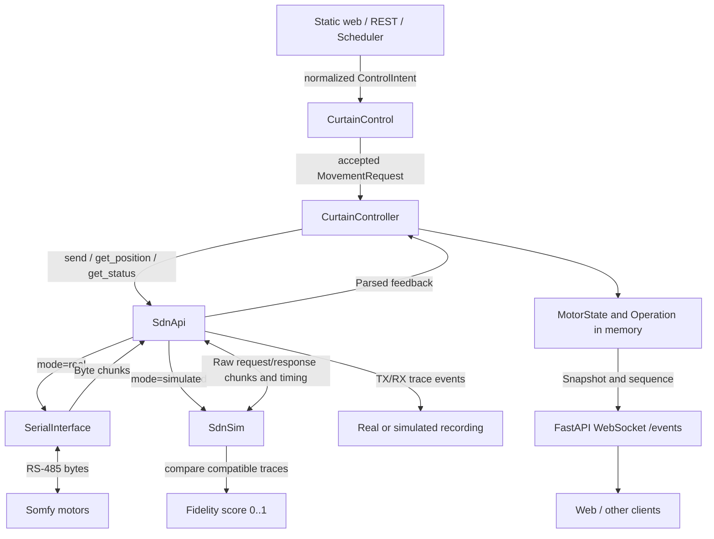
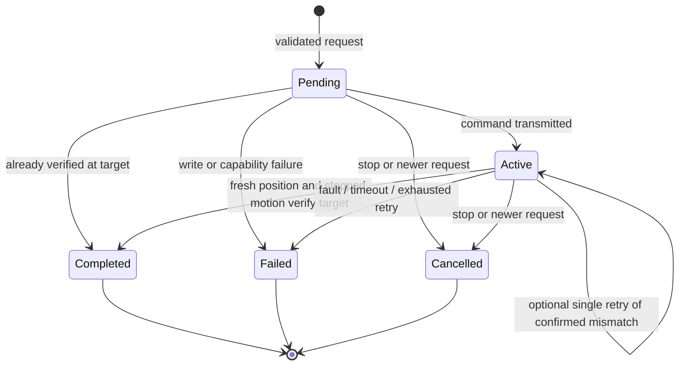
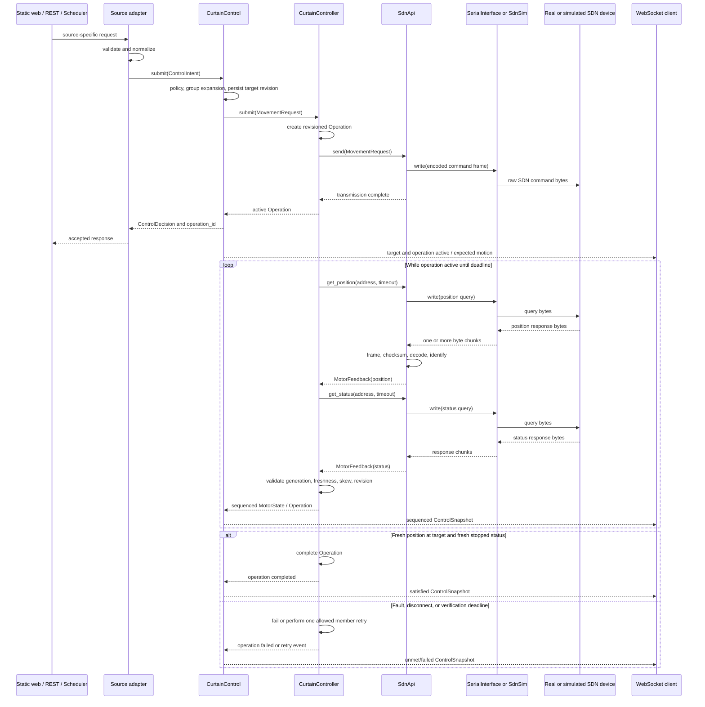
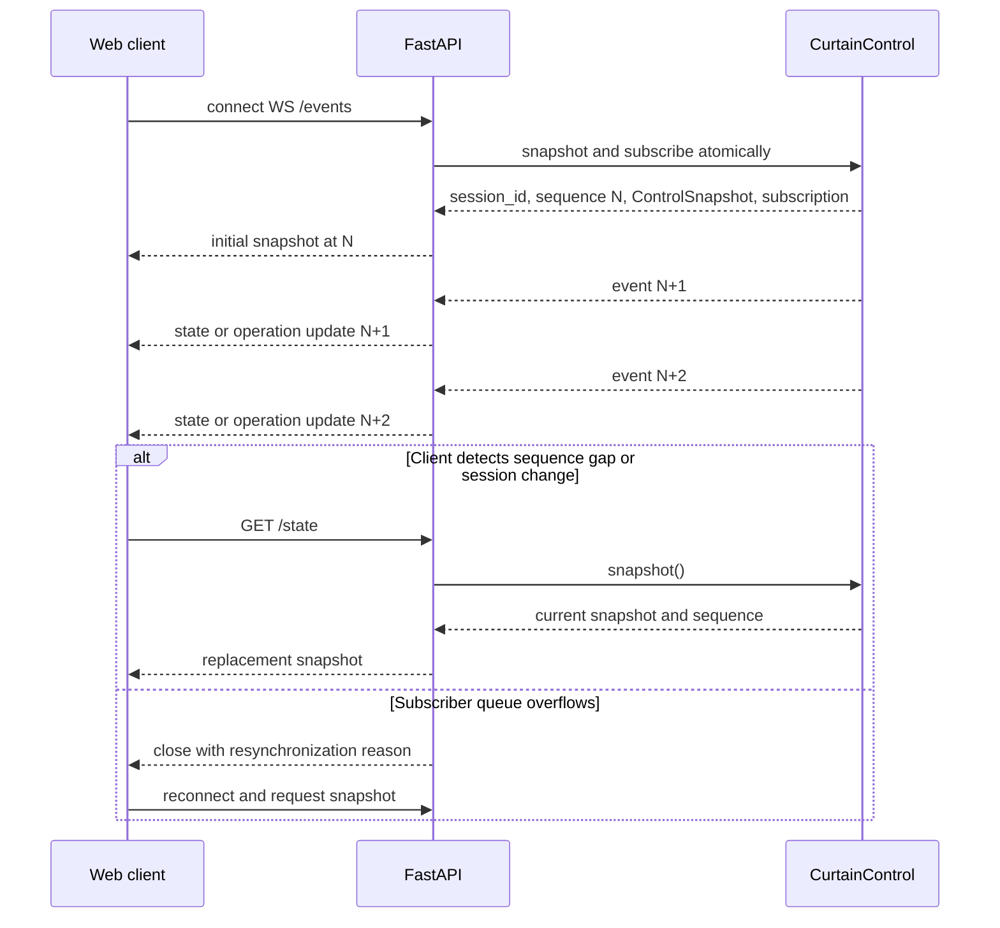
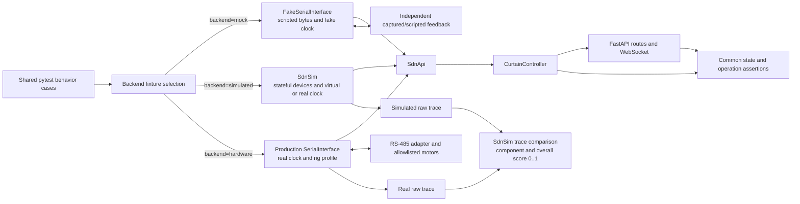
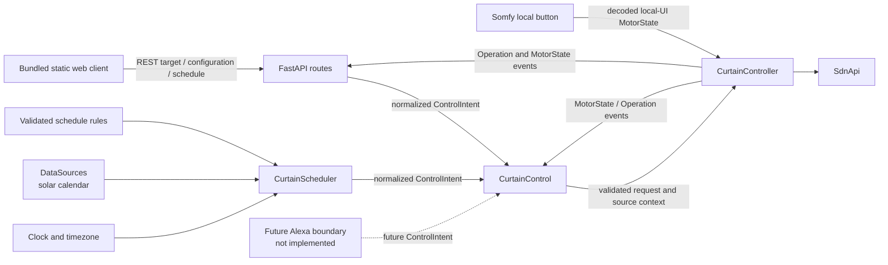
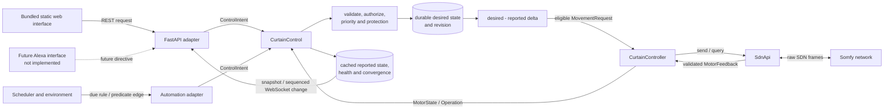
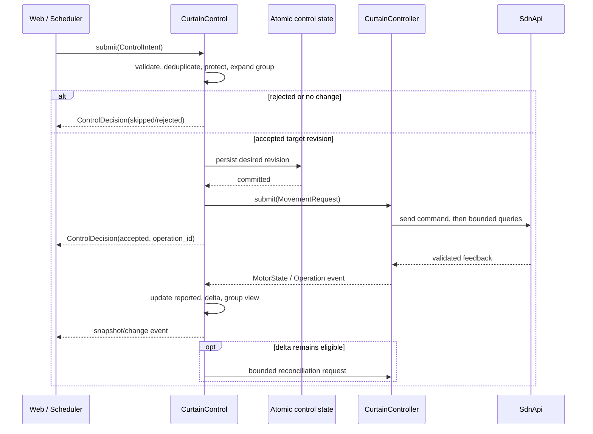
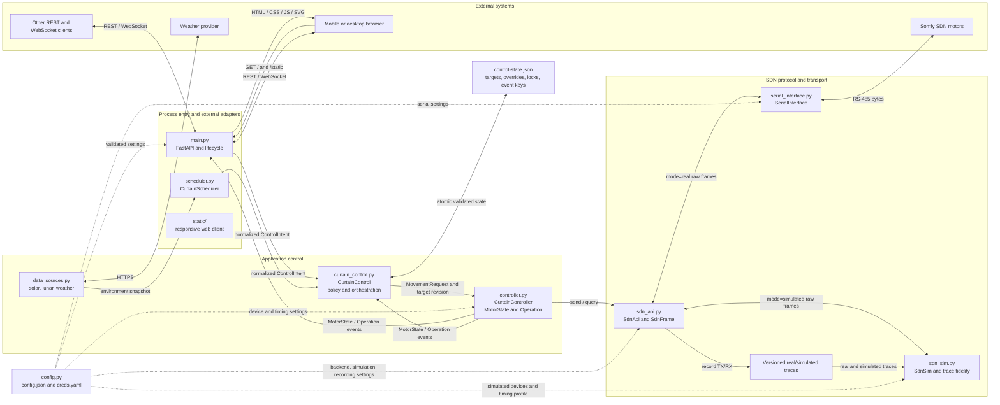
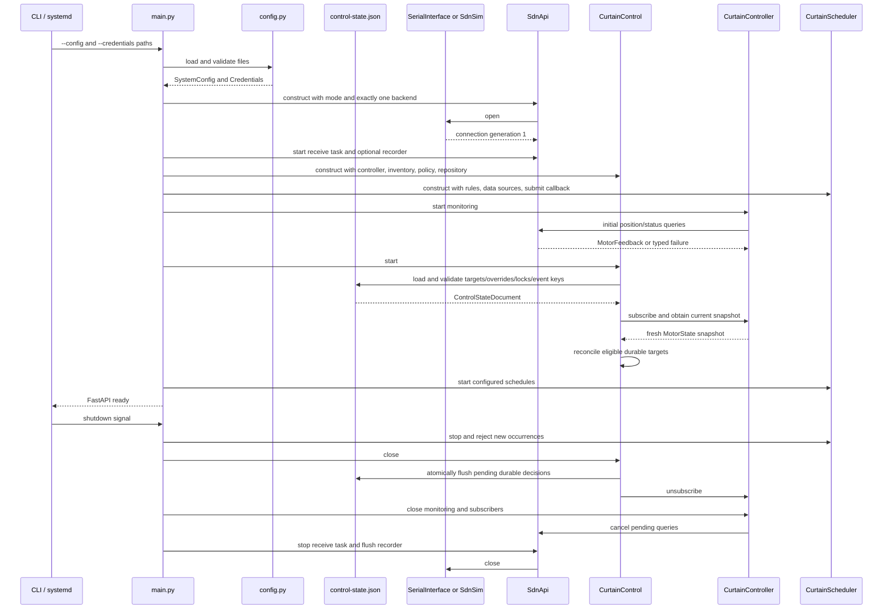

# main.py Curtain Control Program Specification
### Brad Larson
### 2026-10-02

## Table of Contents

- [Introduction](#introduction)
- [Creator Interview](#creator-interview)
  - [Creator Interview Transcripts](#creator-interview-transcripts)
    - [Existing-program review and migration requirements](#existing-program-review-and-migration-requirements)
- [Specification Description](#specification-description)
- [Program Generation Process](#program-generation-process)
- [Program Generation Report](#program-generation-report)
  - [Initial specification creation](#initial-specification-creation)
  - [Structure simplification](#structure-simplification)
  - [State and Test Backend Review](#state-and-test-backend-review)
  - [Module Communication Visualizations](#module-communication-visualizations)
  - [SDN Protocol Definition](#sdn-protocol-definition)
  - [JavaScript-compatible SdnMsg](#javascript-compatible-sdnmsg)
  - [SDN Version Compatibility Matrix](#sdn-version-compatibility-matrix)
  - [SDN Compatibility Recommendations](#sdn-compatibility-recommendations)
  - [SDN Simulator and Fidelity Comparison](#sdn-simulator-and-fidelity-comparison)
  - [CurtainControl Application Orchestration](#curtaincontrol-application-orchestration)
  - [Control Targets and Environmental Automation](#control-targets-and-environmental-automation)
  - [CurtainControl Interface Review](#curtaincontrol-interface-review)
  - [Responsive Web Interface](#responsive-web-interface)
  - [Test Specification Expansion](#test-specification-expansion)
- [Program](#program)
  - [Program Description](#program-description)
    - [SDN](#sdn)
      - [SDN protocol](#sdn-protocol)
        - [SDN document and JavaScript compatibility matrix](#sdn-document-and-javascript-compatibility-matrix)
      - [Structure Analysis and Simplification](#structure-analysis-and-simplification)
      - [Requirements and Current Assessment](#requirements-and-current-assessment)
      - [Pydantic Data Models](#pydantic-data-models)
      - [System State Review and Required Corrections](#system-state-review-and-required-corrections)
      - [SDN Interface and Protocol](#sdn-interface-and-protocol)
        - [SdnMsg requirements and dependencies](#sdnmsg-requirements-and-dependencies)
        - [SdnSim simulator, recording, and fidelity scoring](#sdnsim-simulator-recording-and-fidelity-scoring)
      - [Controller Monitoring and Verification](#controller-monitoring-and-verification)
      - [Command, Feedback, and Live-State Communication](#command-feedback-and-live-state-communication)
      - [REST and Live State](#rest-and-live-state)
      - [Testing and Code Generation](#testing-and-code-generation)
      - [Mocked, Simulated, and Real Communication Backends](#mocked-simulated-and-real-communication-backends)
    - [CurtainControl](#curtaincontrol)
      - [Legacy capability and requested-feature review](#legacy-capability-and-requested-feature-review)
      - [Design references and adopted patterns](#design-references-and-adopted-patterns)
      - [Responsibilities and boundaries](#responsibilities-and-boundaries)
      - [Class interface](#class-interface)
      - [Unified control flow](#unified-control-flow)
      - [Target and actual state model](#target-and-actual-state-model)
      - [Input priority, durable overrides, and locks](#input-priority-durable-overrides-and-locks)
      - [Target reconciliation](#target-reconciliation)
      - [Manual web control](#manual-web-control)
      - [Autonomous scheduling and solar control](#autonomous-scheduling-and-solar-control)
      - [Environmental event rules](#environmental-event-rules)
      - [Durable control-state persistence](#durable-control-state-persistence)
      - [Conflict, safety, and lifecycle rules](#conflict-safety-and-lifecycle-rules)
      - [CurtainControl testing](#curtaincontrol-testing)
  - [Use Cases](#use-cases)
  - [Program Structure](#program-structure)
    - [Module Architecture](#module-architecture)
    - [Inter-module Communication Contract](#inter-module-communication-contract)
    - [Startup and Shutdown Communication](#startup-and-shutdown-communication)
  - [API Contract](#api-contract)
  - [JSON Configuration](#json-configuration)
  - [SDN Protocol Compatibility](#sdn-protocol-compatibility)
  - [System-Control Data Sources](#system-control-data-sources)
  - [Scheduling](#scheduling)
  - [Web Interface](#web-interface)
  - [Alexa Control](#alexa-control)
  - [Program Environment](#program-environment)
- [Prompts](#prompts)
- [Functional Requirements](#functional-requirements)
- [Tests](#tests)
  - [Unit Tests](#unit-tests)
  - [Integration Tests](#integration-tests)
  - [System-Wide Tests](#system-wide-tests)
  - [End-to-End Tests](#end-to-end-tests)
- [General Program Structure](#general-program-structure)
  - [Dependency-injected application services](#dependency-injected-application-services)
  - [Local configuration boundary](#local-configuration-boundary)
- [Program Capabilities](#program-capabilities)
- [Issues](#issues)
  - [Open Issues](#open-issues)
  - [Resolved Issues](#resolved-issues)

## Introduction

`main.py` shall replace the existing Node.js CurtainControl server with a Python FastAPI service for operating Somfy SDN curtains through either a real RS-485 serial adapter or the required `SdnSim` backend. It preserves the existing device commands, SDN packet format, serial settings, and scheduled-operation capability. It replaces the legacy jQuery/Socket.IO pages with a dependency-free responsive static client served by FastAPI.

The service is started with the path to one JSON configuration file as a required command-line argument. That file is the sole persistent source of configuration; the program shall not require, connect to, or depend on an external SQL database. The FastAPI HTTP API is the programmatic control surface for automation clients and administration.

Inputs are command-line options, the JSON configuration document, HTTP API requests, time/celestial events, and raw bytes from the selected real or simulated SDN backend. Outputs are validated HTTP responses, SDN frames written to the selected backend, optional versioned traces/fidelity reports, structured logs, and scheduling activity.

## Creator Interview

### Creator Interview Transcripts

#### Existing-program review and migration requirements

**Date**: 2026-10-02  
**Creator**: Brad Larson  
**Interviewer**: Codex  

**Transcript**:

**Q:** What behavior does the existing program provide?  
**A:** It controls Somfy SDN curtains and groups over RS-485, presents web and Socket.IO controls, stores motors and groups in MySQL, and has scheduling support.

**Q:** What implementation change is required?  
**A:** Convert the Node server to a Python FastAPI server with similar functionality.

**Q:** What is the storage change?  
**A:** Remove the dependency on an external SQL database. System configuration is in a JSON file specified as a command-line parameter.

**Q:** Should the existing UI be retained?  
**A:** At that stage no interface was required. The later web-interface request supersedes this answer: the server now serves the new static client, but does not retain the legacy UI or Socket.IO.

**Q:** How should the small Python project be organized?  
**A:** Use `main.py` and a small set of support classes for serial communication, SDN commands, system control, data sources, and scheduling. Alexa is now deferred.

**Q:** How should runtime dependencies and credentials be handled?  
**A:** Declare runtime packages in `requirements.txt`. Store secrets in a separate `creds.yaml` file with restricted read access on Raspberry Pi; do not put secrets in `config.json` or source control.

**AI text generation instructions expansion table:**

| Instruction topic | Evidence / answer | Resulting specification |
|---|---|---|
| Purpose, inputs, outputs, and processing | The existing server handles SDN commands, serial I/O, configuration, and scheduling. | Implement a FastAPI service using local JSON configuration, an RS-485 transport, and a small static client. |
| Storage | The creator requires a JSON file named at the command line and no external SQL database. | Load, validate, and atomically persist one local JSON configuration document; do not include a database driver. |
| User interface | The initial creator interview specified no interface; a later explicit request requires one. | Serve the new dependency-free responsive client from `static/`; do not carry forward jQuery, Socket.IO, or the legacy pages. |

## Specification Description

This document directs future implementation and verification of `main.py`, its support modules, and the specified static client. It is the source of truth for the new Python service. The completed server shall provide REST control, a WebSocket state-event stream, and the responsive client under `static/`. Serving the legacy browser UI or using Socket.IO is prohibited. The current web-interface work is specification-only.

When a requirement conflicts with undocumented legacy behavior, this specification takes precedence. The existing JavaScript source is reference material for compatible SDN commands and data fields, not for carrying forward defects.

## Program Generation Process

For each implementation iteration, the generation agent shall:

1. Read this specification and inspect relevant existing implementation and tests.
2. Plan the smallest coherent change, mapping it to requirement IDs.
3. Implement typed Python code, documentation, and tests together.
4. Run formatting, linting if configured, and the applicable unit/integration tests.
5. Record the change, results, risks, and unresolved items in the Program Generation Report.
6. Do not add SQL, Socket.IO, legacy browser dependencies, or undocumented hardware behavior. Browser assets shall remain dependency-free and within the explicitly specified `static/` client.

The agent shall use dependency injection or a transport abstraction so protocol and API tests run without physical serial hardware. It shall never send test commands to physical curtains unless an explicitly configured integration environment is being used.

## Program Generation Report

### Initial specification creation

- **Date**: 2026-10-02
- **Request**: Create a program specification for a FastAPI replacement of the Node CurtainControl server, using a command-line JSON configuration file and no UI or external SQL database.
- **Status**: Specification created; implementation has not started.

Future reports shall include the request, plan, requirement mapping, changed files, test commands/results, critique, and whether another iteration is needed.

### Structure simplification

- **Date**: 2026-10-02
- **Request**: Apply the small-project structure analysis and expand the test table with names, descriptions, and SDN interfaces tested.
- **Decision**: Consolidate monitoring/state/verification in `CurtainController`, use distinct command/query methods in `SdnApi`, implement the basic movement/feedback subset first, and initially organize tests into four files. The required simulator later adds `test_sdn_sim.py` as a fifth file.
- **Status**: Specification updated; implementation and runtime tests remain to be generated.

### State and Test Backend Review

- **Date**: 2026-10-02
- **Request**: Support real and mocked hardware/communication tests and resolve system-state shortcomings.
- **Decision**: Define communication health, field freshness, feedback identity, coherent verification, stop/group outcomes, session-aware live events, and initially two explicit test backends using the same production controller/protocol stack. The simulator decision below subsequently expands this to mock, simulated, and real backends.
- **Status**: Specification changes implemented; runtime code and physical test execution remain future implementation work.

### Module Communication Visualizations

- **Date**: 2026-10-02
- **Request**: Add clear visualizations of program structure and communication between design modules.
- **Decision**: Define the allowed dependency graph, inter-module message contracts, startup/shutdown order, command/feedback sequence, live-state resynchronization, and mock/real test topology with Mermaid diagrams.
- **Status**: Specification diagrams and supporting communication rules added; implementation remains to be generated.

### SDN Protocol Definition

- **Date**: 2026-10-04
- **Request**: Define the SDN message format, USB-to-RS485 transmission process, every documented command and return value, and verify the definition against the Node implementation.
- **Decision**: Record the documented Somfy format and its differences from the Node encoder. This decision was subsequently superseded by the JavaScript-compatibility decision below.
- **Status**: SDN wire format, Node comparison, command/response table, and implementation constraints added; golden-frame and real-hardware verification remain implementation work.

### JavaScript-compatible SdnMsg

- **Date**: 2026-10-04
- **Request**: Specify an `SdnApi.SdnMsg` function equivalent to the JavaScript `SomfyMsg`, with the JavaScript implementation controlling any conflict with protocol documentation.
- **Decision**: Make `SdnMsg` the pure, compatibility-critical frame builder. Preserve the JavaScript encoder's source-address order and lack of source-byte inversion, while using documentation to validate requirements not decided by the implementation. Express the format with named offsets, masks, enums, and explicit byte-order rules using Python standard-library primitives rather than implementation-dependent bit fields.
- **Status**: Function contract, dependencies, compatibility rules, and verification requirements added; implementation remains future work.

### SDN Version Compatibility Matrix

- **Date**: 2026-10-04
- **Request**: Extend the SDN document comparison to identify whether JavaScript aligns with the older profile, newer guide, both, or neither.
- **Decision**: Classify observable JavaScript behavior separately from declaration-only enum constants and the defective receive parser.
- **Status**: Compatibility matrix added under the SDN protocol definition.

### SDN Compatibility Recommendations

- **Date**: 2026-10-04
- **Request**: Recommend a resolution for every compatibility issue, prioritizing reliable communication and JavaScript behavior proven by routine open/close control.
- **Decision**: Use conservative serialized transport; preserve JavaScript wire behavior only for exercised movement paths; adopt mutually aligned rules next; and disable unresolved lock, setup, reset, and device-management functions pending profile-specific documentation and hardware captures.
- **Status**: Recommended approach added to every compatibility-matrix row, with unresolved conflicts explicitly identified.

### SDN Simulator and Fidelity Comparison

- **Date**: 2026-10-04
- **Request**: Require a selectable `SdnSim` backend whose byte responses and timing model real devices, record real and simulated executions, and score their fidelity from 0 to 1.
- **Decision**: Select exactly one real or simulated backend when constructing `SdnApi`; keep the production codec/controller path unchanged; record monotonic raw TX/RX traces for both; and compare comparable traces using explicit sequence, wire, value, timing, and outcome component scores.
- **Status**: Simulator architecture, trace schemas, scoring rules, configuration, diagrams, and mock/simulator/hardware tests added; calibration still requires real hardware captures.

### CurtainControl Application Orchestration

- **Date**: 2026-10-04
- **Request**: Define a `CurtainControl` class that preserves manual web control and autonomous fixed-time/solar control from the Node server.
- **Decision**: Add one application-level facade above `CurtainController`. FastAPI and scheduled occurrences enter through `CurtainControl`; `CurtainController` continues to own SDN execution, monitoring, and verification. The later web-interface decision below supersedes only the original headless-client decision.
- **Status**: Class contract, scheduling rules, architecture, functional requirements, and named tests added; implementation remains future work.

### Control Targets and Environmental Automation

- **Date**: 2026-10-04
- **Request**: Extend `CurtainControl` to maintain motor/group targets, accept web, Somfy local-button, and autonomous intent subject to durable overrides and locks, reconcile physical position, and support cron plus solar, lunar, weather, temperature, and extensible environmental events.
- **Decision**: Make per-curtain desired targets durable application state owned by `CurtainControl`; make group targets versioned intent expanded to member targets; consume truthful `MotorState` observations from `CurtainController`; and use bounded reconciliation rather than placing policy in the SDN layer. Define application locks independently from unresolved hardware SDN lock commands. Define environmental automation as validated edge-triggered rules with freshness, hysteresis, debounce, and cooldown.
- **Status**: Control-state models, class methods, priority/reconciliation rules, persistence, environmental scheduling, API requirements, and CC09–CC16 tests added. Implementation and installed-hardware validation remain future work.

### CurtainControl Interface Review

- **Date**: 2026-10-04
- **Request**: Review missing Node and requested capabilities, compare current control patterns, simplify/generalize manual and autonomous control, add an interaction diagram, and clarify `CurtainControl` boundaries.
- **Decision**: Distinguish working Node behavior from protocol-only helpers and broken stubs; normalize every producer into one `ControlIntent` accepted by `CurtainControl.submit()`; keep protection changes separate; model desired/reported/delta state; use capability flags and truthful cached state; and keep all SDN execution/feedback in `CurtainController`/`SdnApi`. Draw from Home Assistant cover entities, Matter Window Covering, AWS IoT desired/reported shadows, Kubernetes reconciliation, and Alexa state/change reporting without adding those platforms as dependencies.
- **Status**: Review tables, simplified interface, architecture/sequence visualization, adapter rules, state conventions, requirements, and tests updated. Jog and hardware SDN locks remain explicitly deferred pending verified protocol/hardware evidence.

### Responsive Web Interface

- **Date**: 2026-10-04
- **Request**: Provide a mobile/PC static interface optimized for autonomous operation and one-press room control, with home, configuration, and schedule tools; defer Alexa.
- **Decision**: Serve a dependency-free HTML/CSS/JavaScript client from `static/`. Quick tiles use local SVG symbols with the requested semantic `fa-*` names, display controller-observed state, and toggle open/closed in one press. REST performs mutations and the existing WebSocket triggers truthful live-state refresh. Calibration is an explicit confirmed administrative operation. Alexa has no runtime implementation in this version.
- **Status**: Behavior, architecture, routes, directory layout, and acceptance tests are specified. Only placeholder directories exist; no HTML, CSS, JavaScript, icon artwork, FastAPI static route, or browser behavior has been implemented.

### Test Specification Expansion

- **Date**: 2026-10-04
- **Request**: Expand code-generation testing so every Tests subsection has an implementation table, system-wide cases define inputs/behavior/outcomes, every case states initial/action/final state, edge cases cover partial positions/concurrent commands/schedule conflicts, and assumptions are explicit.
- **Decision**: Add common deterministic assumptions plus unit, integration, system-wide, and end-to-end tables with named IDs and explicit preconditions, initial state, action, expected behavior, final state, forbidden side effects, and hardware safety boundaries. Preserve the earlier detailed M/S/C/A/SIM/CC/UI/R/H matrices as additional coverage requirements. Do not generate or execute any test artifact in this iteration.
- **Status**: Specification-only test expansion completed. No test module, fixture, mock, trace, browser automation, hardware profile, or program code was implemented or executed.

## Program

### Program Description

The program is a long-running FastAPI process deployed near the RS-485 adapter (for example, on a Raspberry Pi). At startup it parses the configuration-file argument, validates the JSON document, selects the configured real or simulated SDN backend, and starts scheduled actions. Real mode opens the configured serial device; simulated mode opens no operating-system serial port. HTTP callers can inspect configuration and issue curtain actions. Both modes run the same `SdnApi`, controller, scheduler, and API behavior against raw SDN frames.

Quality attributes are safety (reject malformed or unsupported commands before serial writes), predictable configuration, observable failures, and testability without hardware.

#### SDN

The SDN subsystem shall transmit commands, read motor feedback, and verify requested movements. Serial write success means only that a command was sent. A movement operation completes when fresh reported position/status confirms its operation target. `CurtainController` then ends that operation and continues reporting physical changes. `CurtainControl` separately decides whether a later keypad/physical change becomes the new desired target or requires a bounded corrective operation under the active override/lock policy.

##### SDN protocol

This protocol definition is based on [Sonesse 30 RS485 profile](Documents/sonesse-30-rs485_profile.pdf), [ST30 RS485 profile](Documents/st30-rs485.pdf), [Somfy RS485 Decode](Documents/Sonfy%20RS485%20Decode.docx), and Somfy's [SDN Integration Guide rev. 004](https://service.somfy.com/downloads/bui_v4/sdn-integration-guide-rev.004.pdf). The device documents describe an asynchronous half-duplex master/slave bus. The controller is the master; motors are slaves and normally respond only to a master request. Each motor has a three-byte NodeID, and a configured group has a three-byte GroupID.

**USB-to-RS485 serial connection.** Connect the Raspberry Pi to the SDN data bus through an isolated USB-to-RS485 adapter that supports two-wire half-duplex communication and automatic transmit/receive direction, or configure direction control if the adapter requires it. The motor documentation identifies the data conductors as RS485 `+`, signal ground, and RS485 `-`; connect them according to the adapter and installation wiring documentation. The program opens the adapter device (normally `/dev/ttyUSB0`) at 4800 baud, 8 data bits, odd parity, one stop bit (`4800 8O1`), NRZ, with no software transformation of UART bit order. The UART sends each byte least-significant bit first automatically.

The program shall wait until the bus is idle before writing. Use the more conservative device-specific interval of at least 100 ms between master messages unless verified hardware testing establishes a shorter safe value; this also exceeds the general SDN master-request delay. A complete frame must be supplied to the serial driver in one ordered write so the inter-character gap remains below 1 ms. The adapter must release the half-duplex bus after transmission so a motor can reply. Reads may return partial or multiple messages and therefore feed the incremental parser rather than assuming one read equals one frame.

**Logical message format.** An SDN message contains 11 fixed bytes plus zero to 21 DATA bytes, for a documented total of 11 to 32 bytes. There is no start/end synchronization byte. Frame length and bus inactivity delimit the message.

| Logical byte(s) | Field | Format and meaning |
|---|---|---|
| 0 | `MSG` | One-byte message/command identifier. |
| 1 | `ACK/EXT/LEN` | ACK-request flag, reserved EXT flag (`0`), and total frame length. The current program leaves ACK clear unless acknowledgment support is explicitly implemented. |
| 2 | `NODE TYPE` | Source NodeType in the high nibble and destination NodeType in the low nibble. A master source is `0`; Sonesse/ST30 destination type is `0x02`. |
| 3–5 | `SOURCE@` | The documented format is a three-byte transmitter NodeID, least-significant byte first and complemented on the wire. The compatibility `SdnMsg` format instead stores it most-significant byte first without complementing it, matching JavaScript `SomfyMsg`. |
| 6–8 | `DEST@` | Three-byte receiver NodeID, least-significant byte first. Point-to-point uses the motor NodeID; group addressing uses `SOURCE@ = GroupID` and `DEST@ = 000000`; broadcast uses destination `FFFFFF` and is not used by this program. |
| 9 through `n-3` | `DATA` | Command-specific payload. Multi-byte numeric fields are least-significant-byte first unless the command definition explicitly states otherwise. |
| `n-2`, `n-1` | `CHECKSUM` | Sixteen-bit sum of the transmitted/complemented bytes from `MSG` through the final DATA byte, truncated modulo 65536 and stored most-significant checksum byte first. These checksum bytes are not complemented. |

**Creating the transmitted frame.** The documentation defines both addresses as least-significant-byte first and all pre-checksum bytes as complemented. For migration compatibility, however, `SdnMsg` shall reproduce the JavaScript `SomfyMsg` output: set total length to `11 + len(DATA)`; complement the command, length, ST30 device type, destination bytes, and DATA bytes as unsigned eight-bit values; place the source address most-significant byte first without complementing it; place the destination least-significant byte first; sum every constructed byte before the checksum modulo `0x10000`; and append checksum high byte followed by low byte without complementing them. The complete returned frame is later written to the USB serial adapter. Receiving shall recognize this compatibility format; support for strictly documented frames, if later required, must be an explicit protocol-profile option rather than an implicit behavior change.

```text
logical:   MSG | ACK/LEN | NODE TYPE | SRC | DEST | DATA
JS wire:  ~MSG |~ACK/LEN |~NODE TYPE | SRC[MSB..LSB] |~DEST[LSB..MSB] |~DATA | CHECKSUM_BE
```

**Verification against `sdn-protocol.js`.** For the Python migration, JavaScript `SomfyMsg` behavior used by the existing routine open/close and group-movement helpers is controlling when it conflicts with the documents. JavaScript declarations or defective code that are not exercised by those paths are not controlling. The documents define validation, reliable serial transport, response semantics, and future protocol profiles where they agree or JavaScript is silent.

| Concern | Documented protocol | Node implementation | Required Python implementation |
|---|---|---|---|
| Command, length, NodeType, destination, DATA | Complement every transmitted byte before checksum. | Complements these fields. | Preserve this behavior and validate all values before encoding. |
| Source address | LSBF and complemented on the wire, like the other header bytes. | Writes source MSB first and does not complement it. | Preserve the JavaScript behavior in `SdnMsg`; golden tests must use a non-palindromic address so this compatibility rule is observable. |
| Group addressing | `SOURCE@ = GroupID`, `DEST@ = 000000`. | Group helpers use this logical addressing pattern. | Preserve the JavaScript logical addressing and its source/destination encoding rules. |
| Length | Total bytes, 11–32, held in ACK/EXT/LEN. | Uses `11 + DATA length` and complements the byte; it does not explicitly enforce the maximum or ACK/EXT bits. | Enforce 11–32, EXT=0, and explicit ACK policy. |
| Checksum | Sum complemented wire bytes through DATA, modulo 65536; append high byte then low byte without complementing. | Sums all bytes as constructed, including its uncomplemented source bytes, and stores the result high byte then low byte. | Reproduce the JavaScript result exactly. |
| Movement payload | Function, 16-bit value LSBF, reserved byte; older ST30 profile uses four DATA bytes for non-tilting movement. | `MoveData` matches this four-byte payload. | Use four bytes for configured non-tilting ST30/Sonesse motors; gate extended angle payloads by device capability. |
| ACK/return handling | Controls/settings may request ACK/NACK; status GET returns corresponding POST and no separate ACK is needed. | Does not request ACK and resolves when the serial write completes. | Treat write completion as `sent` only; verify movement using GET/POST feedback. ACK support may be added later. |
| Receive parser | Validate framing, inversion, length, checksum, addresses, command, and DATA. | Not operational: uses `length()`/function-call indexing, misspelled identifiers, wrong command/length offsets, uninitialized buffers, and the wrong parser object. | Implement and test a new bounded incremental decoder; do not port this parser. |

###### SDN document and JavaScript compatibility matrix

The supplied files represent different protocol generations and document scopes. “Alignment” describes observable JavaScript behavior; an enum constant without a working encoder, decoder, or caller is identified as declaration-only rather than implemented support. Recommendations apply this priority order: reliable communication and safe validation first; compatibility with JavaScript behavior actually used for routine open/close control second; behavior on which JavaScript and the documents substantially agree third; and explicit disablement where conflicting evidence has no safe resolution.

| Area | Older ST30/Sonesse documents | Newer SDN guide | JavaScript alignment | Recommended approach |
|---|---|---|---|---|
| Bus timing | Approximately 100 ms between messages. | Master waits for 25 ms of bus inactivity and also observes inter-character and slave-reply timing. | **Different from both / omitted.** No bus-idle or inter-message delay is enforced. | **Reliability priority:** use one serialized bus writer, require observed bus idle, and default to the conservative 100 ms interval. Permit a shorter 25 ms interval only after real-hardware stress tests show no collision, truncation, or lost reply. |
| `CTRL_MOVETO` | Four-byte non-tilting payload, including raw count positioning. | Four-byte base payload with optional angle fields and newer tilt functions. | **Older version.** `MoveData` always creates the older four-byte payload and exposes count positioning. | **JavaScript day-to-day priority:** use the four-byte JavaScript payload for up-limit/open and down-limit/close. Enable percent only with its existing fixture; keep count, IP, and tilt modes disabled until profile-specific hardware tests pass. |
| Position report | Defines the basic position response fields. | Defines a variable 5–11-byte report with optional tilt/reserved fields. | **Neither is operationally supported.** The command IDs align with both, but the receive parser cannot decode the response reliably. | Implement a new checksum-validating variable-length parser accepting the documented base fields and preserving optional trailing bytes. Confirm field meaning with captured replies before position can verify a movement. **Unresolved until a real response fixture exists.** |
| Local/DCT locking | IDs `0x17/0x27/0x37` describe DCT locking. | The same IDs describe generalized `SET/GET/POST_LOCAL_UI`. | **Different from both as implemented.** JavaScript misnames request ID `0x17` as `POST_DCT_LOCK` and provides no working helper/parser. | Disable from the initial API. Do not infer SET/POST direction from the JavaScript name. Require an installed-device profile and safe read-only hardware test before any lock write is enabled. **Conflicting without a current resolution.** |
| Network locking | Legacy/profile-specific lock behavior. | `SET/GET/POST_NETWORK_LOCK` use `0x16/0x26/0x36`. | **Legacy/implementation-specific, not conclusively aligned.** JavaScript uses `GET_LOCK 0x4B` and `SET_LOCK 0x5B`; it does not match the newer guide and the supplied older tables do not fully validate those IDs. | Disable `0x4B/0x5B` and `0x16/0x26/0x36` initially. Select one family only from confirmed firmware/profile documentation plus hardware evidence. **Conflicting without a clear resolution.** |
| Factory defaults | Includes GET/POST factory-default status at `0x2F/0x3F`. | Defines destructive `SET_FACTORY_DEFAULT` at `0x1F`. | **Older version, declaration-only.** JavaScript declares `0x2F/0x3F` but has no caller/helper. | Exclude all factory-default operations from the server. They are unnecessary for routine control and potentially destructive. Use a dedicated Somfy commissioning tool instead. |
| Motor configuration | Includes limits, rotation direction, speed, IP, and corresponding status messages. | Assumes some setup is already complete and omits some older procedures. | **Older version, mostly declaration-only.** JavaScript enums contain the older IDs; only a subset has helpers. | Treat motors as preconfigured. Do not expose configuration writes through FastAPI. Add individual commands later only with a declared motor profile, golden frames, and opt-in hardware tests. |
| ACK behavior | Acknowledgments receive limited emphasis in the device profile. | Explicit ACK request bit, `ACK 0x7F`, `NACK 0x6F`, error codes, and retry guidance. | **Closer to older behavior but incomplete.** ACK remains clear and ACK/NACK parsing is absent. | Preserve ACK-clear JavaScript frames for initial open/close compatibility, but never equate write completion with movement completion. Use fresh position/status queries for verification. Add ACK mode only after reply parsing and timeout/retry behavior are proven on hardware. |
| Frame inversion | All bytes before the checksum are inverted. | Same requirement. | **Different from both.** Command, length, device type, destination, and DATA are inverted, but source-address bytes are not. | **JavaScript day-to-day priority:** reproduce `SomfyMsg` exactly for the initial compatibility profile because every existing open/close frame uses it. Mark this as a high-risk conflict and require captured known-working frames. A documented-SDN encoding may be added only as an explicit alternative profile. |
| Transmit length | Fixed header plus command DATA. | Explicit total length of 11–32 bytes. | **Partially aligns with both.** JavaScript computes `11 + DATA length` but does not enforce the documented maximum. | Keep the JavaScript length calculation and add the documented 11–32-byte validation before construction. Reject oversize payloads rather than truncating or transmitting them. |
| Receive length | Length is obtained from the header. | Same, including variable-length reports. | **Different from both.** The parser uses incorrect offsets/calls and an incorrect 11–16-byte assumption. | Do not port the parser. Implement bounded incremental framing for 11–32-byte messages, validate length before allocation, validate checksum before decoding, and recover from noise without losing the next valid frame. |
| Address byte order | Source and destination addresses are LSBF. | Source and destination addresses are LSBF. | **Different from both.** Destination is LSBF and inverted; source is MSB-first and uncomplemented. | **JavaScript day-to-day priority:** preserve the JavaScript source and destination encoding in `SdnMsg` for routine movement. Use non-palindromic golden fixtures and real captures to make the discrepancy visible. **Protocol-correct encoding remains unresolved until hardware evidence identifies what the installed motors accept.** |
| Serial configuration | 4800 baud, 8 data bits, odd parity, one stop bit. | Same. | **Both in intent.** JavaScript requests 4800/8/O/1, although its `databits` and `stopbits` option spelling must be verified against the installed serial library version. | **Shared/reliability priority:** configure pyserial explicitly for 4800/8/O/1, no flow control, finite read/write timeouts, and half-duplex direction handling appropriate to the adapter. Verify effective settings after opening the port. |
| Device type | ST30/Sonesse 30 is NodeType `0x02`. | Ø30 DC family is NodeType `0x02`. | **Both.** JavaScript uses `ST30 = 0x02`. | Use `0x02` for the configured ST30/Sonesse 30 profile. Reject unsupported device types rather than silently transmitting. |
| Group addressing | GroupID is placed in source and destination is zero. | Same logical convention. | **Both logically, but not at the wire level.** JavaScript applies its nonstandard source order/non-inversion to the GroupID. | Preserve the JavaScript logical and wire encoding for existing group open/close commands. Verify every member individually after transmission; do not issue group GET requests that can produce reply collisions. |
| Device-management IDs | GET requests use `0x40/0x41/0x45/0x4C`; SET and POST occupy their documented ranges. | Same message-family scheme. | **Different from both as named.** JavaScript labels SET-range values `0x50/0x51/0x55` as GET commands and uses `0x5C` instead of documented serial-number GET `0x4C`. | Do not implement the mislabeled JavaScript constants. Device discovery, labeling, and group-table configuration are outside routine control and remain disabled until independently specified and tested. **Conflicting JavaScript names have no safe compatibility value.** |

The resulting migration rule is intentionally narrow: `SdnMsg` reproduces JavaScript `SomfyMsg` for the frame fields used by proven routine movement helpers, especially open/close and existing group movement. JavaScript enum-only declarations, defective receive behavior, and conflicting setup/lock/device-management commands are not controlling. Where no reliable resolution exists, the feature remains disabled and is identified as unresolved rather than choosing a protocol version silently.

**SDN protocol command table.** “Return value” identifies the on-wire response, not the Python method return. With ACK clear, `CTRL_*` and `SET_*` messages normally produce no immediate response. If ACK is requested, success is `ACK (0x7F, no DATA)` and failure is `NACK (0x6F, ErrorCode)`; documented errors include data out of range (`0x01`), unknown message (`0x10`), message length error (`0x11`), and busy (`0xFF`). A control ACK means execution started, not that movement finished. `GET_*` messages return the corresponding `POST_*` report.

| Category | SDN command | MSG | Request DATA (logical, before complement) | Return value / report | Node implementation verification and program scope |
|---|---|---:|---|---|---|
| Control | `CTRL_MOVE` | `0x01` | Direction (`00` down, `01` up, `02` cancel adjustment), duration `0x0A..0xFF` in 10 ms units, speed selector (`00` up, `01` down, `02` slow). | None with ACK clear; optional ACK/NACK. Motor state is read separately. | Implemented as `Jog`; deferred from initial Python scope. |
| Control | `CTRL_STOP` | `0x02` | One reserved byte (`00`). | None with ACK clear; optional ACK/NACK. Verify with `GET_MOTOR_STATUS`. | Motor/group helpers match payload; included in initial scope. |
| Control | `CTRL_MOVETO` | `0x03` | For non-tilting ST30: function, 16-bit LSBF value, reserved `00`. Functions: `00` down limit, `01` up limit, `02` IP, `03` pulse position in older profile, `04` percentage. Newer profiles may append angle data. | None with ACK clear; optional ACK/NACK. Verify using position/status queries. | `MoveData`, up/down, count, and percent helpers match older four-byte payload. Initial Python scope enables limits and percent only. |
| Control | `CTRL_MOVEOF` | `0x04` | Function (`00/01` next IP down/up; `02/03` jog down/up pulses; `04/05` jog down/up 10 ms units), 16-bit LSBF value, reserved. | None with ACK clear; optional ACK/NACK; state queried separately. | Enum only; deferred. |
| Control | `CTRL_WINK` | `0x05` | None. | None with ACK clear; optional ACK/NACK; status cause may report wink. | Enum exists; no Node helper; deferred. |
| Status | `GET_MOTOR_POSITION` | `0x0C` | None. | `POST_MOTOR_POSITION (0x0D)`: minimum five DATA bytes—pulse count LSBF (2), percentage (0–100), tilt/reserved, IP index (`0xFF` when not at an IP). Some profiles return up to 11 DATA bytes. | Node request helper exists. Required for Python monitoring. |
| Report | `POST_MOTOR_POSITION` | `0x0D` | Slave report only. | Decoded `MotorFeedback`: raw pulse count, reported percentage, optional tilt/IP fields, receipt metadata. | Enum exists; Node parser cannot decode it. Required. |
| Status | `GET_MOTOR_STATUS` | `0x0E` | None. | `POST_MOTOR_STATUS (0x0F)`, four DATA bytes: status, direction, source, cause. | Enum exists; no Node request helper. Required for verified stop/movement. |
| Report | `POST_MOTOR_STATUS` | `0x0F` | Slave report only. | Status `00` stopped, `01` running, `02` blocked, `03` locked; direction `00` down, `01` up, `FF` unknown; source `00` internal, `01` network, `02` local UI; cause includes target reached, explicit command, wink, obstacle, over-current, thermal, and timeout. | Enum exists; Node parser cannot decode it. Required. |
| Setting | `SET_MOTOR_LIMITS` | `0x11` | Four bytes: function, direction, 16-bit LSBF value. | None with ACK clear; optional ACK/NACK. | Enum only; device setup is deferred. |
| Setting | `SET_MOTOR_DIRECTION` | `0x12` | One byte: `00` standard, `01` reversed. | None with ACK clear; optional ACK/NACK. | Enum only; deferred. |
| Setting | `SET_MOTOR_ROLLING_SPEED` | `0x13` | Three bytes: up, down, slow speed (documented 6–28 RPM for ST30). | None with ACK clear; optional ACK/NACK. | Enum only; deferred. |
| Setting | `SET_MOTOR_IP` | `0x15` | Four bytes: function, IP index, 16-bit LSBF position/value. | None with ACK clear; optional ACK/NACK. | Enum only; deferred. |
| Setting | `SET_NETWORK_LOCK` | `0x16` | Function and priority. Functions: `00` unlock, `01` lock at current position, `03` save lock across power cycles, `04` do not save. | None with ACK clear; optional ACK/NACK. | Current SDN definition; absent from Node enum, whose legacy lock IDs conflict. Deferred. |
| Setting | `SET_DCT_LOCK` / newer `SET_LOCAL_UI` | `0x17` | Three bytes. Older ST30: lock/unlock DCT input, index, priority. Newer profile: enable/disable local UI item, index, priority. | None with ACK clear; optional ACK/NACK. | Node names this `POST_DCT_LOCK`, which is incorrect for a master request; deferred and profile-dependent. |
| Reset | `SET_FACTORY_DEFAULT` | `0x1F` | One function byte: `00` reset all, `01` clear group addresses, `15` delete IPs, `17` clear locks/save status. | None with ACK clear; optional ACK/NACK. | Current SDN definition; destructive configuration command, absent from Node and excluded from application scope. |
| Status | `GET_MOTOR_LIMITS` | `0x21` | None. | `POST_MOTOR_LIMITS (0x31)`: up and down limits, two LSBF bytes each. | Enum only; deferred. |
| Status | `GET_MOTOR_DIRECTION` | `0x22` | None. | `POST_MOTOR_DIRECTION (0x32)`: `00` standard or `01` reversed. | Enum only; deferred. |
| Status | `GET_MOTOR_ROLLING_SPEED` | `0x23` | None. | `POST_MOTOR_ROLLING_SPEED (0x33)`: up, down, and slow speed bytes. | Enum only; deferred. |
| Status | `GET_MOTOR_IP` | `0x25` | One-byte IP index (`1..16` in older ST30 profile). | `POST_MOTOR_IP (0x35)`: IP index, pulse position LSBF, percentage. | Enum only; deferred. |
| Status | `GET_NETWORK_LOCK` | `0x26` | None. | `POST_NETWORK_LOCK (0x36)`: status, source address LSBF, priority, and saved flag. | Current SDN definition; absent from Node enum; deferred. |
| Status | `GET_DCT_LOCK` / newer `GET_LOCAL_UI` | `0x27` | One-byte DCT/UI index. | Older `POST_DCT_LOCK` / newer `POST_LOCAL_UI (0x37)`, profile-dependent lock/UI status fields. | Enum only; deferred until exact installed-motor profile is confirmed. |
| Status | `GET_FACTORY_DEFAULT` | `0x2F` | One-byte setting selector. | `POST_FACTORY_DEFAULT (0x3F)`: selector plus `00` non-default or `01` default. | Enum only; deferred. |
| Report | `POST_MOTOR_LIMITS` | `0x31` | Slave report only. | Four DATA bytes containing up/down limits. | Enum exists; no working Node decoder; deferred. |
| Report | `POST_MOTOR_DIRECTION` | `0x32` | Slave report only. | One DATA byte containing rotation direction. | Enum exists; deferred. |
| Report | `POST_MOTOR_ROLLING_SPEED` | `0x33` | Slave report only. | Three DATA bytes containing up/down/slow RPM. | Enum exists; deferred. |
| Report | `POST_MOTOR_IP` | `0x35` | Slave report only. | Four DATA bytes containing index, pulse position, and percentage. | Enum exists; deferred. |
| Report | `POST_NETWORK_LOCK` | `0x36` | Slave report only. | Six DATA bytes: lock status, 24-bit LSBF source address, priority, and power-cycle saved flag. | Current SDN definition; absent from Node enum; deferred. |
| Report | `POST_DCT_LOCK` / `POST_LOCAL_UI` | `0x37` | Slave report only. | Older profile: lock status plus reserved/source/priority fields; newer profile: requested UI index and enabled/disabled status. | Node omits the correct `0x37` report constant; deferred. |
| Report | `POST_FACTORY_DEFAULT` | `0x3F` | Slave report only. | Two DATA bytes: selector and default-state flag. | Enum exists; deferred. |
| Device management | `GET_NODE_ADDR` | `0x40` | None. Usually broadcast discovery; replies can collide. | `POST_NODE_ADDR (0x60)`, no DATA; NodeID is in response header. | Node assigns name `GET_NODE_ADDR` to `0x50`; that conflicts with the documented protocol. Discovery is deferred. |
| Device management | `GET_GROUP_ADDR` | `0x41` | One-byte group-table index `0..15`. | `POST_GROUP_ADDR (0x61)`: index plus three-byte LSBF GroupID. | Node assigns `GET_GROUP_ADDR` to `0x51`, which is documented as `SET_GROUP_ADDR`; deferred. |
| Device information | `GET_NODE_LABEL` | `0x45` | None. | `POST_NODE_LABEL (0x65)`: fixed 16-byte ASCII label. | Node assigns `GET_NODE_LABEL` to `0x55`, documented as `SET_NODE_LABEL`; deferred. |
| Device information | `GET_NODE_SERIAL_NUMBER` | `0x4C` | None. | `POST_NODE_SERIAL_NUMBER (0x6C)`: 12-byte ASCII serial/manufacturing data. | Node assigns `0x5C`, conflicting with documented `0x4C`; deferred. |
| Device management | `SET_GROUP_ADDR` | `0x51` | Group-table index `0..15` plus three-byte LSBF GroupID. | None with ACK clear; optional ACK/NACK. | Node mislabels this ID as `GET_GROUP_ADDR`; configuration is deferred. |
| Device information | `SET_NODE_LABEL` | `0x55` | Exactly 16 ASCII bytes, space-padded. | None with ACK clear; optional ACK/NACK. | Node mislabels this ID as `GET_NODE_LABEL`; configuration is deferred. |
| Report | `POST_NODE_ADDR` | `0x60` | Slave report only; no DATA. | NodeID is carried in the response source-address field. | Absent from Node enum/parser; discovery is deferred. |
| Report | `POST_GROUP_ADDR` | `0x61` | Slave report only. | Group index plus three-byte LSBF GroupID. | Absent from Node enum/parser; deferred. |
| Report | `POST_NODE_LABEL` | `0x65` | Slave report only. | Fixed 16-byte ASCII label. | Absent from Node enum/parser; deferred. |
| Report | `POST_NODE_SERIAL_NUMBER` | `0x6C` | Slave report only. | Twelve ASCII bytes containing NodeID, manufacturer ID, year, and production week. | Absent from Node enum/parser; deferred. |
| Acknowledgment | `NACK` | `0x6F` | Slave report only. | One-byte error code: `01` range, `10` unknown MSG, `11` length, `FF` busy. | Missing from Node enum/parser. Add only when ACK mode is implemented. |
| Device information | `GET_NODE_APP_VERSION` | `0x74` | None. | `POST_NODE_APP_VERSION (0x75)`: six bytes containing firmware part number, revision letter/number, and reserved byte. | Current SDN definition; absent from Node enum; deferred. |
| Report | `POST_NODE_APP_VERSION` | `0x75` | Slave report only. | Six firmware-identification bytes returned for `GET_NODE_APP_VERSION`. | Current SDN definition; absent from Node enum; deferred. |
| Acknowledgment | `ACK` | `0x7F` | Slave report only. | No DATA; receipt/processing acknowledgment, not movement completion. | Missing from Node enum/parser. Add only when ACK mode is implemented. |
| Legacy/unverified | `GET_LOCK` / `SET_LOCK` | `0x4B` / `0x5B` | Node `SET_LOCK` sends function (`00` lock current, `05` unlock), reserved, priority. | Expected legacy lock status/ACK behavior is not fully defined by the supplied ST30 tables. Newer SDN defines network lock as `SET 0x16`, `GET 0x26`, `POST 0x36`. | Used by Node helpers but conflicts with newer documented IDs; disable until verified against installed hardware/profile. |
| Legacy/unverified | Network error/status constants | `0x5D` / `0x5E` | Not defined by the supplied ST30 command tables used here. | Unknown. | Node enum contains misspelled/error/status names without helpers; do not implement without authoritative device documentation. |

The table distinguishes the older ST30/Sonesse profile used by the repository from newer general SDN revisions where names, payload extensions, or configuration command IDs differ. `config.json` shall declare a motor protocol profile/capabilities; code must not select a conflicting payload solely from the Node enum. Initial code generation implements only the rows marked required/included. Every additional row requires an independent golden request/response fixture and either document or real-hardware acceptance evidence.

##### Structure Analysis and Simplification

The earlier design separated controller, state store, monitor, and reconciler classes. Those classes shared ownership of targets, operation revisions, observations, and retries, adding coordination and race conditions. It also duplicated command/result/operation models, provided overlapping command/query interfaces, required a broad initial command set before feedback was verified, and spread tests across eleven unit-test files.

Use a small set of support classes instead. Keep state, monitoring, operation tracking, and bounded retry within `CurtainController`. Verify actual feedback before expanding the command set. Test observable behavior and failure cases; an arbitrary coverage percentage or a large test-file count is not an acceptance criterion.

| Class / module | Responsibility |
|---|---|
| `SerialInterface` in `serial_interface.py` | Open/close the port, read byte chunks, serialize complete writes, and report I/O failures. |
| `SdnSim` in `sdn_sim.py` | Required stateful SDN device/bus simulator that accepts raw request frames and emits hardware-like raw response chunks with configurable real-device timing. Record simulated traces and compare them with compatible real traces. |
| `SdnApi` in `sdn_api.py` | Select exactly one real `SerialInterface` or simulated `SdnSim` backend from its initialization configuration; encode commands, frame/decode feedback, match query replies, record raw traffic, and own one receive loop and bounded buffer. |
| `CurtainControl` in `curtain_control.py` | Own desired/protection state, normalize policy across sources, expand groups, deduplicate intent, compute desired/reported delta, and request bounded reconciliation. It does not own scheduler or controller lifecycle. |
| `CurtainController` in `controller.py` | Validate resolved movement requests/addresses, own in-memory physical motor states and operations, poll feedback, verify completion, optionally retry once, and publish observations. |
| FastAPI routes in `main.py` | Accept manual control requests through `CurtainControl`, return state/operations, and provide live WebSocket updates. |
| Static web adapter and scheduler | Translate authenticated browser requests or scheduled occurrences into `ControlIntent` and deliver them to `CurtainControl`. Alexa is a future boundary, not a module in this version. |

`config.py` shall handle JSON settings and safe YAML credential loading. Keep Pydantic models beside the class using them; introduce `models.py` only if shared definitions become cumbersome. Separate `StateStore`, `StateMonitor`, and `Reconciler` classes and `state.py`/`monitor.py` modules are not required.



Only `CurtainControl` admits application actions, and only `CurtainController` calls the SDN command/query interface. `SdnApi` exposes identical behavior for real and simulated modes; `CurtainControl`, the controller, and FastAPI may not branch on the selected backend. The controller's background task handles active/idle polling, unsolicited feedback, and operation deadlines. The SDN receive task owns backend reading and delivers feedback to pending queries and the controller. Blocking serial I/O and simulator delays shall not block FastAPI's event loop. These are tasks inside one process, not separate services.

##### Requirements and Current Assessment

The repository currently contains the Node migration reference; the Python classes and automated tests are not implemented. The following requirements define the initial Python scope.

| ID | Requirement | Existing implementation / issue | Test names |
|---|---|---|---|
| SDN-001 | Validate command, state, configuration, and frame data with Pydantic v2. | Loose JavaScript conversions; no Python schemas. | M01–M05 |
| SDN-002 | Encode open, close, stop, and percentage commands through the single JavaScript-compatible `SdnMsg` frame builder. | Legacy subset exists; Python output must match `SomfyMsg`, including its source-address exception to the documents. | S01–S04 |
| SDN-003 | Parse position/status feedback, correlate replies, and recover from corrupt input. | Legacy receive buffer and parser are defective. | S05–S09 |
| SDN-004 | Separate reported state from the active requested target and estimates. | No runtime state tracking. | C01–C03 |
| SDN-005 | Track movement operations and verify completion using fresh feedback. | Legacy write completion is mislabeled as movement completion. | C02–C05 |
| SDN-006 | Optionally retry a confirmed failure once and respect stop/fault/supersession. | No verification or retry policy. | C04–C08 |
| SDN-007 | Verify group members individually and handle overlapping requests. | Group packets exist without member verification. | C09–C10 |
| SDN-008 | Provide state snapshots and live movement updates. | No verified live position stream. | A01–A04 |
| SDN-009 | Handle serial faults, reconnect, query/poll coordination, and shutdown. | Lifecycle/recovery incomplete. | S08–S10, C11, A05 |
| SDN-010 | Prove initial functionality with schema/unit/integration tests and hardware acceptance. | No Python test suite found. | All applicable tests; H01 |
| SDN-011 | Separate communication health, observation freshness, and controller-session identity. | Prior state definition conflated online state with usable observations. | M06, C12, C13, A06 |
| SDN-012 | Support mock, simulated, and real-hardware test backends with explicit result classification. | Prior real-hardware acceptance was too broad to reproduce, and mocks do not establish simulator fidelity. | R01–R02, SIM01–SIM10, H01–H07 |
| SDN-013 | Require `SdnSim` as a stateful runtime/test backend selected by `SdnApi` initialization without opening a serial port. | Scripted mocks cannot model device state, response bytes, or timing fidelity. | SIM01–SIM06 |
| SDN-014 | Record comparable real and simulated raw SDN executions and produce transparent component and overall fidelity scores in `0..1`. | No trace schema, comparison alignment, timing metric, or simulator calibration exists. | SIM07–SIM10, H07 |

##### Pydantic Data Models

Use `extra="forbid"`, validated defaults, and validated replacement objects for state changes. Keep policy/intent models in `curtain_control.py`, execution/state models in `controller.py`, and protocol frames/feedback in `sdn_api.py`; move only genuinely shared primitives to `models.py` if circular imports would otherwise result.

| Model | Definition |
|---|---|
| `MovementRequest` | Controller-ready position or stop request containing resolved motor/member addresses, optional proven group address, strict percentage, target revision/correlation, and capability snapshot. It contains no web/Alexa/schedule policy. |
| `MotorState` | Motor ID, reported percentage and motion, independent position/status observation times and validity, communication health, connection generation, optional motor fault, optional estimated percentage, active target percentage, active operation ID, and controller session ID. |
| `Operation` | UUID, action (`position` or `stop`), target motor/group, per-member revision and outcome where applicable, optional requested percentage, status, creation/transmission/deadline/completion times, retry count, verification error, and controller session ID. |
| `SdnFrame` | Raw bytes, command/device identifiers, source/destination addresses, payload, checksum, and receipt time. Decode and check raw bytes before exposing a validated frame. |
| `MotorFeedback` | Motor address, decoded position and/or supported status, actual receipt timestamp and monotonic time, source (`query` or `unsolicited`), connection generation, and frame sequence. Defined in `sdn_api.py`; this preserves observation metadata across the protocol boundary. |
| `SdnTraceEvent` | Trace-relative monotonic timestamp, direction (`tx`/`rx`), raw bytes, chunk boundary, backend (`real`/`simulated`), session/connection identity, optional decoded frame identity, and request correlation. Raw bytes remain authoritative. |
| `SdnTrace` | Schema version, trace ID, backend, motor/profile identity, sanitized configuration hash, simulator seed when applicable, initial device state, ordered trace events, terminal state, start/end timestamps, and completeness/cleanup status. |
| `SdnFidelityScore` | Comparison validity, real/simulated trace IDs, event coverage, configured tolerances, mismatch details, and result. Component/overall scores are required and in `0..1` only for a valid comparison; they are null with explicit reasons when preflight declares the traces incomparable. |

Use strict integer percentage `0..100` and integer addresses `1..0xFFFFFF`; reject booleans, fractional values, unknown fields, and inappropriate action parameters. Accept decimal and `0x` address strings through an explicit before-validator. `set_percent` requires percentage; other initial actions forbid it. Raw/payload bytes serialize to hex and round-trip through validated JSON.

Use timezone-aware timestamps and an injected monotonic clock for elapsed time. A new position response does not refresh an older motion/status observation. Unknown valid protocol commands may be logged but cannot update state. An unknown observation remains null rather than defaulting to zero.

The application convention is `0% = fully open`, `100% = fully closed`. Apply a verified per-motor `invert_position` setting to commands and feedback. Keep estimates separate from reports: estimates may animate a client, but cannot verify completion or trigger retry.

Validate source-specific input at its adapter, then validate the normalized `ControlIntent` again at `CurtainControl.submit()` and `MovementRequest` at the controller boundary. Validate replacements of `MotorState` and `Operation`. Do not bypass validation using `model_construct()` or unchecked `model_copy(update=...)`. Generate `model_json_schema()` and validate representative JSON examples; also test cross-field rules through Pydantic because JSON Schema alone does not exercise runtime logic.

##### System State Review and Required Corrections

| Shortcoming | Required solution | Verification |
|---|---|---|
| Online status does not establish fresh position/motion; serial failure is not a motor fault. | Separate connection health, per-motor reachability, per-field validity, and reported motor faults. Retain historical values but label them stale. | M06, C12, H05 |
| Scalar query results lose receipt time/source; waiter and event consumers can apply the same reply twice. | Return validated `MotorFeedback` with connection generation and frame sequence. Apply each observation once; use reception time rather than consumer time. | S07, M07, C13 |
| A new operation can appear complete from an old, unrelated observation. | Record transmission time/revision, require post-transmission verification, and explicitly limit position/status time skew. | C14 |
| Stop has no percentage target but shares position-completion logic. | Model stop separately: completion requires fresh supported stopped/idle status after stop transmission; retain the actual position without a position goal. | M03, C06, H03 |
| Group retry could restart motors that already succeeded. | Retry only eligible failed members individually; aggregate member outcomes and retain successful results. | C15, H04 |
| A session restart resets event sequences and makes old operation IDs ambiguous. | Tag snapshots, events, and operations with a new session UUID; reconnect invalidates prior-generation verification data. | C13, A06 |
| Communication timeouts and external keypad interference do not have explicit outcomes. | Report typed verification failures; never infer a motor fault or keypad origin from silence/position change alone. | C05, C16, H05 |
| Real hardware tests lack setup, isolation, shared assertions, and a simulator calibration path. | Provide explicit backend selection, device profile, read-only/movement categories, recorded evidence, shared test contract, and valid real/simulated trace comparison. | R01–R02, SIM01–SIM10, H01–H07 |

Communication health shall use `unknown`, `online`, `stale`, or `offline`. A valid supported reply from the real or simulated motor establishes online reachability; malformed traffic or an open backend does not. No response beyond the configured freshness limit makes the relevant field stale; a configured consecutive-query-failure threshold makes motor reachability offline. Backend disconnect immediately makes communication unavailable. These transitions publish state updates even if no new position arrives. Motor faults remain distinct and are cleared only by fresh supported fault-free status or an explicit controller reset that invalidates observations.

Expose field validity as `unknown`, `fresh`, or `stale`, along with last receipt timestamps. Historical reports may be retained for display but are excluded from completion/retry decisions. `reported_motion` contains only supported decoded motor values (including `unknown` when unavailable); expected opening/closing and estimated percentage are separate presentation fields. A contradictory moving status and position at the target keeps an operation active rather than declaring completion.

Every controller start creates a session UUID; every real or simulated backend reconnection increments a connection generation. Observations from older generations cannot verify current operations. Event ordering is identified by `(session_id, sequence)`, and frames by `(connection_generation, frame_sequence)`. The query waiter receives the same `MotorFeedback` identity published to the receive stream; controller application is idempotent across both paths. Old feedback cannot overwrite a newer field observation. `get_operation()` returns a clear not-found response for expired or previous-session IDs.

For a newly transmitted movement, position and stopped/idle status used for completion must be received after its latest transmission, from the current connection generation, within each field's freshness limit, and within configured `verification_max_skew_seconds` of each other. A pre-transmission already-at-target optimization requires the same current/fresh/coherent pair and is disabled for stale or moving state. Receipt metadata cannot establish which request generated a delayed on-wire reply; query timeout recovery shall refresh both fields and must not claim perfect attribution.

Keep lifecycle `pending/active/completed/failed/cancelled` separate from motor motion. A stop operation has no percentage target and verifies stopped/idle feedback after its own transmission. If the stop write succeeds but verification times out, return failed verification with transmission recorded; do not report the motor stopped. A control write failure cancels that operation's goal and produces a terminal error. A successful write followed by query failures remains unverified and ends failed at its verification deadline, with no automatic resend.

Group child outcomes are `pending`, `active`, `completed`, `failed`, or `cancelled`; aggregate completed requires every member completed. Unverified/offline members produce explicit per-member failures. Optional retry applies to individual, freshly observed stopped mismatches only, never to already successful members or the whole group. `CurtainController` reports physical keypad movement without independently correcting it; `CurtainControl` owns any target adoption or later reconciliation. During an active operation, contradictory movement may be interference or normal behavior; default to failing the operation at its deadline without retry unless fresh stopped feedback satisfies the explicitly enabled retry policy.

##### SDN Interface and Protocol

Use one command method and two query methods with distinct responsibilities:

| Interface | Behavior |
|---|---|
| `SdnApi.__init__(backend_config, serial_interface=None, simulator=None, recorder=None, clock=None)` | Validate `backend_config.mode` as `real` or `simulated` and select exactly one backend. Real mode requires `SerialInterface` and forbids `SdnSim`; simulated mode requires `SdnSim` and forbids opening an OS serial port. Injected instances support testing, but configuration and instance type must agree or initialization fails. |
| `SdnApi.send(request: MovementRequest) -> None` | Receive a controller-resolved address/action, encode and write a supported movement command. Return after transmission; raise typed validation/transport errors. Application source, protection, and schedule fields must not cross this boundary. |
| `SdnApi.get_position(address: int, timeout: float) -> MotorFeedback` | Query a motor and return decoded raw percentage with receipt metadata after a matching validated reply. Raise typed timeout/transport/protocol errors. The controller applies configured percentage inversion. |
| `SdnApi.get_status(address: int, timeout: float) -> MotorFeedback` | Query a motor and return supported idle/opening/closing/stopped/fault status with receipt metadata. Unsupported status feedback is explicitly unavailable. |
| `SdnApi.encode_request(request) -> bytes` | Validate and translate a supported application request into source address, destination address, command ID, and command-specific DATA, then call `SdnMsg`. |
| `SdnApi.SdnMsg(source_address, destination_address, command, message_data) -> bytes` | Pure compatibility frame builder equivalent to JavaScript `SomfyMsg`; it returns one complete immutable SDN frame and performs no serial I/O. |
| `SdnApi.decode_frame(raw: bytes) -> SdnFrame` | Validate complete frame length/checksum and decode fields. |
| `SdnApi.feed_received_data(data: bytes) -> list[SdnFrame]` | Accumulate fragments and recover complete frames from a bounded buffer. |
| `SdnApi.received_frames()` | Async stream of valid raw frames for diagnostics and decoded `MotorFeedback` for supported observations, including unsolicited replies. Use explicit event types so diagnostics cannot be mistaken for observations. |
| `SerialInterface.open()/close()/read()/write()` | Serial transport lifecycle and bytes only. |
| `SdnSim.open()/close()/read()/write()` | Provide the same asynchronous byte-transport contract as `SerialInterface`; `write` consumes complete raw controller frames and `read` yields scheduled raw device-response chunks. |

Remove the generic `execute()`/`SdnResult` layer: command transmission errors are exceptions, query methods return decoded feedback with metadata, and application progress belongs in `Operation`. The controller calls `send()` only after resolving names and verifying supported target capabilities. Query methods own request construction, timeout, and reply matching.

###### SdnMsg requirements and dependencies

`SdnMsg` is the single low-level frame-construction boundary. Its name intentionally follows the requested migration API even though ordinary Python methods use lowercase names. Application actions, configuration lookup, serial timing, transmission, response matching, and movement verification are outside this function.

| Area | Requirement |
|---|---|
| Inputs | Accept a validated 24-bit source address, validated 24-bit destination address, a supported one-byte command identifier, and immutable bytes-like command DATA. Reject booleans, negative values, values wider than their protocol fields, unsupported command identifiers, non-bytes payloads, and frames longer than 32 bytes before allocating the result. |
| Output | Return exactly one immutable `bytes` value whose length is `11 + DATA length`. Repeated calls with identical inputs must return identical bytes and must not mutate caller-owned DATA. |
| Header | Use the fixed JavaScript offsets: command at byte 0, total length at byte 1, ST30 device type at byte 2, source at bytes 3–5, destination at bytes 6–8, DATA starting at byte 9, and the checksum in the final two bytes. ACK and EXT remain clear because JavaScript encodes only the total-length value. |
| JavaScript compatibility | Apply an unsigned eight-bit complement to command, total length, ST30 device type, each destination byte, and each DATA byte. Store the source address most-significant byte first without complementing it. Store the destination least-significant byte first. These rules control over the conflicting document encoding. |
| Checksum | Sum, modulo 65536, every already-constructed frame byte before the final two checksum bytes, including the uncomplemented source bytes. Store the checksum most-significant byte first and do not complement either checksum byte. |
| Addressing | Point-to-point helpers pass the controller source address and motor destination. Group helpers pass the GroupID as the source and zero as the destination. `SdnMsg` encodes the supplied values and does not resolve names or decide addressing mode. |
| Errors | Raise `SdnValidationError` for invalid caller input. Frame creation must not partially write, log secret/configuration content, access hardware, or convert validation errors into transport errors. |
| Dependencies | Depend only on protocol constants/field definitions, the command and device-type enums, the checksum operation, and validated primitive inputs. It must not depend on FastAPI, `CurtainController`, `SerialInterface`, configuration files, Pydantic model serialization, clocks, or asynchronous tasks. |
| Callers | `encode_request`, position/status query builders, and future explicitly enabled command helpers call `SdnMsg`. `send` and query methods pass its returned frame to the selected real or simulated backend `write`; no caller may duplicate frame layout or checksum logic. |
| Verification | Compare every supported helper's output with fixtures captured from JavaScript `SomfyMsg`. Include empty and maximum permitted DATA, motor/group addressing, boundary 24-bit addresses, a non-palindromic source address, payload byte values `00`, `7F`, `80`, and `FF`, checksum carry/wrap, determinism, input immutability, and every validation failure. Fixtures must be generated independently of the Python function under test. |

**Recommended Python protocol representation.** Define the wire layout declaratively with immutable field metadata: field name, byte offset or bit position, width, byte order, complement rule, and whether the field participates in the checksum. Represent command IDs and device types with `IntEnum`; represent ACK/EXT/LEN using named masks and shifts; construct the frame with a bounded `bytearray`; perform address conversion with explicit integer byte-order operations; and return immutable `bytes`. Pydantic validates request/frame models at system boundaries but should not perform bit packing. Avoid `ctypes` bit fields because their allocation order is implementation-dependent, and avoid a third-party bit-packing dependency for this mostly byte-aligned, 32-byte-maximum protocol. Python's standard library is sufficient and keeps the Raspberry Pi deployment small.

###### SdnSim simulator, recording, and fidelity scoring

`SdnSim` is required production code, not a renamed mock. A mock returns test-scripted bytes for isolated cases; `SdnSim` maintains motor and bus state across requests and can run the complete application without hardware. `SdnApi` is the only caller of either byte backend, so encoding, incremental parsing, query matching, controller verification, REST behavior, and live events remain identical in real and simulated modes.

The selected mode is immutable for the lifetime of an `SdnApi` instance. Changing modes requires orderly shutdown and construction of a new instance with a new connection generation. `SdnApi` shall never write a request to real and simulated backends simultaneously. Fidelity reproduction is a separate simulated execution using the recorded real trace as comparison input, preventing simulator work from delaying or altering live RS-485 communication.

**Simulation model requirements**

| Area | Required behavior |
|---|---|
| Device topology | Load validated simulated motors, NodeIDs, GroupIDs, device type/profile, initial position/status, supported commands, travel speed, and feedback capabilities from configuration. Reject duplicate addresses, unknown group members, broadcast targets, and unsupported profiles. |
| Raw input | Accept exactly the bytes that real mode would pass to `SerialInterface.write`. Validate length, checksum, command, destination/group membership, and supported payload before changing simulated state. Invalid requests produce the configured real-device behavior—normally silence or a documented NACK—and never become successful state changes. |
| Stateful movement | Model open, close, stop, and percentage movement over monotonic time. Position, direction, running/stopped state, status cause, and group-member state must evolve independently and consistently. A fixed seed makes all configured variation reproducible. |
| Raw output | Produce the same raw serial values as the configured real device profile: command/report ID, address fields, payload values, inversion, length, checksum, ACK/NACK policy, and optional fields. Responses are byte chunks delivered through `read`; callers may not receive pre-decoded objects. Simulator response encoding shall be verified against independent documented or captured fixtures rather than using the production decoder as its oracle. |
| Timing | Model bus-idle delay, request-to-first-response latency, inter-byte/chunk timing, movement duration, polling response latency, and optional bounded jitter from a named timing profile. Defaults come from protocol limits until calibrated captures exist. Tests use an injected virtual monotonic clock; interactive simulation defaults to real elapsed time. `time_scale` may accelerate development runs but must be `1.0` for fidelity comparisons. |
| Collision and faults | Support explicitly configured silence, delayed/late reply, malformed checksum, fragmented/coalesced chunks, offline motor, blocked movement, and disconnect scenarios. Fault injection is disabled unless named in the simulation scenario and recorded in the trace. |
| Lifecycle | `open` resets or restores only the configured scenario state, increments a simulated connection generation, and starts no OS serial device. `close` cancels scheduled replies and pending movement tasks deterministically. No scheduled response may be emitted after close. |
| Isolation | Simulator state and traces must not alter `config.json`, real motor state, or real capture files. Simulated mode must never instantiate or probe `pyserial`, even if a serial device path is present. |

**Recording requirements.** Recording is implemented at the `SdnApi` backend boundary so identical logic captures real and simulated execution. For every backend write and delivered read chunk, record trace-relative monotonic time, direction, exact raw hex/bytes, chunk boundary, connection generation, and correlation to the triggering request when known. After normal parsing, append decoded frame identity and semantic values without replacing the raw event. Record initial and terminal motor state, backend/profile, simulator seed, timing-profile version, sanitized configuration hash, completion/cleanup status, and software/schema versions. Use append-safe versioned JSON Lines plus a validated summary document; flush in order, detect incomplete traces, and never record credentials. File creation shall be restricted to the service user/group and comparison shall not modify source recordings.

A real trace intended as a simulator baseline must come from an explicitly permitted hardware run. Reproduce the same ordered requests, device/profile, group membership, starting position/status within configured tolerances, and `time_scale=1.0` in simulation. If these comparability conditions or required trace events are missing, report the comparison as invalid with reasons; do not manufacture a numeric score or treat it as zero.

**Fidelity comparison and score.** `SdnSim.compare(real_trace, simulated_trace, comparison_config) -> SdnFidelityScore` aligns events by request correlation, direction, response message type/address, and relative order—not merely by list index. Extra and missing events affect coverage and sequence scores. Dynamic values such as position are compared with explicit field tolerances; categorical fields, checksums, addresses, and message IDs require exact agreement. Timing uses request-relative and preceding-event-relative monotonic deltas so wall-clock differences do not affect the result.

For valid comparable traces, calculate each component in `0..1` and the weighted overall score:

| Component | Weight | Scoring requirement |
|---|---:|---|
| Event sequence and completeness | 0.20 | Match required TX/RX event presence, direction, order, response count, and correlation; penalize missing and unexpected events. |
| Wire/frame fidelity | 0.25 | Compare exact static bytes, message/address layout, payload shape, length, inversion, and checksum. Dynamic DATA fields are delegated to value scoring but must occupy the same documented locations. |
| Decoded value fidelity | 0.25 | Require exact categorical values and score numeric fields from absolute error relative to configured tolerances, clamped to `0..1`. Missing required values score zero for that value. |
| Timing fidelity | 0.20 | For each aligned interval use `max(0, 1 - absolute_error / tolerance)` and average the required intervals, including first-response, chunk, polling, movement, and terminal-response timing where present. |
| Terminal state/outcome | 0.10 | Compare final position within tolerance, motion/status/fault, per-member group outcome, and operation completion/failure classification. |

The overall score is the weighted sum and is clamped to `0..1`; `1.0` means all required events, bytes/static fields, values, timing intervals, and outcomes match within their exact/tolerance rules. Report every component, matched/expected event count, unmatched events, maximum timing/value errors, and mismatches alongside the total. A default fidelity acceptance requires overall score at least `0.90`, sequence and wire scores each at least `0.95`, no invalid checksum/address, and complete cleanup; thresholds are validated configuration and may be tightened. A high overall score cannot mask a failed hard condition.

Trace comparison is read-only and available for: real baseline versus simulated reproduction; two simulator versions against the same real baseline; and regression comparison of a new real capture against an approved simulator/baseline. Never compare traces from different commands, profiles, starting conditions, or time scales as if they were equivalent.

Initial functionality is open, close, stop, percentage positioning, position query, and status query. Jog, lock/unlock, count position, incremental movement, wink, and other setup commands are later extensions, each requiring a verified payload, capability check, and tests before being enabled.

Default serial settings are 4800 baud, 8 data bits, odd parity, one stop bit; controller source address is `0x000001`. The frame layout, byte inversion, address order, checksum, group-addressing convention, and command payloads are defined in **SDN protocol** and **SdnMsg requirements and dependencies** above. Preserve the JavaScript encoder's uncomplemented, most-significant-byte-first source address because migration compatibility is controlling. Do not copy its defective receive parser or use previously illustrative packets as authoritative fixtures.

For the initial non-tilting ST30/Sonesse profile, movement payloads use `[move_type, value_low, value_high, 0]` and stop uses `[0]`. Exact profile behavior and response-address semantics shall be confirmed by golden-frame tests and the opt-in real-hardware tests before other commands are enabled.

One receive task handles all bytes. Register query waiters before writing, keep at most one query pending on the bus, match expected response type/address, and publish feedback to both the waiter and controller. After timeout, drain/quiesce before an indistinguishable query is repeated. Unsolicited/late feedback may update observations but cannot revive an obsolete operation.

Handle fragmented/coalesced frames, leading noise, invalid length/checksum, and incomplete-frame expiry. On corruption, rescan from the next byte. Default maximum receive buffer is 4096 bytes; cancel pending queries on disconnect/shutdown. Use typed errors such as `SdnValidationError`, `SdnFrameError`, `SdnTimeoutError`, and `SdnTransportError`, translated into safe API messages.

##### Controller Monitoring and Verification

The controller owns dictionaries of `MotorState` and `Operation`, bounded operation history, subscriber queues, and one background monitoring task. Private methods may separate polling, observation updates, completion checks, and retry decisions without introducing additional service classes.

| Controller interface | Responsibility |
|---|---|
| `submit(request: MovementRequest) -> Operation` | Validate resolved addresses/capabilities/revision, dispatch supported position or stop work, and return its operation record. Position requests are verified asynchronously; stop follows the cancellation path. |
| `stop(motor_id) -> Operation` | Cancel the target operation, discard queued retry, transmit stop, and track the stop outcome from supported status feedback. |
| `get_state(motor_id=None)` | Return one or all validated motor snapshots without exposing mutable internal dictionaries. |
| `get_operation(operation_id) -> Operation` | Return the current or terminal operation record. |
| `subscribe()` | Register a bounded subscriber and return initial snapshot/sequence followed by live updates. |
| `start()/close()` | Start and cancel monitoring/feedback tasks and release pending operations/subscribers. |

The controller serializes state transitions using one lock and performs serial queries outside that lock. Operation terminal status requires a completion timestamp; failures require a safe error; successful completion requires verified observations. A permitted retry starts a new bounded travel deadline without changing the operation ID or allowing another retry.

1. Validate/resolve intent and create a revisioned operation. Repeating the same active target returns its current operation ID.
2. Send the command and mark the operation active. Expected motion may be exposed separately; do not claim it was reported by the motor.
3. Poll active motors and process unsolicited feedback, updating observed state and live snapshots.
4. Complete only after fresh reported percentage is within configured tolerance and fresh status confirms motion has stopped. An already-satisfied goal may complete without writing if fresh reports prove it.
5. If a travel deadline expires with fresh feedback proving a stopped position mismatch, optionally resend once after a cooldown. Retry is disabled by default. Never retry on faults, missing/stale feedback, disconnect, or estimates.
6. After completion/failure/cancellation, clear the controller's active operation target and continue observing. The durable desired target remains in `CurtainControl`, which may adopt a permitted local-button result or request bounded restoration under its reconciliation policy.



Stop cancels the active operation, clears its goal, and discards unsent retries before sending stop. A newer request supersedes the older revision. Recheck revision/cancellation immediately before every queued write. Terminal operations cannot become active again.

A group command creates per-member targets and verifies each member by individual queries; all members must pass for group completion. Report partial failure. A later request for a group member supersedes its older goal and cancels the overlapping aggregate operation while unaffected member operations continue.

Configure active/idle polling (starting values 500 ms / 60 seconds), query/freshness timeouts, consecutive-failure offline threshold, verification-pair skew, per-motor travel deadline, tolerance (default 3 percentage points), retry enablement/cooldown, and bounded history/event queues. Validate these in `config.py`: intervals/thresholds must be positive, tolerance is in `0..100`, and skew is no greater than the field freshness limits. Validate freshness settings against the effective polling cadence so idle motors are not incorrectly classified stale solely because their next poll has not arrived. Space polls to fit 4800-baud bus capacity and give stop/control precedence over polling. Startup/reconnect refreshes unknown state without replaying historical requests.

If the device cannot report the position/status needed for verification, reject verified-position operations with an explicit capability error. Transmission-only actions can still be exposed distinctly after payload verification; they must not be reported as verified movement completion. Persistent desired-state enforcement and external-change policy belong exclusively to `CurtainControl`, never this controller.

##### Command, Feedback, and Live-State Communication



Expected motion published immediately after transmission is presentation state and shall be labeled as expected. Only decoded `MotorFeedback` updates reported position, motion, communication health, or motor fault. A feedback object is applied idempotently using its connection generation and frame sequence even when it reaches the controller through both a query waiter and the receive stream.

For unsolicited motor feedback, the sequence begins at the device-response path: the selected `SerialInterface` or `SdnSim` backend delivers bytes to `SdnApi`, which emits validated `MotorFeedback`, and the controller updates state and publishes a live event. Unsolicited feedback may update observations but cannot complete a cancelled, superseded, or prior-session operation.

##### REST and Live State

| Method / path | Behavior |
|---|---|
| `GET /state` | Cached `ControlSnapshot` containing desired, reported, delta, convergence, protection, health, and event sequence; no serial I/O. |
| `GET /motors/{motor_id}/state` | Reported/estimated position, motion, freshness, active target, and operation. |
| `PUT /motors/{motor_id}/desired-state` | Change the persistent desired percentage through `CurtainControl`; return 202 and an operation/decision ID pending reconciliation and verification. |
| `PUT /groups/{group_id}/desired-state` | Set versioned group intent, expand it to member targets, and return member/aggregate reconciliation status. |
| `POST /motors/{motor_id}/stop` | Cancel active operation, send stop, and pause reconciliation for the current target revision. |
| `POST /motors/{motor_id}/resume` | Resume eligible reconciliation for a paused target revision after authorization. |
| `GET /operations/{operation_id}` | Operation outcome, retry count, and safe error. |
| `WS /events` | Initial control snapshot followed by sequenced desired/reported/convergence/operation updates. |

Use a small event envelope containing session ID, sequence, event type, timestamp, and the affected `ControlSnapshot` view/operation; a separate event-service class is unnecessary. A client can show `closing - 48%`, desired position, protection, and convergence using fresh reported state while visibly marking stale/estimated values. Capture the initial snapshot and subscribe atomically, discard duplicate/old sequences within the current session, and refresh on gaps/reconnect/session change. Bound subscriber queues and disconnect slow clients for resynchronization; client delivery must not block serial work. Use the same authentication policy for REST and WebSocket.



##### Testing and Code Generation

Organize the future SDN, application-control, and integrated web tests in seven Python files: `test_models.py`, `test_sdn_api.py`, `test_sdn_sim.py`, `test_controller.py`, `test_curtain_control.py`, `test_api.py`, and `test_web_ui.py`. Multiple named tests belong in each file; test-file count is not an acceptance criterion. The following table defines the named SDN behavior cases and interfaces exercised; CC01–CC18 and UI01–UI08 in the `CurtainControl` subsection define the application/client cases.

| Name | Test description | SDN interface tested |
|---|---|---|
| M01 — Valid control schema | Normalize open/close/stop/resume/percentage inputs, resolve valid decimal/hex references, and round-trip intent/movement JSON. | adapter input; `ControlIntent`; `MovementRequest` |
| M02 — Invalid control schema | Reject booleans/fractions as addresses or percentages, out-of-range values, unknown actions/fields, missing/inappropriate percentage, and unrelated parameters; assert zero persistence and writes. | `ControlIntent`; `CurtainControl.submit()`; `MovementRequest` |
| M03 — State and operation invariants | Reject naive timestamps and inconsistent terminal operations; keep estimates and reported values distinct; validate replacements. | `MotorState`, `Operation` |
| M04 — Frame schema | Round-trip raw/payload hex; reject invalid raw length/checksum and field disagreement; retain unknown commands without interpreting state. | `SdnFrame`; `SdnApi.decode_frame()` |
| M05 — Configuration and JSON Schema | Validate monitoring limits, group references, capability settings, and schema examples using both generated JSON Schema and Pydantic. | `config.py` models; `model_json_schema()` |
| M06 — State health schema | Validate communication health independently of motion/fault and freshness; reject inconsistent observation identity and monitoring thresholds. | `MotorState`; monitoring configuration |
| M07 — Feedback metadata schema | Validate receipt times, source, address, connection generation, and frame sequence; rejected frames cannot yield valid observations. | `MotorFeedback`; query/receive boundary |
| S01 — Open and close packets | Compare motor/group limit packets byte-for-byte with fixtures captured from JavaScript `SomfyMsg`, using non-palindromic addresses to prove its source-address encoding. | `SdnApi.SdnMsg()`; `encode_request()`; `send()` |
| S02 — Stop packet | Verify motor/group stop payload, JavaScript-compatible addressing, inversion, and checksum. | `SdnApi.SdnMsg()`; `encode_request()`; `send()` |
| S03 — Percentage packet | Test 0/50/100 percent, payload byte order, and inversion normalization; reject unsupported targets before writes. | `SdnApi.SdnMsg()`; `encode_request()`; `send()`; controller inversion |
| S04 — Wire-field mutation | Change checksum, declared length, source/destination address bytes, and payload; ensure JavaScript fixtures detect ordering/inversion differences and the decoder rejects corruption. | `SdnApi.SdnMsg()`; `decode_frame()`; `encode_request()` |
| S05 — Fragmented/coalesced input | Split each valid fixture at every byte boundary; combine multiple replies and recover every frame exactly once. | `SdnApi.feed_received_data()` |
| S06 — Parser recovery | Inject noise/bad frames before valid input; expire incomplete candidates; enforce receive-buffer bounds. | `SdnApi.feed_received_data()`; receive loop |
| S07 — Position and status replies | Decode documented replies, register waiter before write, match command/address, and deliver feedback to both query and controller. | `get_position()`, `get_status()`, `received_frames()` |
| S08 — Query timeout and late reply | Time out silently unavailable motors; clean waiter; process late/unmatched/duplicate frames without satisfying the wrong query or leaking resources. | `get_position()`, `get_status()`; query matching |
| S09 — Query serialization | Submit concurrent polls and commands; assert one pending query, whole-frame writes, and stop/control precedence for real and simulated byte backends. | `SdnApi` query coordination; selected backend `write()` |
| S10 — Transport lifecycle | Simulate open/read/write errors and disconnect; close/cancel reader and waiters; recover with a new connection; reject zero, multiple, or mode-mismatched backends. | `SerialInterface`/`SdnSim` lifecycle; `SdnApi.__init__()` and lifecycle |
| C01 — Unknown and stale state | Start with unknown reports; expire position/status independently; estimates never verify target or trigger retry. | Controller observation update and freshness check |
| C02 — Verified movement | Close from 0 through intermediate positions to 100 with stopped status; remain active until both fresh reports confirm completion. | `CurtainController.submit()`, background monitor; position/status queries |
| C03 — Already at target | Fresh position and stopped status prove target; complete without redundant movement write. | Controller completion check; `SdnApi.send()` write count |
| C04 — Stalled movement | Reach deadline with confirmed mismatch; fail by default, optionally retry once after cooldown, then fail if still mismatched. | Controller deadline/retry methods; `SdnApi.send()` |
| C05 — Missing verification | A write alone, position alone without required stopped status, or old feedback cannot complete an operation; deadline produces explicit failure. | Controller verification; `get_position()`, `get_status()` |
| C06 — Stop during movement/retry | Cancel target and queued retry, send stop first, and ignore later observations for completion of cancelled operation. | `CurtainController.stop()`; `SdnApi.send()` |
| C07 — Superseding request | New target revision cancels older operation; repeated active target returns same ID; stale queued command is discarded. | `CurtainController.submit()`; command dispatch |
| C08 — Fault and external movement | Fault suppresses controller retry; after operation ends, physical-keypad movement updates reports without the controller independently issuing correction. `CurtainControl` policy is tested separately by CC12–CC14. | Controller monitor; `received_frames()`; `send()` write count |
| C09 — Group verification | All configured member reports must verify; expose partial/offline member failure and handle supported group packet. | Controller group operation; `send()`, individual queries |
| C10 — Overlapping targets | Individual request supersedes its group goal; aggregate cancels and unaffected member operations continue. | Controller revision/group arbitration |
| C11 — Restart and reconnect | Refresh observations after reconnect; do not replay ended requests; cancel background work on shutdown and enforce history bounds. | Controller lifecycle; `SdnApi` queries/lifecycle |
| C12 — Freshness transitions | Expire position/status independently without new packets; historical values remain marked stale; only supported valid replies restore online state. | Controller freshness/background task; `MotorState` |
| C13 — Observation identity | Apply waiter/stream feedback once, reject out-of-order and prior-connection feedback, and start a new session on restart. | Controller observation application; `MotorFeedback` |
| C14 — Completion coherence | Reject pre-transmission, mismatched-generation, moving, and excessively skewed position/status pairs; verify a current coherent pair. | Controller completion check; query feedback |
| C15 — Member-only retry | One group member succeeds and another mismatches; retry only the eligible failed member once and preserve successful member result. | Controller group verification; `SdnApi.send()` |
| C16 — Stop and error semantics | Stop writes but status is silent, or transmission itself fails; report the appropriate terminal verification/transport error and never claim stopped motion. | `CurtainController.stop()`; `get_status()`; transport errors |
| A01 — REST control acceptance | Valid request yields 202 and operation ID; repeated target is idempotent; invalid requests yield 4xx and zero writes. | FastAPI adapter -> `CurtainControl.submit()` -> `CurtainController.submit()` |
| A02 — Simulated live close | Run a stateful `SdnSim` close; snapshots/events show raw-response-derived closing percentages and timing; completion follows verified stopped target. | State routes, `WS /events`, controller monitor, `SdnApi` over `SdnSim` |
| A03 — Snapshot and reconnect | Snapshot/event handoff loses no state; reconnect/gap recovery returns current state; discard older events. | `GET /state`; `WS /events` |
| A04 — Slow subscriber | Fill bounded event queue; disconnect/resync slow client while polling/control continue. | Controller subscription; `WS /events` |
| A05 — Mid-motion disconnect | Mark motor unavailable and operation failed without blind retry; return safe API error; reconnect refreshes state. | REST/state events; `SerialInterface`, controller lifecycle |
| A06 — Session and stale-state events | Client receives freshness changes without new frames; session change forces a new snapshot; previous operation IDs return not found. | `GET /state`; `GET /operations`; `WS /events` |
| R01 — Mock communication contract | Run production codec/parser/controller over a byte-level fake with chunking/delay/fault injection; assert no OS serial port opens. | `SerialInterface` contract; full SDN stack |
| R02 — Capture replay | Replay independently captured request/response fixtures through the fake transport; verify decoded state against recorded expected values. | Codec, parser, feedback, controller observation |
| SIM01 — Backend selection | Construct `SdnApi` in real and simulated modes; select exactly one matching backend, reject invalid combinations, and prove simulated mode never opens/probes a serial port. | `SdnApi.__init__()`; `SdnSim`; `SerialInterface` spy |
| SIM02 — Stateful motor movement | Open, close, set percentage, poll during travel, and stop; verify monotonic position, direction/status/cause, terminal state, and independent group members. | `SdnSim.write/read`; virtual clock; production `SdnApi` |
| SIM03 — Raw response fidelity | Compare simulator response frames with independent documented/hardware fixtures for IDs, addresses, payload layout, inversion, length, checksum, and optional fields. | `SdnSim` response encoder; `SdnApi.decode_frame()` |
| SIM04 — Timing model | Verify bus-idle, first-response, chunk/inter-byte, polling, and travel timing at boundary values and with seeded jitter; `time_scale=1.0` preserves comparison timing. | `SdnSim`; injected virtual clock; timing profile |
| SIM05 — Simulator faults | Exercise configured silence, late reply, malformed checksum, fragmentation/coalescing, offline motor, blocked movement, and disconnect; unconfigured faults never occur. | `SdnSim` scenario model; `SdnApi` recovery |
| SIM06 — Lifecycle determinism | Same seed/config/requests produce the same values and timings; close cancels all scheduled replies; reopen follows configured reset/restore policy with a new generation. | `SdnSim.open/close`; virtual clock |
| SIM07 — Trace recording | Record real-shaped and simulated TX/RX chunk events, monotonic deltas, decoded annotations, initial/terminal state, version/profile/seed, and cleanup; reject malformed/incomplete trace schemas. | `SdnApi` recorder; `SdnTraceEvent`; `SdnTrace` |
| SIM08 — Comparison validity | Accept only matching profile, ordered requests, initial conditions, and `time_scale=1.0`; mismatches produce an invalid comparison with reasons and no numeric score. | `SdnSim.compare()`; comparison preflight |
| SIM09 — Fidelity component scoring | Use fixed trace pairs to verify event alignment, missing/extra penalties, exact static-byte checks, numeric tolerances, timing formula, component weights, clamping, and reproducible total in `0..1`. | `SdnSim.compare()`; `SdnFidelityScore` |
| SIM10 — Fidelity hard conditions | Demonstrate that invalid checksum/address, incomplete cleanup, or sequence/wire score below threshold fails acceptance even when weighted overall score is high; report all mismatches. | `SdnSim.compare()`; acceptance evaluation |
| H01 — Hardware feedback acceptance | On a permitted rig, confirm response layouts, position convention, actual movement/stop, group addressing, and polling turnaround. | Real `send()`, `get_position()`, `get_status()`, serial adapter |
| H02 — Read-only communication | Open only the configured adapter and query allowlisted motors; confirm reply addresses, checksum, response latency, capabilities, and serial settings. | Real `get_position()`, `get_status()`, `SerialInterface` |
| H03 — Real movement and stop | On an allowed motor, move within configured limits, observe intermediate state, stop while moving, and verify stopped feedback. | Real controller movement/stop; SDN commands/queries |
| H04 — Real group verification | Move an explicitly configured test group and verify each member; report member outcomes and ensure no target outside the allowlist is addressed. | Group `send()`; per-member position/status queries |
| H05 — Real communication interruption | On a dedicated test rig, interrupt/restore the adapter or designated motor connection; verify stale/offline state, no blind retry, and fresh reconnect observations. | Real transport lifecycle; controller verification/events |
| H06 — Live hardware workflow | A REST movement request produces reported WebSocket progression and verified terminal outcome; record actual hardware timing and endpoint results. | REST -> real SDN stack -> `WS /events` |
| H07 — Real/simulator fidelity | Record an allowlisted real execution, reproduce its requests and initial conditions in `SdnSim` at `time_scale=1.0`, compare traces, and report validity, component scores, overall `0..1` score, coverage, and mismatches. | Real `SdnApi`; `SdnSim`; trace recorder/comparator |

For generation, implement validated models first, then pure codec/parser, then backend contract and `SdnSim`, then transport/query handling and tracing/comparison, then controller monitoring, then REST/live updates. Run the relevant named tests at each step and the complete default suite before reporting completion.

For mocked tests, use a fake byte transport, scripted reply frames, and injected monotonic/wall clocks. Simulator tests use the production `SdnSim` with a virtual clock except end-to-end real-time timing checks. Neither may depend on attached motors or weather services. Real serial/hardware tests use actual serial I/O and monotonic time with configured finite deadlines. Record document/capture provenance for independent fixtures; never compute expected bytes with the encoder under test. Schema tests alone do not prove movement or simulator fidelity.

##### Mocked, Simulated, and Real Communication Backends

Use the byte-backend boundary owned by `SdnApi`. Runtime configuration selects `real` or `simulated`; `tests/conftest.py` may additionally select `mock` and supplies backend/clock fixtures to the same production `SdnApi` and `CurtainController`. Small mock helpers may live under `tests/helpers/`. Backend selection changes byte I/O, modeled device behavior, and clock source—not command validation, protocol parsing, controller logic, or completion criteria. No mode may silently fall back to another.

| Backend | Hardware | Communication | Purpose |
|---|---|---|---|
| `mock` (default) | Scripted motor behavior | Byte-level fake transport; no port access | Deterministic schemas, fault cases, parser recovery, state transitions, API/live workflows. |
| `simulated` | Stateful configured `SdnSim` motors | Production simulator emits raw response chunks and modeled timing; no port access | Full no-hardware runtime, stateful movement/live updates, trace generation, timing calibration, and real/simulated fidelity comparison. |
| `hardware` | Allowlisted real Somfy motors | Production serial adapter and actual RS-485 bus | Verify physical movement, genuine response layouts, electrical/serial communication, and live reported state. |



All three paths use the production `SdnApi`, `CurtainController`, `CurtainControl`, Pydantic schemas, and FastAPI routes. Mock assertions establish isolated deterministic logic and error handling. Simulator assertions establish stateful byte/timing behavior and reproducibility without claiming physical accuracy. Hardware assertions establish actual framing, timing, electrical communication, motor response, and movement behavior. Only valid real-versus-simulated trace comparisons quantify simulator fidelity.

Mocked communication uses independent documented/captured response frames; echoing an outgoing command is not motor feedback and cannot verify an operation. `SdnSim` generates stateful responses and may inject only scenario-declared faults. Arbitrary corruption/race injection remains mock-only except H05 on an isolated permitted rig. Real communication tests use actual motors and the production serial adapter; tests shall not physically stall a motor or send malformed motor-programming packets to installed hardware.

Register `mock`, `simulated`, `hardware`, `fidelity`, and `motion` pytest markers. Add `--backend=mock|simulated|hardware`, `--sim-config=PATH`, `--rig-config=PATH`, `--real-trace=PATH`, and `--allow-motion` options. Backend-aware collection explicitly selects applicable tests: default mock collection cannot open a real port. Simulated mode must fail if its profile/scenario is invalid and never probe a port. Hardware mode must fail preflight when the requested adapter/motors/profile are missing or unusable; it must never silently fall back or report a skip as successful acceptance. Real movement commands are disabled unless `--allow-motion` and a valid allowlisted profile are both supplied.

The rig profile is a separate validated JSON document containing adapter port/serial parameters, allowed motor/group addresses and supported feedback capabilities, safe test percentage range, maximum travel/query times, and intended movement test cases. Reject groups containing a motor outside the allowlist, broadcast targets, duplicate identities, and commands outside test limits before writing. Disable the scheduler, web command admission, and competing controller processes for the test session; exclusively own the adapter. Read-only hardware tests may transmit position/status queries but cannot call movement/stop commands.

Mark H01, H03, H04, H06 and shared physical movement scenarios as `hardware` and `motion`; H02 is read-only. H05 requires an isolated rig profile permitting communication interruption and shall not interrupt an unrelated running controller. Test fixtures check these conditions before execution, and show unsupported/not-run classification without issuing movement.

Parameterize shared feasible behaviors across mock, simulated, and hardware backends: matched position/status queries (S07), query ordering (S09), observed freshness (C12), movement verification (C02), already-at-target (C03), stop (C06/C16), member verification (C09), and live progression (A02). Stateful/timing/fidelity cases run on `SdnSim`; deterministic corruption/retry/race cases remain mocked unless declared as simulator scenarios; equivalent claims on physical motors require recorded evidence. Use the same target/tolerance/state assertions, while allowing configured hardware timing and not requiring every real motor to emit every intermediate percentage.

Hardware preflight shall query current position/status, verify required capabilities and allowed targets, record initial state, and fail tests requiring unavailable feedback with a clear unsupported result. Record pass, fail, unsupported, and not-run separately. Unsupported hardware cannot satisfy acceptance for a required capability. A test session ID, device/adapter identity, backend, safe configuration summary, raw TX/RX hex with monotonic timing, feedback frames, operation outcomes, and cleanup result shall be included in the report without credentials. H07 additionally records the simulator configuration/seed, trace comparability result, component/overall fidelity scores, event coverage, and mismatches.

Teardown cancels background tasks/queries, flushes and closes trace recording, and closes the selected backend in all modes. Simulator teardown cancels every scheduled response/movement and verifies no post-close event. Movement-enabled hardware tests send a best-effort stop only to motors that the test moved and may still be moving, then query status with a bounded deadline. Report cleanup failure explicitly. Do not automatically restore real initial positions; any restoration requires a configured test step within the allowed range. Read-only hardware tests never issue stop during cleanup.

```text
python -m pip install -r requirements.txt -r requirements-dev.txt
python -m pytest tests -q --strict-markers --backend=mock -m "not hardware"
python -m pytest tests -q --strict-markers --backend=simulated --sim-config=tests/sdn_sim.example.json -m "simulated"
python -m pytest tests -q --strict-markers --backend=hardware --rig-config=tests/rig.hardware.json -m "hardware and not motion"
python -m pytest tests -q --strict-markers --backend=hardware --rig-config=tests/rig.hardware.json --allow-motion -m hardware
python -m pytest tests -q --strict-markers --backend=simulated --sim-config=tests/sdn_sim.example.json --real-trace=tests/captures/approved-real-trace.json -m fidelity
```

`requirements-dev.txt` shall include `pytest`, `pytest-asyncio`, and `jsonschema`; production `pyserial` is reused by real communication tests. `SdnSim`, trace recording, and scoring use the Python standard library and Pydantic and add no runtime dependency. Coverage reporting with `pytest-cov` is optional; acceptance is passing behavior cases, not a percentage. Provide placeholder `sdn_sim.example.json` and `rig.hardware.example.json`, not production addresses or credentials. Test cases selected for enabled behavior cannot be silently skipped or replaced with placeholders. Backend-inapplicable cases are explicitly deselected and reported, and unsupported hardware capability is not treated as pass.

The generation report shall map SDN-001..014 to implemented methods and named test results, record failures/remaining uncertainties, and distinguish mock correctness, simulator correctness, measured simulator fidelity, and real-motor/serial verification. Generation acceptance requires applicable mock and simulator tests to pass. A simulator fidelity claim requires a valid comparison with an approved real trace and reports its score; passing simulator tests alone does not establish fidelity. Hardware acceptance requires the requested real-hardware runs to pass; absence of a rig leaves physical and fidelity claims not-run/unverified. Extended commands and persistent state enforcement remain deferred until separately specified and tested.

#### CurtainControl

`CurtainControl` is the application-level control facade and desired-state reconciler in `curtain_control.py`. It preserves the Node server's web and scheduled control, adds Somfy local-button intent, and supports autonomous open/close/percentage decisions from time, celestial, and environmental rules. It provides one policy boundary so every source uses identical target validation, priority, override/lock handling, reconciliation, operation tracking, and live-state behavior.

This class is distinct from `CurtainController`. `CurtainControl` decides *when and why* a validated action is submitted; `CurtainController` decides *how* that action is sent, monitored, and verified through SDN. `CurtainControl` consumes validated `MotorState`/`Operation` events but shall not encode SDN frames, read/write serial bytes, decode raw motor feedback, or duplicate the controller's operation state machine.

##### Legacy capability and requested-feature review

The migration shall preserve useful behavior, not defects. A command builder in `sdn-protocol.js` is not considered a working Node application capability unless `CurtainControl.js` or `server.js` exposes and invokes it.

| Node behavior | Evidence and quality | Specification decision |
|---|---|---|
| Initialize and write to a 4800/8/O/1 serial port | `CurtainControl.Initialize()` opens the port; `Start()` writes complete command buffers. | Required and strengthened with lifecycle, serialization, typed errors, mock/simulated/real backends, and verified feedback. |
| Motor/group open and close | `CurtainControl.Start()` maps `UpLimit`/`DownLimit`; the main web page creates group buttons. | Required through normalized position targets: open=`0`, close=`100`. |
| Motor percentage | `Start()` maps motor `Percent`; the low-level helper also has a group form that `Start()` does not expose. | Required for both motor and group; groups expand to supported member targets and may use a proven group command where safe. |
| Timed jog | `Start()` maps motor `Jog`; the service page submits direction/time. | Missing from the active specification and now recorded as a deferred compatibility extension. It requires limits, maximum duration, stop semantics, authorization, and hardware tests before exposure. |
| Legacy motor lock/unlock | `Start()` sends JavaScript `0x4B/0x5B`-family behavior through `SetLock()`. Supplied SDN revisions conflict and the Node receiver cannot verify it. | Do not claim parity by sending an unsafe command. Application policy protection is required; hardware lock/unlock remains capability-gated and deferred until profile/hardware evidence resolves the wire protocol. |
| Stop, count position, and position/status queries | Helpers exist in `sdn-protocol.js`, but exported `CurtainControl.Stop()` is empty, application routes do not expose count/query behavior, and the receive parser is broken. | Stop and verified position/status are required new functionality. Raw count positioning remains deferred; down-limit counts are calibration/configuration, not a public target unit. |
| Device/group configuration UI and CRUD | Static configuration page plus MySQL GET-based add/update/delete routes. | Preserve validated inventory/configuration read/update behavior through REST and atomic JSON/YAML files; intentionally omit MySQL, unsafe GET mutations, and bundled legacy UI. |
| Scheduling | `NextEvent()` supports one-time date, timestamp, misspelled `chron`, sunrise/sunset, moonrise/moonset, offsets, and callback conditions. Offset values are added to JavaScript millisecond timestamps while examples appear written as seconds; `ProcessEvents()` is hard-coded test behavior including one-minute alternating movement. | Support `cron` (accept `chron` only in an explicit migration importer), one-time timestamps, explicit `offset_seconds`, solar/twilight/lunar/environment events, typed conditions, and configuration-driven actions. Never carry forward ambiguous units or test alternation. |
| Static web and Socket.IO control | Express serves pages and Socket.IO accepts `Action`. The handler calls `Start()` with the wrong signature in the checked-in code. | Replace it with the new `static/` HTML/CSS/JavaScript client using REST plus the native WebSocket event stream. Socket.IO, jQuery, and the bundled legacy pages remain excluded. |
| Virtual serial port in development | Node selects `virtual-serialport` from `NODE_ENV`. | Replaced by deterministic byte mocks and the stateful `SdnSim`; no second serial-simulator path. |
| Physical feedback and completion | Intended receive code references variables/functions incorrectly and resolves movement on write completion. | Not a usable legacy capability. The Python design must parse/validate feedback and distinguish accepted, moving, satisfied, stopped, and failed states. |

The requested capabilities were previously underspecified in several important areas. This revision resolves them as follows:

| Requested behavior | Earlier gap | Controlling definition |
|---|---|---|
| Targets by curtain and group | Active operation targets were transient and group truth was ambiguous. | Per-curtain `desired_position` is authoritative; `GroupTarget` is versioned intent plus derived member status. |
| Web, Somfy button, and autonomous target changes | Each path had separate methods and local-button attribution was not rigorous. | Every producer emits the same `ControlIntent`; only validated `local UI` cause can create `somfy_button` intent. |
| Durable user override and lock | Duration windows and hardware lock terminology were conflated. | `Protection` has explicit durable override/policy-lock modes, scope, target, owner, reason, expiry, and revision. Hardware SDN locking is separate. |
| Change physical state to match target | No single convergence contract or suppression rule after failure. | Desired/reported delta drives bounded reconciliation; exhaustion produces `failed_unmet` and no command loop. |
| Monitor and update actual state | Wording could imply discarding physical state after retry failure. | Every newer valid observation updates reported state regardless of target/retry outcome. |
| Cron and event scheduling | Cron dialect, DST, edges, stale data, and repeated-true behavior were incomplete. | Five-field cron plus explicit DST policy; celestial/environment events use occurrence IDs, freshness, edge, debounce, hysteresis, and cooldown. |
| Solar/twilight/moon/weather/temperature/other inputs | “Dawn/dusk,” “moon visible,” and “other” were not testable definitions. | Named civil/nautical/astronomical events, deterministic moon predicate, typed environmental registry, units, freshness, and fail-closed missing data. |
| Stop under maintained desired state | It was unclear whether reconciliation would immediately restart motion. | Stop sets the affected target revision to `paused`; correction cannot resume until an authorized `resume` or newer target intent. |

##### Design references and adopted patterns

These are design references, not runtime dependencies:

| Reference | Useful pattern | Applied improvement |
|---|---|---|
| [Home Assistant Cover entity](https://developers.home-assistant.io/docs/core/entity/cover/) | Small standard action set (`open`, `close`, `set_position`, `stop`), current position/motion, and advertised supported features; state properties return cached information rather than performing I/O. | Use a capability set and a read-only in-memory snapshot. Normalize open/close to position while retaining stop. Home Assistant's position convention is the reverse of this program, so any adapter must invert explicitly at its boundary. |
| [Matter Window Covering](https://docs.espressif.com/projects/arduino-esp32/en/latest/matter/ep_window_covering.html) | Separate target and current lift position, operational status, feature-dependent commands, calibration, and `0=open`/`100=closed`. | Use the same internal percentage convention, keep calibration/counts below the public interface, and never report a target as current position. |
| [AWS IoT Device Shadow documents](https://docs.aws.amazon.com/iot/latest/developerguide/device-shadow-document.html) | Desired, reported, and computed delta state with timestamps, versions, and correlation tokens; stale versions can be rejected. | Make desired/reported/delta explicit, revision every accepted intent, attach timestamps/idempotency keys, and persist only the small local state document—without adding AWS. |
| [Kubernetes controller pattern](https://kubernetes.io/docs/concepts/architecture/controller/) | A control loop observes current state and requests side effects that move it toward desired state while keeping ownership boundaries clear. | `CurtainControl` computes policy/delta; `CurtainController` performs bounded operations. Reconciliation is idempotent and rate-limited rather than a command-producing timer loop. |
| [Alexa state and change reporting](https://www.developer.amazon.com/docs/alexaplus/smarthome/state-reporting-for-smart-home-addons.html) and [window-covering capability mapping](https://developer.amazon.com/docs/alexaplus/smarthome/supported-matter-device-categories.html) | Window coverings use a range-like position; current state, cause, sample time, and endpoint health are retrievable and proactively reported. | Map Alexa range directives to the same intent, report controller-observed state rather than optimistic target state, include endpoint health/cause/time, and publish changes from the common event stream. |

The project shall adopt these small data/control patterns but shall not embed Home Assistant, Matter, AWS, Kubernetes, or an Alexa cloud client in `CurtainControl`.

##### Responsibilities and boundaries



`CurtainControl` shall:

- accept all manual and autonomous application actions and attach an immutable source context;
- maintain durable desired targets for every curtain plus versioned group intent and derived aggregate status;
- consume controller state events, including verified Somfy local-button movement, without interpreting raw SDN frames;
- validate that the target and requested action remain present and enabled in the active configuration;
- arbitrate web, local-button, group, scheduled, override, and lock intent before calling `CurtainController`;
- compare fresh actual positions with desired targets and request bounded corrective operations when policy permits;
- accept normalized autonomous intent without depending on scheduler implementation or lifecycle;
- preserve schedule/environment occurrence identity so one event cannot create duplicate motor commands;
- atomically persist durable targets, overrides, locks, handled-event keys, and retry-exhaustion state to a configured local control-state file;
- expose controller state/operation queries to route adapters without copying or mutating those models; and
- log accepted, skipped, superseded, and failed decisions without including credentials.

FastAPI and `CurtainScheduler` shall call `CurtainControl`, not `CurtainController` directly. A future Alexa adapter must obey the same boundary, but no Alexa adapter is implemented in this version. `CurtainController` remains the only application class allowed to call `SdnApi`.

##### Class interface

The implementation shall provide the following typed asynchronous behavior. Exact Python spelling may follow normal conventions, but the semantics are required.

| Method | Required behavior |
|---|---|
| `__init__(controller, inventory, control_config, state_repository, clock, logger)` | Receive validated dependencies by injection. Construction shall not start tasks, access serial hardware, execute schedules, or write state. `CurtainControl` has no dependency on FastAPI, Alexa, `CurtainScheduler`, `DataSources`, or `SdnApi`. |
| `start()` | Load and validate durable control state, subscribe to an already-started `CurtainController`, obtain its cached/initial physical state, and enqueue eligible reconciliation. Calling twice shall be harmless or raise a documented lifecycle error without duplicate tasks/subscriptions. |
| `close()` | Reject new intent, unsubscribe, atomically flush pending policy state, and cancel reconciliation tasks. It shall not close the controller and shall be bounded/idempotent. |
| `submit(intent) -> ControlDecision` | The single manual/autonomous command entry. Validate source/capability/idempotency, apply protection and priority, normalize open/close/position/stop/resume, expand groups, durably revision accepted desired state before movement, and request eligible controller operations. |
| `set_protection(change) -> ControlDecision` | The single override/lock entry. Atomically create, replace, clear, or expire a scoped `Protection` after authorization; stop remains allowed and hardware SDN locking remains separate. |
| `observe(event) -> None` | Internal subscriber callback for validated controller `MotorState`/`Operation` events. Update reported/group state, recognize supported local-UI cause, calculate delta, and enqueue reconciliation without blocking the publisher. |
| `request_reconcile(scope, actor) -> ControlDecision` | Authorized recovery entry for a failed/paused target. Clear only eligible suppression state and enqueue the same internal reconcile path; it does not write SDN directly. |
| `snapshot(scope=None) -> ControlSnapshot` | Return immutable cached desired/reported/delta, motion, health, protection, and operation views. It performs no serial/network I/O. |
| `reload(inventory, control_config)` | Validate a complete control/inventory replacement before atomically changing target views; quarantine removed references and re-evaluate capabilities/protection. Scheduler-rule reload is coordinated separately by `main.py`. Failure leaves prior control state active. |

Web, scheduler/environment, and local-button adapters shall construct `ControlIntent` and call only `submit()`. Open and close are aliases normalized to positions `0` and `100`; they are not separate policy paths. Scheduler occurrence computation and `get_next_events()` remain responsibilities of `CurtainScheduler`. Controller operation lookup remains a read-only controller service composed into `ControlSnapshot` by `CurtainControl`.

The supporting Pydantic models shall include:

| Model | Required fields and validation |
|---|---|
| `DesiredTarget` | Motor ID/address, strict percentage `0..100`, source, target revision, set/updated timestamps, originating group/rule/request, reconciliation status, retry count, retry-not-before time, and optional terminal unmet reason. |
| `GroupTarget` | Group ID, requested percentage, source/revision/time, member target revisions, and derived status (`satisfied`, `moving`, `mixed`, `unavailable`, or `failed`). Individual member targets are authoritative for execution; a group target is versioned intent and aggregate reporting, not a second competing motor value. |
| `Protection` | Discriminated mode `override` or `policy_lock`; motor/group scope, fixed percentage or `hold_current`, creator/reason, creation time, optional expiry, and revision. Overrides block ordinary target intent; locks freeze the protected target. It never implies a hardware command. |
| `ControlIntent` | Source (`web`, `alexa`, `somfy_button`, `schedule`, `environment`, or `reconcile`), motor/group reference, action (`set_position`, `stop`, or `resume`), optional strict percentage, idempotency/correlation key, timezone-aware timestamp, actor/rule metadata, and desired-state precondition revision. Adapters normalize open/close before construction. |
| `CurtainCapabilities` | Per motor/profile booleans for open/close, stop, percentage, reliable position/status, local-input cause, jog, and verified hardware lock. Adapters expose only the intersection supported by every addressed group member; unsupported intent is rejected before persistence or SDN writes. |
| `ScheduleRule` | Unique `id`, `enabled`, trigger discriminator, open/close/percentage action, motor/group target, timezone, signed offset, missed-event policy, cooldown, and optional typed conditions. Cron, solar/twilight, lunar, weather, temperature, and registered environmental triggers are supported as defined below. Unknown fields are rejected. |
| `ScheduledOccurrence` | Rule ID, stable occurrence ID, scheduled UTC instant, scheduled local instant with IANA timezone, action/target, calculation source, configuration revision, and optional solar base instant/offset. Timestamps must be timezone-aware. |
| `EnvironmentalCondition` | Registered source/field, typed comparator, value and unit, required freshness, hysteresis, debounce, missing-data behavior, and optional clear threshold. Unsupported sources, fields, comparators, or unit combinations are rejected. |
| `ControlContext` | Source, request/occurrence ID, actor/rule when applicable, accepted time, and active configuration revision. |
| `ControlDecision` | Status (`accepted`, `no_change`, `skipped`, or `rejected`), reason code, target revision when changed, context, affected motors, and optional operation IDs. An already-satisfied accepted target may have no operation; skipped/rejected decisions cannot claim one. |
| `ControlSnapshot` | Immutable cached motor/group views containing desired, reported, computed delta, convergence (`unknown`, `satisfied`, `moving`, `paused`, `unmet`, or `failed_unmet`), freshness/health, effective protection, target revision, and active/last operation. |
| `ControlStateDocument` | Schema version, configuration fingerprint, monotonic revision counter, motor/group targets, active protections, paused/retry-exhaustion records, bounded handled-event keys, and last atomic-write time. It contains no credentials or raw SDN traffic. |

`ScheduleRule.model_json_schema()` and the complete configuration schema shall be generated and checked into the implementation or emitted deterministically for validation/documentation. Both JSON Schema validation and Pydantic construction must accept every valid example and reject every invalid test fixture.

##### Unified control flow

All command producers are adapters. They translate source-specific messages into `ControlIntent`; none chooses SDN commands, mutates desired/reported state, expands groups, or bypasses policy.



The command and feedback sequence is:



There is one durable write-before-move rule and one feedback path. `CurtainControl` never waits for full curtain travel while holding its state lock; `CurtainController` never changes desired state; `SdnApi` never knows about users, schedules, groups by name, overrides, or web clients.

##### Target and actual state model

For every curtain, `CurtainControl` maintains a desired percentage independently from the actual percentage reported by `CurtainController`. `0` is fully open and `100` is the configured down limit/fully closed. A configured count-based motor limit may be used by the protocol/controller to convert or verify movement, but the application target remains a normalized percentage unless a later capability explicitly enables count-position requests.

Actual state is observational truth and shall never be overwritten with the target, an estimate, or the last successful command. Every newer valid controller observation updates actual position, motion, freshness, communication health, and local/network cause even when the target is unmet, an operation failed, or retries are exhausted. Failed retries change reconciliation status to `failed_unmet`; they do not suppress or falsify actual state.

A group target expands atomically to one target revision per current member. Later individual intent supersedes the affected member without changing unrelated members. Later group intent supersedes every included member according to the same priority rules. Group actual status is derived from member states and must expose mixed/offline/failed members; it shall not report a fabricated average as group position.

##### Input priority, durable overrides, and locks

The default priority from highest to lowest is: safety `stop`; authenticated lock/override management; authenticated web target; verified Somfy local-button terminal position; scheduled/environmental target; background reconciliation of the current target. A later intent at the same priority supersedes an earlier overlapping intent. Configuration may disable a source but may not raise automation above a safety stop or active durable override/lock.

- A durable override fixes the desired target (or holds the freshly observed current position) across schedule events, environmental changes, configuration reload, service restart, and local-button input. An authorized web request may explicitly replace or clear it; an ordinary web target request cannot silently do so.
- An application policy lock freezes the protected desired target and rejects target-changing input from every source except an authorized unlock/lock-replacement request. `stop` remains permitted. If a local button physically moves an unlocked-at-hardware motor, actual state remains truthful and bounded reconciliation may restore the locked target after movement settles.
- With neither override nor lock active, a verified Somfy local-button movement becomes user intent: after fresh stopped feedback, its terminal position becomes the new durable target so the service does not fight the user. Movement lacking a supported `local UI` cause updates actual state but is not automatically attributed to a button.
- Hardware network/local-UI locking is not implied by a `Protection` in `policy_lock` mode. It remains disabled until the installed ST30 profile, command family, acknowledgments, and safe hardware tests resolve the protocol conflicts documented in the SDN section.

Expired override/lock records are cleared atomically before evaluating a new intent. Group overrides/locks expand to members, and the effective member policy records its originating group and revision. Conflicting overlapping records are rejected unless an authorized replacement explicitly identifies the records it supersedes.

##### Target reconciliation

`CurtainControl` subscribes to non-blocking controller state/operation events and also runs a low-frequency reconciliation scan. A motor is satisfied only when its fresh reported position is within the configured percentage tolerance of its desired target and its fresh status is stopped/idle. Reconciliation shall request movement only when all of the following are true:

1. The desired target revision is current and not already satisfied.
2. Actual position/status are fresh enough to make a safe decision, or bounded queries have refreshed them.
3. No current operation already addresses that motor/target revision.
4. Local movement has reached a stopped/settled state and the local-input debounce period has elapsed.
5. The motor has no blocking fault, communication-unavailable state, active stop, or retry-exhaustion record for that target revision.
6. The configured retry limit, minimum retry interval, and total reconciliation deadline permit another attempt.

Each correction is a normal revisioned `CurtainController` operation. Success marks the target satisfied. A verified stopped mismatch may retry only within configured bounds. Transport failure, stale/unknown feedback, blocked/locked motor feedback, or retry exhaustion records an explicit unmet reason and suppresses further automatic writes for that target revision until fresh recovery evidence, an authorized retry/reset, or a newer target revision makes another attempt eligible. This prevents an endless motor-command loop.

Open/close/group commands may use the proven limit operations. Intermediate percentages use the verified percentage command. The control layer shall not convert a percentage into undocumented raw counts. Reconciliation decisions, requested operations, observations, retries, and terminal outcomes are emitted to the live event stream.

##### Manual web control

FastAPI shall serve `static/html/index.html` at `/` and the versioned/deployable contents of `static/` at `/static`. The future client shall use standards-based HTML, CSS, JavaScript, and an inline SVG symbol sprite with the required semantic icon IDs; it shall have no Node/npm, jQuery, Socket.IO, front-end framework, external CDN, or external font dependency. `CurtainControl` remains UI-agnostic: FastAPI owns files/routes and translates UI requests into validated calls on the facade. This subsection specifies future behavior and does not authorize implementation in this iteration.

The primary screen is optimized for the exceptional manual action: normally automation needs no intervention; when it does, a room reaches the opposite terminal state with one press. Quick tiles default to Full Home (`fa-home`, target `All Windows`), Entry (`fa-door-open`), Sunroom (`fa-sun`), and Studio (`fa-mobile-alt`). Each tile always includes a text state plus a status symbol: `fa-curtain-open` for all members at or within tolerance of `0`, `fa-curtain-closed` for all at or within tolerance of `100`, and `fa-curtain-half-open` for partial, moving, or mixed known members. Unknown/offline state disables the toggle instead of guessing. A closed room continues to show its room symbol as the principal icon and the curtain symbol as a status indicator.

Pressing a closed tile requests open; pressing an open, partial, moving, or mixed tile requests close. This deterministic mixed-state rule provides one-press closure without hiding the pre-command state. The tile becomes busy while request acceptance is pending, but the client must not optimistically change actual position. It updates from `GET /control-state` and authenticated `WS /events`; after a reconnect it fetches a complete snapshot before applying later events.

Holding a quick tile for 650 milliseconds navigates directly to that room's detailed controls without sending a movement command; each tile includes a short visible hold hint. The detailed target list is scoped to the room group, every configured subgroup whose members are wholly contained in that room, and the individual curtains belonging to the room; unrelated or merely overlapping groups are excluded. The room group is selected and the position panel is brought into view. Releasing after a recognized hold must suppress the synthetic click so a hold can never also toggle the room. Pointer cancellation or leaving the tile cancels the pending hold, and the native touch context menu is suppressed on these controls. `Shift+Enter` provides the equivalent direct-detail action for keyboard users, while ordinary Enter remains the one-press toggle. Selecting Home in the bottom toolbar restores the unfiltered target list.

The fixed bottom tool bar contains exactly three primary destinations:

1. Home (`fa-home`) lists rooms, subgroups, and curtains. Selecting any target enables open/close and an integer `0..100` slider, where `0` is open and `100` is closed.
2. Configure (`fa-gear`) edits validated group membership and calibrates an individual motor's top/open or bottom/closed physical limit. Calibration requires administrator authorization, a fresh stopped motor state, an explicit confirmation, and an individual motor; it is never issued through a group or generic movement action.
3. Schedule (`fa-clock`) lists and creates fixed-time or supported solar, twilight, lunar, weather, temperature, and environmental actions. The form produces the same validated `ScheduleRule` used for configuration-file rules.

The layout shall work at 320 CSS pixels and at desktop widths, use at least 44 by 44 CSS-pixel touch targets, preserve visible keyboard focus, expose control names and textual state to assistive technology, and honor `prefers-reduced-motion`. Icons may reinforce but never be the only state indication. The requested `fa-*` names are semantic IDs in the local sprite; exact Font Awesome artwork or a Font Awesome runtime dependency is not required.

`POST /actions` shall validate/authenticate the request, normalize it to `ControlIntent`, then call `CurtainControl.submit()`. The supported legacy intent mapping is:

| Web/API intent | Normalized controller action | Legacy Node behavior preserved |
|---|---|---|
| Open a motor or group | `open` / up limit / position 0 | Web `Open` action mapped to `UpLimit`. |
| Close a motor or group | `close` / down limit / position 100 | Web `Close` action mapped to `DownLimit`. |
| Stop active movement | `stop` | Immediate stop through the normal controller path and pause reconciliation for the affected target revision until resume/new target. |
| Set percentage | `set_position` with integer `0..100` | Supported programmatic position control; endpoints remain consistent with open/close. |

The route shall return HTTP 202 and an operation/decision identifier when an action is accepted. Invalid input, an unknown/disabled target, or failed authorization shall produce a typed 4xx response and zero SDN writes. Transport unavailability shall produce a safe 503 response. The resulting `Operation` and `MotorState` progression shall be published through the existing WebSocket event stream so a web client can show opening/closing progress and the verified terminal state.

##### Autonomous scheduling and solar control

Each autonomous action shall originate from one enabled `ScheduleRule` in JSON. At minimum, the implementation shall support:

- recurring fixed local open/close/percentage times represented by a local-time trigger or standard five-field cron expression; and
- solar-calendar events for sunrise, sunset, civil dawn/dusk, nautical dawn/dusk, and astronomical dawn/dusk, each with a signed offset in seconds.

Cron syntax is minute, hour, day-of-month, month, and day-of-week. The implementation shall document its day-of-week numbering and reject nonstandard extensions unless explicitly enabled. Rules are evaluated in their configured IANA timezone. Ambiguous/nonexistent local times at daylight-saving transitions follow an explicit per-rule policy and may not run twice accidentally.

Solar occurrences shall be calculated locally from the configured latitude, longitude, elevation when supported, calendar date, and IANA timezone. Civil, nautical, and astronomical twilight correspond to solar-center altitudes of `-6`, `-12`, and `-18` degrees respectively. The scheduled instant is the calculated event plus its offset. Calculations shall be refreshed at startup, after each occurrence, at the next local-date boundary, and after a relevant configuration reload. Daylight-saving transitions shall use the configured timezone rather than a fixed UTC offset. A polar day/night or unavailable event shall produce an explicit skipped/unavailable result and shall not default to midnight or execute a command.

`CurtainScheduler` calculates/waits for occurrences and evaluates typed trigger conditions; it does not apply target priority or protection policy. When an occurrence becomes due, its adapter creates a `ControlIntent` whose idempotency key is deterministically derived from rule ID, scheduled UTC instant, and configuration revision, then calls `CurtainControl.submit()`. Persisted handled keys prevent clock adjustment, recomputation, or duplicate callbacks from creating a second SDN command.

On startup or delayed wake, the default missed-event policy is `skip`. A rule may configure `run_within_grace_seconds`; then an overdue event may run once only when its age is within that positive bound. Events outside the bound are recorded as skipped. Handled-event keys are persisted atomically, so restart shall not replay an occurrence retained in the configured bounded history. A crash between a physical SDN write and persistence/feedback can still leave an indeterminate outcome; startup refreshes actual state and reconciles the durable target rather than blindly replaying that write.

##### Environmental event rules

Event rules may use locally calculated celestial data or timestamped provider observations. They support an action when a predicate changes from false to true, remains true for its debounce duration, is fresh, and is outside its cooldown. Periodic evaluation while a predicate remains true shall not repeatedly issue commands.

| Event/condition | Required semantics |
|---|---|
| Sunrise/sunset and twilight | Time events described above, with signed offset and IANA timezone. Twilight names shall be explicit (`civil_dawn`, `civil_dusk`, `nautical_dawn`, `nautical_dusk`, `astronomical_dawn`, `astronomical_dusk`). |
| Moon visible | A deterministic policy predicate, not a promise of naked-eye visibility: moon geometric altitude is above the configured horizon threshold, optional illumination/phase minimum is met, and optional cloud/sun-altitude conditions pass. Moonrise/moonset boundary times and calculation version are recorded. |
| Weather | Typed fields such as cloud cover, precipitation rate/probability, wind speed/gust, condition code, and provider alert status. Every field declares units, comparator, maximum age, and missing-data behavior. |
| Outside temperature | Timestamped temperature with explicit unit normalized to the configured canonical unit. Separate activation/clear thresholds or hysteresis are required for repeated threshold rules. |
| Other environment | An allowlisted registered source and field with declared type/unit, polling or push behavior, freshness limit, comparator set, and failure policy. Arbitrary Python expressions, templates, or code execution are forbidden. |

Conditions combine through a validated `all`, `any`, and `not` tree with bounded depth and item count. A trigger identifies *when to evaluate*; conditions identify *whether to act*. Missing, stale, unit-incompatible, or provider-error data defaults to `unknown` and fail-closed (`skip`) unless the rule explicitly selects another safe behavior. Each decision records source timestamps and values used, but never provider credentials.

Environmental rules must specify debounce, cooldown, and—where a continuously varying threshold can oscillate—hysteresis/clear behavior. After restart, the first observation establishes baseline predicate state; it does not synthesize a rising edge unless the rule's explicit startup policy permits execution within a grace window.

##### Durable control-state persistence

Durable runtime control state shall be stored in a separate versioned JSON file configured by `control.state_file` (recommended `/var/lib/curtain-control/control-state.json`). It is operational state, not system configuration or credentials, and does not reintroduce an SQL database. `config.py` or a small repository in `curtain_control.py` shall validate `ControlStateDocument`, write a temporary file in the same directory, flush it, and atomically replace the prior file.

Accepted target/override/lock changes must be durably written before the corresponding movement request is submitted. Actual position is reconstructed from fresh hardware queries at startup and is not trusted from the state file. A missing file initializes targets from configured startup defaults or fresh actual positions according to explicit policy. A malformed/incompatible file causes a safe startup failure or configured read-only/no-motion mode; it must never silently discard active locks or overrides. Configuration fingerprint mismatch triggers target/reference reconciliation and requires removed/renamed devices to be quarantined rather than reassigned by list position.

##### Conflict, safety, and lifecycle rules

1. Safety stop is always accepted for an addressable motor. It cancels pending reconciliation and does not by itself change the durable target; a later correction requires stopped feedback and an explicit resume/new-target policy.
2. An active application lock rejects every target-changing source except authorized unlock/replacement. An active durable override rejects schedule, environment, ordinary web, and Somfy-button target changes; authorized override replacement/clear is explicit and audited.
3. Without those protections, authenticated web intent supersedes overlapping schedule/environment operations. A verified local-button terminal position is adopted as target after debounce so reconciliation does not fight ordinary physical use.
4. Repeated manual requests for the same target revision use controller idempotency. Repeated persisted schedule/environment occurrence IDs are skipped before reaching the controller.
5. Simultaneous rules are processed in stable order by occurrence UTC instant, configured priority, then rule ID. Each accepted intent creates a target revision; stale queued intents/operations are discarded.
6. Invalid/stale rules, missing targets, unavailable celestial events, disabled rules, unknown environmental predicates, and failed conditions cannot produce an SDN write. Missing weather/environment values are never interpreted as zero.
7. Configuration reload is coordinated and all-or-nothing at the application layer: `main.py` validates the complete candidate, prepares both `CurtainControl` inventory/policy and scheduler rules, commits them, then cancels obsolete occurrences. Handled events are not replayed, and protection/targets for missing devices are quarantined for operator resolution.
8. `main.py` starts the backend/SDN/controller, then `CurtainControl`, then the scheduler/adapters. Shutdown reverses that order so event admission stops before reconciliation and physical monitoring. The same behavior applies in mock, simulated, and real modes.

##### CurtainControl testing

Implement these cases in `tests/test_curtain_control.py` with an injected virtual clock, fake scheduler callback, validated Pydantic fixtures, and mocked `CurtainController`. Integration cases shall also run through production FastAPI and `SdnSim` where identified.

| Name | Test description | SDN interface tested |
|---|---|---|
| CC01 — Manual open/close | Submit motor and group open/close from `POST /actions`; verify normalization to positions 0/100, source context, one controller submission, 202 response, and live operation/state events. | FastAPI adapter -> `CurtainControl.submit()` -> `CurtainController.submit()`; simulated SDN in integration test |
| CC02 — Manual validation and failures | Reject unauthorized, malformed, unknown, and disabled-target requests with zero controller/SDN writes; translate controller transport failure safely. | Route validation; `CurtainControl.submit()`; controller mock/write count |
| CC03 — Fixed schedule occurrence | Advance a timezone-aware virtual clock to recurring open/close times; dispatch one intent at due time and compute the next event. | `CurtainScheduler` adapter -> `CurtainControl.submit()` -> controller mock |
| CC04 — Solar occurrence | Verify known sunrise/sunset/dawn/dusk fixtures, positive/negative offsets, local/UTC timestamps, DST transition behavior, and unavailable polar events. | `DataSources`; scheduler; `CurtainControl` dispatch/write count |
| CC05 — Deduplication and missed events | Deliver duplicate intent keys, move the wall clock backward/forward, test default skip and grace execution, and prove at most one controller submission per occurrence ID. | `CurtainControl.submit()`; controller mock/write count |
| CC06 — Manual/schedule conflict | While scheduled movement is active, submit an overlapping authenticated manual request; verify target revision and controller-operation supersession while unaffected members continue. | `CurtainControl` arbitration; `CurtainController` revision behavior |
| CC07 — Coordinated atomic reload | Apply valid/invalid inventory, policy, rule, and location updates; verify prepare/commit, cancellation/recalculation, revisions, quarantine/no replay, and preservation of all old components after failure. | application reload coordinator; `CurtainControl.reload()`; scheduler reload; controller mock |
| CC08 — Lifecycle and backend independence | Verify application-managed controller -> control -> scheduler startup and reverse shutdown, idempotent component lifecycles, no dependency cycle, and identical decisions with mock/simulated backends. | application lifespan; `CurtainControl.start()/close()`; `SdnApi` over `SdnSim` |
| CC09 — Motor and group targets | Submit motor/group percentages, verify atomic member expansion, later individual/group supersession, and satisfied/moving/mixed/offline/failed aggregate states. | `submit()`; `snapshot()`; `CurtainController.submit()` mock |
| CC10 — Input priority and durable override | Exercise web, local-button, schedule, environment, reconciliation, protection replace/clear/expiry, and safety stop; verify deterministic acceptance and zero writes for rejected intent. | `submit()`; `set_protection()`; controller mock/write count |
| CC11 — Policy and hardware-lock separation | Lock motor/group targets, reject mutations, permit stop/unlock, observe physical local movement, and restore the locked target without sending any unverified SDN lock command. | `set_protection()`; `observe()`; `CurtainController.submit()/stop()` |
| CC12 — Somfy local-button intent | Feed supported local-UI moving/stopped feedback; adopt stable terminal position only when unprotected. With override/lock retain target and reconcile after debounce; ambiguous cause is not guessed. | `observe()` -> internally generated `ControlIntent`; reconciliation |
| CC13 — Reconciliation and truthful actual state | Detect target mismatch, coalesce scans, issue one correction, verify tolerance/freshness, and always update actual state before/during/after failure. | `observe()` / internal reconcile -> controller operations |
| CC14 — Retry exhaustion and recovery | Bound retries/deadline, mark `failed_unmet`, suppress write loops, then test fresh recovery, authorized retry, and new-target revision eligibility. | reconciliation records; controller transport/verification outcomes |
| CC15 — Durable state recovery | Atomically persist targets/overrides/locks/event keys before movement; restore after restart, reject corruption/version mismatch safely, quarantine configuration mismatch, refresh actual state, and avoid blind command replay. | state repository; `start()`; controller queries/reconciliation |
| CC16 — Cron, twilight, moon, and environment | Validate five-field cron/DST, every twilight boundary/offset, moon predicate, weather/temperature units and freshness, condition trees, hysteresis, debounce, cooldown, edge triggering, and provider failure. | `CurtainScheduler`; `DataSources`; automation adapter -> `submit()` |
| CC17 — Adapter equivalence and isolation | Send equivalent web and scheduler inputs; assert normalized intent differs only in source/audit metadata and produces the same target/policy result. Prove no adapter expands groups or calls controller/SDN directly. | adapters -> `submit()`; dependency/call spies |
| CC18 — Capabilities, cached reads, and stop pause | Reject unsupported features before persistence/writes, verify group capability intersection, ensure `snapshot()` performs no I/O, test internal/adapter endpoint convention mappings, and prove stop pauses reconciliation until resume/new target. | `CurtainCapabilities`; `snapshot()`; `submit(stop/resume)`; controller mock |

Static, server, DOM, and browser behavior shall be implemented in `tests/test_web_ui.py` and browser integration tests when the interface is generated. Tests shall use the production assets and API routes, not a parallel test page. No executable web-interface test is required before implementation begins.

| Test | Description | Interface tested |
|---|---|---|
| UI01 — Static delivery | `GET /` returns the new page; CSS, JavaScript, and SVG assets return correct content types and no legacy/CDN dependency. | FastAPI static routes; `static/` |
| UI02 — Responsive/accessibility contract | Verify viewport metadata, semantic buttons/navigation, textual status, keyboard focus, minimum touch sizing, and reduced-motion CSS at mobile and desktop viewports. | HTML/CSS DOM and computed layout |
| UI03 — Quick tile mapping | Defaults map Full Home, Entry, Sunroom, and Studio to the required room icons/targets and map open/closed/mixed state to the required curtain status symbols. | `/config`; `/control-state`; quick tiles |
| UI04 — Tile press and hold | One press sends exactly one close for open/mixed/partial state or one open for closed state; unknown/offline sends none. A 650 ms hold sends no action, suppresses the following click, and opens a list containing only the room, wholly contained subgroups, and member curtains. Verify pointer cancellation and `Shift+Enter`. | quick tile -> `POST /actions` or scoped detail view |
| UI05 — Truthful live movement | Accepted requests do not overwrite actual state; WebSocket events cause visible intermediate/terminal refresh; reconnect obtains a complete snapshot and does not regress sequence. | `WS /events`; `GET /control-state`; UI status |
| UI06 — Target slider | Room/group/curtain selection displays actual state and sends validated integer `0..100` positions with endpoint conventions intact. | target browser; slider; `POST /actions` |
| UI07 — Configuration safety | Group edits submit validated membership; calibration requires an individual stopped motor, fresh state, authorization, and confirmation; cancel/invalid state sends no write. | group and calibration views/routes |
| UI08 — Schedule editor | Create fixed-time and event/offset rules through the validated schedule schema; show API validation without losing user input. | schedule view; `/schedules` |

### Use Cases

| Use case ID | Use case description | Scenario description | Behavior |
|---|---|---|---|
| UC-001 | Start service | Operator launches the server with a JSON path. | Validate configuration, initialize exactly one real or simulated SDN backend, expose API, and start scheduler. |
| UC-002 | Operate a motor | Automation requests open/close for a configured motor. | Validate and transmit, monitor reported movement, and verify operation completion. |
| UC-003 | Operate a group | Automation requests movement for a configured group. | Send the supported group command and verify each member individually. |
| UC-004 | Set a motor position | Automation requests a percentage position. | Validate the target, transmit, publish progressing state, and verify final position/status. |
| UC-005 | Read/update configuration | Administrator reads or updates motors, groups, or schedules through HTTP. | Validate the whole configuration and atomically replace the JSON file. |
| UC-006 | Run schedule | A cron or celestial event becomes due. | Evaluate condition/configuration and execute its configured action once. |
| UC-007 | Run without hardware | Operator selects simulated SDN mode. | Construct `SdnApi` with `SdnSim`, execute the normal controller/API workflow with hardware-like raw responses and timing, and open no serial port. |
| UC-008 | Measure simulator fidelity | Developer records an allowlisted real execution and reproduces it in simulation. | Validate trace comparability, align events, calculate component and overall `0..1` fidelity scores, and report mismatches without altering either trace. |
| UC-009 | Manual web control | A user opens the bundled responsive client and taps a room tile. | FastAPI authenticates and validates exactly one request, `CurtainControl` applies manual priority, and verified movement events update the client live without optimistic actual state. |
| UC-010 | Run fixed/solar automation | A configured local time, sunrise, or sunset occurrence becomes due. | Calculate one timezone-aware occurrence, deduplicate it, apply override/condition policy, and submit its open/close action through `CurtainControl`. |
| UC-011 | Adopt Somfy button input | A user moves a curtain from a supported local Somfy control while no override/lock is active. | Observe local-UI cause and stable stopped position, make it the new durable target, and update group aggregates without fighting the user. |
| UC-012 | Maintain protected target | Actual position differs from a durable or locked target after local/external movement. | Preserve truthful actual state, wait for settling, issue bounded correction, and mark explicit unmet failure rather than retry forever. |
| UC-013 | Apply environmental automation | A moon, weather, outside-temperature, or registered environmental predicate crosses its configured edge. | Validate freshness/units/conditions, debounce/deduplicate/cool down, respect override/lock, and set the configured target once. |
| UC-014 | Configure from browser | An authorized administrator edits group membership, calibrates one stopped curtain, or creates a schedule. | Validate the complete resource, require explicit calibration confirmation, persist atomically, and display safe validation feedback. |

### Program Structure

| Module / object | Responsibilities |
|---|---|
| `main.py` | Parse command-line arguments, construct the support classes, define the FastAPI REST/WebSocket API, mount `static/`, and manage application startup/shutdown. |
| `config.py` | Pydantic configuration/credential models; JSON settings load, validation, optional atomic write, and safe YAML loading of restricted `creds.yaml`. |
| `serial_interface.py` | `SerialInterface`, a small `pyserial` wrapper that opens, closes, reads, and serializes writes to the RS-485 port. |
| `sdn_api.py` | `SdnApi`, selecting the configured real/simulated byte backend and implementing SDN commands, packet construction, byte inversion, addressing, checksums, response parsing, and backend-boundary trace recording. |
| `sdn_sim.py` | Required `SdnSim`, simulated motor/bus state, timing/fault scenarios, raw response generation, trace schemas, comparison, and fidelity scoring. |
| `data_sources.py` | `DataSources`, providing solar, lunar, and optional cached weather observations. |
| `curtain_control.py` | `CurtainControl`, the application facade and desired-state reconciler for web/local-button/autonomous intent, durable targets/overrides/locks, bounded correction, schedule lifecycle, and configuration reload. |
| `controller.py` | `CurtainController`, owning resolved movement/state/operation models, SDN-address lookup, polling, verification, optional single retry, and physical-state events. |
| `scheduler.py` | `CurtainScheduler`, calculating and waiting for fixed, cron, and celestial occurrences and delivering them to `CurtainControl`. |
| `static/html/index.html`, `static/css/app.css`, `static/js/app.js` | Future dependency-free responsive user interface, inline semantic SVG icons, REST mutations, and WebSocket-driven state refresh. The current repository contains directory placeholders only. |
| `requirements.txt` | Runtime Python dependencies. |
| `config.example.json` | Non-secret example system configuration. |
| `creds.example.yaml` | Credential schema with placeholder values only. |

#### Module Architecture



`CurtainControl` shall be the only application facade called by the scheduler and REST control routes and the only owner of durable desired targets. It applies source-aware priority, override/lock, and bounded reconciliation policy and submits accepted operations to `CurtainController`. `CurtainController` shall be the only class that calls `SdnApi` and remains the owner of actual motor observations. This provides consistent validation, safety handling, logging, and serial-write ordering without introducing a large framework or deep class hierarchy.

The arrows define allowed module dependencies. `SerialInterface` carries real bytes and has no curtain knowledge. `SdnSim` implements configured SDN motor/bus behavior but has no HTTP, schedule, or controller dependency. `SdnApi` understands SDN addresses, frames, feedback, selected backend, and trace recording but not configured display names, schedules, or HTTP. `CurtainControl` owns names/groups, desired state, source policy, and protection; `CurtainController` owns resolved operations and actual motor observations. External adapters communicate with real or simulated motors only through these two layers.

#### Inter-module Communication Contract

| Producer | Data / call | Consumer | Direction and purpose |
|---|---|---|---|
| FastAPI web adapter | Validated normalized `ControlIntent` | `CurtainControl.submit()` | Inbound manual intent with source, actor, precondition revision, and idempotency key. |
| `CurtainScheduler` automation adapter | Validated normalized `ControlIntent` | `CurtainControl.submit()` | Due autonomous intent with stable occurrence key and evidence. |
| `CurtainControl` | Accepted `MovementRequest` and target revision | `CurtainController.submit()` / `stop()` | Execute after deduplication, priority, protection, group expansion, and durable target commit. |
| `CurtainController` | Sequenced actual `MotorState` / `Operation` event | `CurtainControl.observe()` | Update truthful reported/group state, detect supported local UI, calculate delta, and enqueue eligible reconciliation. |
| `CurtainControl` | Validated `ControlStateDocument` | Atomic local state repository | Persist target/override/lock/event/retry revisions before related physical action. |
| `CurtainController` | Resolved command and address | `SdnApi.send()` | Transmit open, close, stop, or percentage command. |
| `CurtainController` | Address and bounded timeout | `SdnApi.get_position()` / `get_status()` | Poll actual motor state for monitoring and verification. |
| `SdnApi` | Complete encoded frame | `SerialInterface.write()` | Ordered RS-485 transmission. |
| `SerialInterface` | Arbitrary byte chunk | `SdnApi` receive loop | Incremental frame assembly and validation. |
| `SdnApi` | Complete encoded frame | `SdnSim.write()` | Apply a request to simulated motor/bus state without serial hardware. |
| `SdnSim` | Scheduled arbitrary raw byte chunk | `SdnApi` receive loop | Exercise the same incremental frame assembly, query matching, and feedback path as real bytes. |
| `SdnApi` | Ordered raw TX/RX events and decoded annotations | Versioned `SdnTrace` recording | Capture comparable real or simulated execution at the common backend boundary. |
| `SdnSim.compare()` | Compatible real and simulated traces plus tolerances/weights | `SdnFidelityScore` | Report component scores, overall score `0..1`, event coverage, hard-condition result, and mismatches. |
| `SdnApi` | Validated `MotorFeedback` with generation/sequence | `CurtainController` | Update observed state exactly once and match pending query. |
| `CurtainController` | Sequenced `MotorState` / `Operation` event | FastAPI WebSocket adapter | Live client updates and reconnect recovery. |
| `DataSources` | Time-stamped solar/lunar/weather data | `CurtainScheduler` | Evaluate configured autonomous rules. |

No module shall mutate another module's Pydantic model instance. Calls pass validated immutable models or primitive bytes; the receiving owner creates a newly validated replacement when state changes. Errors cross boundaries as typed exceptions and are translated into safe application/API errors at `CurtainController`, `CurtainControl`, or `main.py`.

#### Startup and Shutdown Communication



Startup is successful only after configuration validation, exact backend selection, and selected-backend initialization. Real mode requires successful serial initialization; simulated mode requires successful `SdnSim` profile/scenario initialization and must not access a serial port. Initial feedback failure may leave motors unknown/offline while the API remains available, according to configured startup policy. Shutdown proceeds in reverse ownership order so no task uses a closed backend and no trace remains unflushed.

### API Contract

The exact route naming may be refined during implementation, but the following resource behavior is required:

| Method and route | Behavior |
|---|---|
| `GET /` and `GET /static/{path}` | When implemented, serve `static/html/index.html` and same-origin CSS/JavaScript assets with correct content types. Static paths are read-only and may not shadow API routes. |
| `GET /health` | Return service health, selected SDN mode, backend readiness, and recording status without operating a curtain. |
| `GET /config` | Return the validated in-memory configuration with no credentials. |
| `PUT /config` | Validate and atomically replace the complete JSON configuration; reload dependent runtime state safely. |
| `GET /motors` and `GET /groups` | Return configured motors or groups. |
| `PUT /groups/{id}` | Administrator-only validated replacement of one group's curtain membership, committed through the same complete configuration validation and atomic write path as `PUT /config`. |
| `POST /actions` | Normalize an authenticated manual request for open, close, stop, resume, or percentage into `ControlIntent` and call `CurtainControl.submit()`. Movement changes the durable target; stop pauses its revision. Return the decision and pending operation ID when applicable. |
| `GET /control-state` | Return desired/actual motor state, group aggregates, reconciliation status, and redacted override/lock metadata. |
| `GET /schedules` and `POST /schedules` | Return schedules or validate and atomically add a `ScheduleRule`, then reload scheduler occurrences without replay. |
| `POST /motors/{id}/calibration` | Administrator-only top/bottom limit capture for one motor. Require fresh stopped state, explicit request confirmation evidence, applicable capability, and a dedicated calibration service path; reject groups and never treat acceptance as verified calibration. |
| `PUT` / `DELETE /motors/{id}/override` and `/groups/{id}/override` | Establish/replace or clear an authorized durable override with target/hold-current, reason, and optional expiry. |
| `PUT` / `DELETE /motors/{id}/lock` and `/groups/{id}/lock` | Establish or clear an authorized application policy lock; never imply an SDN hardware lock was sent. |
| `POST /motors/{id}/reconcile` | Authorized reset/retry of an unmet target revision after returning current actual/target/failure information. |
| `WS /events` | Authenticated sequenced controller/control events. On connect/reconnect, clients obtain a current snapshot plus a session identifier before incremental updates. |

The state, operation, target, stop, and WebSocket routes defined in the SDN subsection are part of this API contract. Future extension commands require an explicit update and verified payload/capability tests.

Successful command responses shall indicate acceptance/completion status and action metadata, never expose raw internal exceptions. Invalid request data returns HTTP 422; unknown targets/actions return 404/422 as appropriate; serial unavailable/write failures return HTTP 503.

### JSON Configuration

The required command-line form is:

```text
python main.py \
  --config /etc/curtain-control/config.json \
  --credentials /etc/curtain-control/creds.yaml
```

The document shall be UTF-8 JSON and include schema version, SDN backend selection, applicable real/simulation/recording settings, durable-control/reconciliation settings, site location used by celestial schedules, motors, groups, data sources, and schedules. Addresses may be JSON integers or `0x`-prefixed strings, but the loader shall normalize them to integers in the valid 24-bit range.

```json
{
  "schema_version": 1,
  "sdn": {
    "mode": "real",
    "recording": { "enabled": false, "directory": "traces" },
    "simulation": {
      "seed": 20261004,
      "time_scale": 1.0,
      "timing_profile": "st30-default",
      "devices": [
        { "motor": "Stairs East", "initial_position_percent": 0, "travel_time_seconds": 20.0 }
      ]
    }
  },
  "serial": {
    "port": "/dev/ttyUSB0",
    "baudrate": 4800,
    "bytesize": 8,
    "parity": "odd",
    "stopbits": 1
  },
  "control": {
    "state_file": "/var/lib/curtain-control/control-state.json",
    "startup_target_policy": "fresh_actual_if_missing",
    "position_tolerance_percent": 2,
    "local_input_debounce_seconds": 1.0,
    "reconcile_interval_seconds": 30,
    "retry_limit": 1,
    "retry_cooldown_seconds": 10,
    "reconciliation_deadline_seconds": 120,
    "handled_event_history_limit": 1000
  },
  "location": { "latitude": 47.6062, "longitude": -122.3321, "timezone": "America/Los_Angeles" },
  "web": {
    "quick_rooms": [
      { "id": "all", "label": "Full Home", "target": "All Windows", "icon": "fa-home" },
      { "id": "entry", "label": "Entry", "target": "Entry", "icon": "fa-door-open" },
      { "id": "sunroom", "label": "Sunroom", "target": "Sunroom", "icon": "fa-sun" },
      { "id": "studio", "label": "Studio", "target": "Studio", "icon": "fa-mobile-alt" }
    ]
  },
  "motors": [
    { "address": "0x0671E4", "name": "Stairs East", "description": "", "type": "ST30 RS485", "install": "2026-01-01", "angle": 0, "distance": 0 }
  ],
  "groups": [
    { "address": "0x010110", "name": "Main Floor", "description": "", "devices": ["Stairs East"] }
  ],
  "schedules": [
    { "id": "weekday-open", "enabled": true, "timer": "cron", "expression": "45 5 * * 1-5", "action": { "action": "open", "target_type": "group", "target": "Main Floor", "source": "scheduler" } },
    { "id": "sunset-close", "enabled": true, "timer": "solar", "event": "sunset", "offset_seconds": -1800, "action": { "action": "close", "target_type": "group", "target": "Main Floor", "source": "scheduler" } },
    { "id": "hot-afternoon-shade", "enabled": true, "timer": "solar", "event": "civil_dawn", "offset_seconds": 21600, "conditions": { "all": [{ "source": "weather", "field": "outside_temperature", "operator": ">=", "value": 80, "unit": "degF", "max_age_seconds": 900, "hysteresis": 3 }] }, "debounce_seconds": 300, "cooldown_seconds": 3600, "action": { "action": "set_percent", "percentage": 75, "target_type": "group", "target": "Main Floor", "source": "environment" } }
  ]
}
```

`sdn.mode` is required and is exactly `real` or `simulated`. `SdnApi` receives this validated configuration as its initialization parameter. Real mode requires valid serial settings and constructs/injects only `SerialInterface`. Simulated mode requires a complete simulation profile and constructs/injects only `SdnSim`; a serial section may remain for later deployment but is neither opened nor probed. Recording may be enabled in either mode. Relative recording paths resolve against the configuration-file directory; configuration updates must not overwrite trace files.

Simulation configuration validates a fixed integer seed, positive `time_scale`, named/versioned timing profile, one simulated state entry per configured motor, initial position `0..100`, positive travel time, supported capabilities, and optional explicitly named fault scenarios. Fidelity comparison requires `time_scale=1.0`. Timing profiles contain protocol-limit defaults plus calibrated response/chunk/movement distributions and comparison tolerances; every calibration records provenance to real trace IDs. Unknown timing profiles, duplicate simulated devices, missing configured motors, or scenarios targeting unknown motors are startup errors.

The implementation shall reject duplicate names or addresses, group members that do not refer to configured motors, malformed schedules/condition trees, incompatible units, invalid coordinates/timezones, invalid control/retry/persistence limits, invalid address ranges, invalid backend combinations, invalid serial/simulation/recording settings, and unwritable enabled recording/state destinations. File replacement shall use a temporary file in the same directory followed by an atomic rename. The original configuration/control-state document must remain intact if validation or writing fails. Configuration, control-state, and trace files shall contain no passwords, API keys, OAuth secrets, or access tokens.

### SDN Protocol Compatibility

The encoder shall preserve the existing program's routine movement operations and reproduce JavaScript `SomfyMsg` for the exercised motor/group open and close frame fields when they conflict with the supplied Somfy protocol documents:

- SDN device type `ST30` (`0x02`) and source address `0x000001` unless made configurable later.
- JavaScript-compatible 24-bit addressing: source is most-significant-byte first and not complemented; destination is least-significant-byte first and complemented. Group requests place the GroupID in `SOURCE@` and `000000` in `DEST@`.
- Initial commands: move-to, stop, motor position query, and motor status query. Other legacy command IDs are reference material for later extensions.
- Initial movement modes: down limit, up limit, and percent. Incremental/count positioning is deferred.
- Command, length, device type, destination, and DATA bytes are complemented; source bytes are not. The non-complemented 16-bit checksum is calculated over all constructed pre-checksum bytes and stored high byte first.
- Serial settings default to 4,800 baud, 8 data bits, odd parity, one stop bit.

Position and motion/status feedback needed for initial monitoring shall be parsed and validated as defined in the SDN subsection under Program Description. Lock and extended setup commands remain later extensions. Receiving a malformed frame shall not crash the process or affect subsequent valid frames. Serial write completion is transmission confirmation only; verified operation completion requires fresh reported state.

### System-Control Data Sources

`DataSources` shall provide a small, common interface for information used by autonomous control:

- Solar: sunrise, sunset, solar altitude, and civil/nautical/astronomical dawn/dusk calculated locally from date, location, elevation when supported, and timezone.
- Lunar: moonrise, moonset, altitude, phase, and illumination calculated locally when requested by a configured rule.
- Weather: optional cloud cover, outside temperature, wind/gust, precipitation, condition codes, and alerts retrieved through `httpx` from a configured provider.
- Other environment: explicitly registered typed sources exposing allowlisted fields, units, observation timestamps, health, and freshness; arbitrary expressions or dynamic code imports from configuration are prohibited.

Every observation shall carry source, observation time, retrieval time, value, unit, quality/availability, and optional expiry. Results shall be cached, normalized to declared units, and marked unavailable or stale after failures. A missing value must never be interpreted as zero. Solar and lunar calculations shall continue working when the weather provider or network is unavailable. Provider credentials remain in `creds.yaml` and never appear in observations, decisions, or events.

### Scheduling

Schedules shall support the legacy timer concepts: a one-time ISO date/time, Unix-millisecond timestamp, standard five-field cron expression, and celestial events with an offset. Celestial events include sunrise/sunset, all three twilight levels, and lunar boundaries/predicates. Edge-triggered rules may use weather, outside temperature, and registered environmental observations with typed conditions. Each rule declares one target action and explicit timezone/freshness/debounce/cooldown/missing-data behavior as applicable. The scheduler computes the next time event or evaluates the next observation edge, sleeps interruptibly, and recomputes after execution, data update, local-date boundary, or configuration reload. It must isolate/log rule/provider errors and continue evaluating later events.

The legacy hard-coded/test alternating commands shall not be carried forward. Every autonomous action must be explicitly represented in configuration. The scheduler evaluates a due `ScheduledOccurrence`, then its adapter submits one normalized `ControlIntent` to `CurtainControl`; it shall not call `CurtainController`, `SdnApi`, or `SerialInterface` directly. The detailed occurrence identity, missed-event, solar, deduplication, and conflict behavior is defined in the `CurtainControl` subsection.

### Web Interface

The future client assets are `static/html/index.html`, `static/css/app.css`, and `static/js/app.js`; the required semantic SVG symbols shall be embedded in the HTML. FastAPI shall mount these assets on the same origin as the API so no CORS exception or external asset host is required. The page shall be usable on current mobile and desktop browsers, remain legible when the WebSocket is unavailable, display an offline/reconnecting indicator, and refuse state-dependent toggle actions when actual state is unknown. For this specification iteration, `static/html`, `static/css`, and `static/js` are placeholders and the assets shall not be generated.

The client has no independent control model. It reads inventory from `GET /config`, `GET /groups`, and `GET /motors`; reads actual/desired/convergence state from `GET /control-state`; sends mutations through the documented routes; and treats `WS /events` as an invalidation/change signal. It may debounce a burst of events before refreshing state. It shall never turn an accepted HTTP command into a fabricated actual position. API errors are displayed without exposing raw exceptions, credentials, or network internals.

`config.json` may contain an optional `web.quick_rooms` array. Each entry has a stable ID, display label, configured group target, and an allowlisted local icon ID. If absent, the client uses Full Home/`All Windows`/`fa-home`, Entry/`Entry`/`fa-door-open`, Sunroom/`Sunroom`/`fa-sun`, and Studio/`Studio`/`fa-mobile-alt`. A missing configured target appears unavailable rather than silently mapping to another group. Only local sprite IDs are accepted; arbitrary markup, script, CSS, URLs, or SVG paths from configuration are prohibited.

Authentication and authorization are server responsibilities. The page must work with the deployment's same-origin authenticated session, must not store API credentials in JavaScript, local storage, query strings, or static files, and must not expose administrator controls to an unauthorized response context. Hiding a button is not authorization: every configuration, calibration, and schedule mutation is enforced again by FastAPI.

### Alexa Control

Alexa is undefined and explicitly deferred. This version shall not include `alexa.py`, Alexa routes, discovery, directives, account linking, proactive reporting, cloud credentials, dependencies, or tests that imply functional Alexa support. A future adapter may translate authenticated directives into the same `ControlIntent` boundary and read truthful `CurtainControl.snapshot()` state, but adding it requires a separate specification update and security review. No current configuration or credential field is reserved or required for Alexa.

### Program Environment

**Credentials**

No database credentials are used. Non-secret system settings belong in `config.json`; weather keys, API keys, and tokens belong in a separate YAML file supplied using `--credentials`. There are no Alexa credentials in this version.

Production files shall normally be located at:

```text
/etc/curtain-control/config.json
/etc/curtain-control/creds.yaml
```

The repository shall contain `creds.example.yaml` with placeholders, but never a populated `creds.yaml`. `.gitignore` shall exclude `creds.yaml`. `config.py` shall use `yaml.safe_load()` and Pydantic models containing `SecretStr` for secret fields. The program shall not log the credential document or reveal secret values in exceptions, API responses, or object representations.

On Raspberry Pi, the service shall run as a dedicated `curtaincontrol` user. The preferred read-only credential permissions are:

```text
owner: root
group: curtaincontrol
mode: 0640
```

This allows root to update the credential file and the service group to read it. If the application must update rotating OAuth credentials, those tokens shall be placed in a separate service-owned state file rather than making `creds.yaml` writable. Missing credentials for an enabled integration shall cause a clear startup validation error; credentials for disabled optional integrations are not required.

**Libraries**

- Python 3.11 or later.
- `fastapi` and `uvicorn` for the ASGI HTTP server.
- `pydantic` for request/configuration validation.
- `pyserial` for RS-485 serial access.
- `PyYAML` for safe loading of `creds.yaml`.
- `croniter` for cron next-event calculations.
- `astral` for timezone-aware sunrise/sunset calculations.
- `ephem` for lunar phase, moonrise, and moonset calculations.
- `httpx` for asynchronous weather and optional cloud requests.
- `pytest` and `pytest-asyncio` for development testing; these may be kept in a separate development requirements file.

`SdnSim`, trace JSON Lines recording, comparison, and scoring use Python standard-library facilities plus existing Pydantic validation; they introduce no additional runtime package.

`requirements.txt` shall contain the direct runtime dependencies:

```text
fastapi
uvicorn[standard]
pydantic
pyserial
PyYAML
croniter
astral
ephem
httpx
```

**Standards**

- Type annotate public code and use Pydantic models at configuration/API boundaries.
- Use Python `logging`; do not log raw configuration unnecessarily or silently discard serial errors.
- Keep SDN encoding pure and byte-for-byte unit tested.
- Provide `requirements.txt`, `config.example.json`, `creds.example.yaml`, `.gitignore`, and deployment instructions for a Python systemd service running as the dedicated `curtaincontrol` user.

## Prompts

No LLM prompts or in-context-learning files are part of the runtime program. Implementation agents shall use this specification, the legacy JavaScript modules, and test fixtures as their implementation context.

## Functional Requirements

| Requirement ID | Requirement description | Requirement verification |
|---|---|---|
| FR-001 | Start only when `--config` identifies a readable, valid JSON file. | Missing, unreadable, malformed, and invalid-schema files cause a clear nonzero startup failure. |
| FR-002 | Do not connect to or require MySQL, SQLite, or any external SQL database. | Dependency/configuration inspection and startup test show no database dependency or connection. |
| FR-003 | Load motors, groups, SDN backend/serial/simulation/recording settings, location, and schedules from JSON. | Valid real and simulated fixtures are normalized and exposed safely through service/config APIs. |
| FR-004 | Persist configuration changes atomically to the same JSON file. | Update test verifies valid replacement and preservation after write/validation failure. |
| FR-005 | Encode initial open, close, stop, and percentage commands compatibly with verified legacy packet rules. | Golden-byte tests cover supported motor/group commands; extensions are gated by separate capability and payload tests. |
| FR-006 | In real mode use configured 4,800/8/odd/1 serial defaults and report serial failures safely; simulated mode must not access a serial port. | Backend-selection tests verify effective real settings, simulated no-port behavior, and safe HTTP/backend errors. |
| FR-007 | Serve the dependency-free responsive client from `static/` while retaining REST/WebSocket control and no jQuery, Socket.IO, external CDN, or front-end build dependency. | UI01 and package/asset inspection verify routes, content types, local assets, and excluded dependencies. |
| FR-008 | Validate action targets and values before serial writes. | Invalid action/target/range tests return 4xx and assert zero writes. |
| FR-009 | Support one-time, timestamp, cron, solar, and lunar schedules and optional weather conditions from JSON, with due occurrences routed through `CurtainControl`. | Deterministic clock/location tests verify next-event selection, data-source failure handling, deduplication, and dispatch. |
| FR-010 | Shut down cleanly in scheduler, controller, SDN, and backend ownership order. | Lifespan test verifies `CurtainControl` stops scheduling before controller/serial close. |
| FR-011 | Load secrets only from the `--credentials` YAML file using safe YAML parsing and validated secret models. | Credential tests cover valid, missing, unreadable, malformed, and incomplete credential files and verify secrets are not logged or returned. |
| FR-012 | Defer Alexa completely in this version while preserving a future adapter boundary at `CurtainControl.submit()`. | File, route, dependency, configuration, and credential inspection confirms no Alexa implementation or implied runtime support. |
| FR-013 | Declare all direct runtime dependencies in `requirements.txt`. | A clean virtual environment can install the file and start the service with test configuration. |
| FR-014 | Maintain reported state separately from active operation targets and verify operations from fresh SDN feedback. | State, response, and group tests demonstrate verified completion and timeout handling. |
| FR-015 | Bound controller operation retry; respect stop, faults, stale feedback, and superseding requests. End each controller operation independently while allowing `CurtainControl` to retain/reconcile its desired target under separate bounded policy. | Controller tests prove operation retry bounds; CC12–CC14 prove target adoption/correction, exhaustion, and absence of command loops. |
| FR-016 | Publish live state and operation events through an authenticated WebSocket with snapshot resynchronization. | API/event tests demonstrate movement progression, reconnect recovery, and bounded subscriber queues. |
| FR-017 | Preserve feedback receipt identity and per-field freshness, separate motor faults from communication failures, and verify using current coherent observations. | M06–M07, C12–C16, and A06 prove metadata, stop/group outcomes, stale-state transitions, and session recovery. |
| FR-018 | Support explicit mock, simulated, and real-hardware backends with shared production protocol/controller code and no fallback. | R01–R02, SIM01–SIM10, and H01–H07 report backend, applicable outcomes, communication evidence, and cleanup. |
| FR-019 | Require stateful `SdnSim` and select real or simulated runtime mode through the validated `SdnApi` initialization configuration. | SIM01–SIM06 prove exact selection, no serial access in simulation, raw response processing, state/timing behavior, and deterministic lifecycle. |
| FR-020 | Record versioned raw TX/RX executions from both real and simulated backends at the common `SdnApi` boundary. | SIM07 and H07 validate ordered monotonic events, raw bytes/chunks, decoded annotations, initial/terminal state, provenance, completeness, and credential exclusion. |
| FR-021 | Compare compatible real and simulated traces and score simulator fidelity from 0 to 1 using explicit sequence, wire, value, timing, and outcome components plus hard acceptance conditions. | SIM08–SIM10 and H07 verify preflight invalidation, formulas/weights/tolerances, reproducibility, mismatch reporting, thresholds, and a real baseline comparison. |

| FR-022 | Provide `CurtainControl.submit(ControlIntent)` as the single application command entry for FastAPI, Somfy local-button intent, scheduler/environment occurrences, and reconciliation while preserving `CurtainController` as the sole SDN execution/actual-state owner. | Architecture inspection and CC01–CC18 verify allowed calls and prove adapters do not bypass the facade. |
| FR-023 | Preserve Node-server manual web behavior in the bundled UI: open maps to up limit, close maps to down limit, and live verified state is published without optimistic actual state. | CC01–CC02, A01–A06, and UI03–UI06 verify mapping, validation, errors, one-press behavior, and live progression with zero writes for rejected requests. |
| FR-024 | Execute fixed/five-field-cron and solar/twilight open/close/percentage rules using location, IANA timezone, signed offsets, explicit DST/missed-event behavior, and deterministic occurrence identity. | CC03–CC05 and CC16 verify cron, sunrise/sunset, all twilight levels, DST, polar/unavailable, grace, and duplicate cases with a virtual clock. |
| FR-025 | Apply deterministic input priority, durable protection, coordinated atomic configuration reload, and application-owned controller -> control -> scheduler startup with reverse shutdown. | CC06–CC08 and CC10–CC11 verify arbitration, protection, reload rollback/no replay, no dependency cycle, lifecycle idempotency, and backend-independent decisions. |
| FR-026 | Maintain a durable desired percentage for every curtain, versioned group intent/member targets, and truthful separately observed actual state. | CC09, CC13, configuration-schema tests, and snapshot/API tests verify supersession, group aggregation, and actual/target separation. |
| FR-027 | Reconcile eligible actual/target mismatches through ordinary controller operations with freshness/tolerance/debounce checks, bounded retry/cooldown/deadline, and explicit unmet state after exhaustion. | CC13–CC14 prove correction, coalescing, failure suppression, recovery eligibility, and no infinite write loop. |
| FR-028 | Interpret supported Somfy local-UI feedback as target-changing user intent only when no durable override/lock blocks it; never infer a button event from ambiguous movement. | CC12 verifies adoption, protected restoration, cause validation, settling, and zero false attribution. |
| FR-029 | Atomically persist versioned targets, overrides, locks, handled-event keys, and retry state in a local non-SQL control-state file before related movement, then safely restore/reconcile after restart. | CC15 verifies ordering, atomic replacement, corruption/version/configuration mismatch handling, actual refresh, and no blind replay. |
| FR-030 | Support moon-visible, weather, outside-temperature, and allowlisted environmental rules with typed units, freshness, edge semantics, hysteresis, debounce, cooldown, and fail-closed missing data. | CC16 and data-source tests verify calculations/observations, predicates, condition trees, provider failures, and single edge-triggered dispatch. |

| FR-031 | Normalize web, scheduler/environment, Somfy-button, and reconciliation actions into one versioned/idempotent `ControlIntent` processed by `CurtainControl.submit()`; adapters contain translation only. | CC17 proves equivalent policy outcomes and dependency spies prove adapters never expand groups or call controller/SDN directly. |
| FR-032 | Advertise and enforce per-motor/group capabilities, use internal `0=open`/`100=closed` consistently, and serve `ControlSnapshot` from cached state without I/O. | CC18 verifies capability intersection/rejection, endpoint conversion fixtures, no-I/O reads, and truthful desired/reported/delta views. |
| FR-033 | Treat stop as a safety action that pauses reconciliation for the current target revision until authorized resume or a newer target, and report controller-observed actual state/health to all clients rather than optimistic desired state. | CC18, A02/A06, and UI05 verify pause/resume, no immediate restart, state/change times, reconnect, and unavailable health. |
| FR-034 | Provide accessible one-press quick tiles with long-hold room detail navigation, room/group/curtain slider control, group editing, confirmed individual calibration, and schedule editing at mobile and desktop widths. | UI02–UI08 and API authorization/schema tests verify the complete interface, gesture separation, scoped navigation, and safety behavior. |

## Tests

The tables in this section are a specification for tests to be implemented during a later code-generation phase; they are not executable tests in this iteration. Do not create test modules, fixtures, mock transports, simulator traces, browser automation, hardware profiles, or test data now, and do not run unit, integration, simulator, browser, or hardware test commands as part of this specification-only change. When implementation is separately authorized, every generated test shall use Arrange/Act/Assert structure and record its preconditions, initial state, triggering action (or explicitly ordered concurrent actions), observable behavior, expected final state, forbidden side effects, and cleanup result.

All test IDs and expected results below are normative future acceptance criteria. A row marked for the future web interface or real hardware remains `not implemented` or `not run` until its required production feature and safe environment exist; it must never be represented as passing based only on this document.

Unless a row overrides them, assume internal position `0=open` and `100=closed`, endpoint tolerance is 2%, clocks/random seeds/environmental observations are injected, the default backend is a byte-level mock, files use isolated temporary directories, no SQL or external network is available, and asynchronous work is awaited or advanced by a virtual clock. A partially open curtain is a fresh stopped position strictly between the endpoint tolerances. Simultaneous inputs are released from a test barrier with deterministic ordering. Real movement is prohibited without a validated rig profile and `--allow-motion`.

### Unit Tests

| ID and test | Preconditions / assumptions | Initial state | Action performed | Expected behavior | Expected final state |
|---|---|---|---|---|---|
| UT-001 — Configuration/schema acceptance | Pydantic and generated JSON Schema use the same versioned fixture. | No configuration loaded. | Validate and construct the complete valid configuration. | Values normalize once; hexadecimal addresses preserve identity; no I/O occurs. | Immutable model equals the hand-authored expected configuration. |
| UT-002 — Configuration rejection matrix | Each fixture has one fault: missing/extra field, duplicate identity, unknown group member, invalid timezone/location, malformed schedule/condition, or incompatible backend. | Valid configuration A is active. | Validate each invalid replacement. | Stable field-specific errors are returned; no partial replacement or SDN write occurs. | Configuration A remains active and byte-for-byte unchanged. |
| UT-003 — Address and action boundaries | Valid range, action enum, and percentage rules are fixed. | No request/model exists. | Parse minimum/maximum, decimal/hex equivalents, zero, overflow, bool, fraction, unknown action, and percentages `-1/0/50/100/101`. | Valid inputs normalize; ambiguous or out-of-range inputs fail before persistence/transport. | Only valid typed requests exist; rejected cases have zero side effects. |
| UT-004 — Golden SDN frames | Expected frames come independently from verified JavaScript/document/hardware evidence and use non-palindromic addresses. | Stateless encoder; empty fake transport. | Build open, close, stop, percentage, position-query, and status-query frames. | Command, length, device, address order/complement, DATA, and checksum exactly match fixtures. | Immutable bytes equal fixtures; invalid inputs produce no transport call. |
| UT-005 — Parser fragmentation/recovery | Valid, corrupted, noisy, fragmented, coalesced, duplicate, and incomplete frame fixtures are available. | Empty bounded receive buffer; no waiter completed. | Feed every valid frame at every split, then corruption/noise followed by valid data. | Valid frames emit once; invalid candidates never become feedback; parser resynchronizes within bounds. | Buffer is empty or contains only the documented incomplete suffix; feedback order is exact. |
| UT-006 — Partial/mixed state classification | Fresh stopped observations exist at `0`, `1`, `50`, `98`, `100`, plus mixed and offline groups. | No desired target or operation. | Produce motor/group snapshots and future UI status models. | Tolerance is consistent; `50` is partial; mixed remains mixed; unknown is never open/closed. | Reported values remain truthful and separate from desired values; zero commands. |
| UT-007 — Partially open one-press rule | Manual quick-control policy enabled; no protection. | Target group is stopped at partial/mixed positions. | Normalize one quick-tile press. | Policy chooses close (`100`), creates one intent, and does not optimistically change actual state. | Desired is `100`; actual remains partial until feedback; exactly one controller submission. |
| UT-008 — Simultaneous intent arbitration | Two intents use a deterministic barrier, source priority, and tie-break sequence. | Same motor stopped at `50`; no protection/operation. | Release overlapping group-close and member-open concurrently, then reverse arrival order. | Priority and revision rules select a deterministic winner; stale queued work is discarded. | One desired revision per motor; unaffected group members retain valid operations; no duplicate write. |
| UT-009 — Conflicting schedules | Two rules have the same due instant, overlapping target, and stable IDs. | Curtain open; both occurrence keys unhandled. | Advance virtual clock through the collision. | Rules are ordered deterministically, both decisions are audited once, and actions cannot oscillate/replay. | One final desired target and at most one active plan remain; both keys are handled. |
| UT-010 — Protection/reconciliation bounds | Valid lock/override, freshness, debounce, retry, cooldown, and deadline fixtures. | Desired/locked `100`; actual stopped at `50`. | Submit lower-priority intents and advance reconciliation through success, stall, stale, fault, and exhaustion. | Protection rejects mutations; eligible correction is bounded; stale/fault suppresses blind retry. | Target is satisfied or explicit `failed_unmet`; writes never exceed the configured bound. |
| UT-011 — Atomic persistence/restart | Temporary repository supports injected write/rename failure; schema/fingerprint are controlled. | Valid revision N state; reported state is intentionally stale. | Commit N+1, fail N+2 at each stage, then load valid/corrupt/mismatched documents. | Atomic write preserves last complete version; policy restores safely; actual never restores as fresh. | Disk/in-memory contain complete N+1 or quarantined failure; no blind movement replay. |
| UT-012 — Scheduler/data-source edges | Fixed timezone/location and hand-authored celestial/weather observations. | No due rule; caches have known freshness. | Evaluate cron/DST, solar/twilight, moon-visible, thresholds, hysteresis, stale/missing data, offsets, and deduplication. | Each eligible edge occurs once; missing/stale inputs fail closed; local celestial calculations survive weather failure. | Next occurrence and handled key match fixtures; unintended intent count is zero. |
| UT-013 — Credentials/redaction | Restricted temporary YAML and sentinel secrets; safe loader injected. | No credentials loaded. | Load valid, malformed, unreadable, over-permissive, missing-required, and disabled-integration cases; serialize/log results. | Only declared secrets load; unsafe input fails; `SecretStr`, errors, traces, and responses redact values. | Consumers receive only their subset; sentinel is absent from every output. |
| UT-014 — Simulator/fidelity determinism | Fixed seed, virtual clock, profile, trace pairs, and independently computed scores. | Simulated devices at declared positions; recorder empty. | Run movement/fault scenarios and compare compatible/incompatible traces. | State/timing are repeatable; preflight precedes scoring; expected score is not computed by code under test. | Trace matches fixture and score is exact `0..1`, or invalid comparison has reasons and no score. |
| UT-015 — Future web contract | Run only after web implementation; before then report `not implemented`, never pass. | Future DOM has known inventory/snapshot; no request emitted. | Test icons/text, one press, 650 ms hold/cancel, scoped subgroups, slider, forms, keyboard, and responsive states. | Press/hold are exclusive; unknown state writes nothing; hold includes only the room, wholly contained subgroups, and members. | DOM/API calls match specification; actual state changes only from snapshot/events. |
| UT-016 — Alexa exclusion | Alexa remains unauthorized/undefined. | Generated file, dependency, route, schema, and credential inventories exist. | Inspect all runtime surfaces. | No Alexa module, route, dependency, secret, or functional test exists; labeled future documentation may remain. | Runtime starts without Alexa and exposes no Alexa capability. |

The following bullets are additional generation and coverage rules for the unit-test table:

- Perform named tests M01–M07, S01–S10, SIM01–SIM10, C01–C16, CC01–CC18, and UI01–UI08 from the SDN, `CurtainControl`, and web tables using the seven-file organization; mock unit fixtures remain default and simulator cases use `SdnSim` with a virtual clock.
- SDN frame golden tests for every supported action, including JavaScript-compatible source encoding, destination encoding, field inversion, payload, and checksum; call `SdnMsg` directly for boundary/error cases.
- Address parsing tests for decimal, hexadecimal, boundaries, and invalid values.
- Pydantic configuration tests for required fields, duplicate addresses/names, invalid group membership, malformed schedule, and invalid timezone/location.
- Generate and validate JSON Schema for `DesiredTarget`, `GroupTarget`, `Protection`, `ControlIntent`, `CurtainCapabilities`, `ControlDecision`, `ControlSnapshot`, `EnvironmentalCondition`, `ScheduleRule`, and `ControlStateDocument`; reject unknown fields, naive timestamps, invalid units/operators, inconsistent revisions, and invalid condition-tree depth/size before state changes or writes.
- Atomic JSON persistence tests using temporary directories.
- Action validation tests proving invalid payloads cannot reach the transport.
- Scheduler and `CurtainControl` tests with fixed clocks/locations and observations for cron, date, timestamp, sunrise/sunset, three twilight levels, moon visibility, weather/temperature/environment thresholds, offsets, past events, deduplication, input priority, durable overrides/locks, reconciliation, and atomic reload.
- Atomic control-state persistence tests for write-before-move ordering, restart restoration, corruption, schema/configuration mismatch, retained handled-event keys, and truthful actual-state refresh.
- Credential-loading tests using restricted temporary files, safe YAML parsing, redacted `SecretStr` values, and missing optional/required integration credentials.
- Solar, lunar, weather-cache, stale-data, and unavailable-provider tests.
- When the interface is implemented, add static-client DOM/contract tests UI01–UI08. Independently inspect the current and future implementation to prove no Alexa module, routes, dependencies, credentials, or enabled configuration exist.
- Simulator schema/state/timing/trace/scoring tests must use fixed seeds and hand-authored expected results; a comparator test may not calculate its expected score with the comparator under test.

### Integration Tests

| ID and test | Preconditions / assumptions | Initial state | Action performed | Expected behavior | Expected final state |
|---|---|---|---|---|---|
| IT-001 — Startup and read API | Valid temp config, mock backend, authentication fixture, no network. | Process/backend stopped. | Enter FastAPI lifespan; call health/config/motors/groups/control-state; exit lifespan. | Components start/stop in ownership order; one backend opens; responses validate and redact secrets. | Service was ready; all tasks/backend are closed with no leaked waiter. |
| IT-002 — REST action to wire | Independent golden frames and scripted feedback installed. | Motor freshly stopped open; no operation. | POST already-open, close, stop, percentage, and invalid actions. | Valid changes return 202/exact bytes; no-op is idempotent; invalid requests return 4xx and zero writes. | Accepted actions end only on verified feedback; rejected cases leave target/state unchanged. |
| IT-003 — Partial-position workflow | Mock or simulator reports fresh stopped `50`; subscriber connected. | Desired/actual `50`; no operation. | POST close; deliver moving `70`, `90`, then stopped `100`. | Actual is not changed on acceptance; events follow feedback; completion requires coherent position/status. | Desired/actual `100`, convergence satisfied, ordered events contain each accepted observation. |
| IT-004 — Concurrent API commands | Barrier-controlled requests have distinct idempotency keys and known priority. | Three-member group stopped at `50`. | Concurrently POST group close and member open; repeat both requests. | Member supersession affects only that motor; duplicate keys/repeated target do not add revisions or writes. | Selected member targets `0`, others `100`; operation and write counts match the winning plan. |
| IT-005 — Conflicting scheduled/manual input | Two same-time rules and a manual request use an explicit release order. | Curtain open; occurrence keys unhandled. | Fire open/close rules, then release authenticated manual open. | All sources enter through `CurtainControl`; priority/revision decisions are deterministic, visible, and audited. | Manual open is final target; obsolete operations cancelled; schedule keys handled once. |
| IT-006 — Snapshot, gap, and reconnect | Session/sequence IDs and bounded subscriber queues enabled. | Client holds snapshot sequence N; motor starts moving. | Send N+1/N+2, introduce a gap or overflow, reconnect, and fetch snapshot. | Gap/overflow forces resync; old-session/out-of-order events are ignored; controller continues. | Client equals current server snapshot with no duplicated or regressed state. |
| IT-007 — Simulated full workflow | Simulated mode, fixed seed/profile, recording on; serial constructor spied. | Simulator open, curtain at `0`, trace empty. | Close curtain, poll through travel, verify, and shut down. | No serial probe; production codec/controller consumes raw simulated frames/timing. | Curtain stopped `100`; operation completed; trace and cleanup validate. |
| IT-008 — Atomic config reload | Valid B, invalid C, and prepare/commit fault D fixtures exist. | Config A/rules active; future occurrence scheduled. | PUT B, then C, then fault D. | B commits coherently; obsolete occurrences cancel without replay; C/D preserve prior complete state. | B remains active/on disk; no partial C/D component, task, or write remains. |
| IT-009 — Transport loss/recovery | Backend supports disconnect and new generation. | Close operation active at actual `60`. | Disconnect, issue request, deliver late old feedback, reconnect, and refresh queries. | Operation fails unavailable; safe 503 returned; old feedback rejected; fresh generation restores state. | Desired remains `100`; actual equals fresh query; no failed operation falsely completes/replays. |
| IT-010 — Credentials through app | Restricted credentials with sentinel; log/API capture active. | App stopped. | Start with config/credentials; invoke enabled provider and read APIs. | Only intended adapter sees its secret; loader/redaction contract holds. | Service operates and sentinel is absent from logs, responses, state, and traces. |
| IT-011 — Future static client | Run only after UI implementation; same-origin browser has no internet. | App ready with known room states. | Request `/`/assets; exercise mobile/desktop press, hold, slider, reconnect, and admin forms. | Correct assets/accessibility and REST/WS calls; no CDN; long-hold emits no action. | Browser equals server snapshot and only intended mutations occurred. |
| IT-012 — Fidelity report | Approved real/sim traces share profile, requests, initial state, and scale. | Both traces validate and are immutable. | Compare them through production comparator. | Components, coverage, mismatches, hard conditions, and aggregate match hand-computed fixture. | Reproducible report; sources unchanged; invalid preflight has no score. |

The following bullets are additional generation and coverage rules for the integration-test table:

- Perform named API/live workflow tests A01–A06, communication tests R01–R02, and simulator tests SIM01–SIM10; select mocked fixtures by default, run simulated mode explicitly, and exercise actual serial communication only in real-hardware tests.
- Start the FastAPI app with a temporary valid configuration and fake serial transport; verify `/health`, `/config`, `/motors`, and `/groups`.
- Verify `/` and every referenced local static asset, exercise quick-tile/slider actions at mobile and desktop viewports, and verify live state/reconnect behavior without external network requests.
- POST each supported `/actions` request and verify the exact frame captured by the fake transport.
- Start the FastAPI app in simulated mode, assert that no serial constructor/probe occurs, run a complete movement/live-update workflow, and validate the resulting simulated trace.
- Compare a fixed approved real trace with its fixed simulated trace and verify every fidelity component, overall score, coverage, and mismatch report.
- PUT `/config`, verify disk replacement and runtime scheduler reload; submit invalid configuration and verify no replacement.
- Simulate transport open/write failure and verify structured 503 responses and continued API availability.
- Start with `--config` and `--credentials`, verify enabled integrations receive only their validated credential subset, and verify API responses never expose credentials.

### System-Wide Tests

System-wide tests exercise policy, scheduling, persistence, controller, protocol, events, and the selected backend together in one process. Run them with `SdnSim` and a virtual clock by default. Hardware equivalents require the End-to-End preconditions.

| ID and scenario | Input conditions | Preconditions / assumptions | Initial state | Action performed | Expected behavior | Expected outcome / final state |
|---|---|---|---|---|---|---|
| SW-001 — Autonomous correct-state no-op | Morning-open rule due; desired/actual `0`. | Scheduler enabled; fresh coherent feedback; no protection. | Entire group open/stopped; occurrence unhandled. | Advance clock through occurrence. | Record occurrence once, detect no delta, send no movement. | Desired/actual remain `0`; satisfied; zero movement writes; next event scheduled. |
| SW-002 — Partial room one-press close | Member actual positions `0`, `50`, `100`; mixed-state click maps to close. | No lock/override; web intent or equivalent API fixture. | Group mixed; no active operation. | Perform one quick-tile press. | One group intent expands atomically; actual values remain until feedback; every member verifies separately. | Capable members end stopped `100`; group closed/satisfied or member-specific failure shown. |
| SW-003 — Long-hold navigation safety | Pointer held 650 ms; room has two contained subgroups and one overlapping external group. | Web interface implemented and inventory valid. | No movement pending; room states mixed. | Hold/release tile, then select a member without applying movement. | Hold suppresses click/action and scopes detail to room, wholly contained subgroups, and members. | Desired/physical state unchanged; external overlapping group absent; selected detail ready. |
| SW-004 — Simultaneous group/member commands | Same barrier releases group close and member open at equal manual priority. | Three-member group; deterministic tie-break/revisions. | All stopped at `50`; no protection. | Release both commands concurrently. | Deterministic order; member intent supersedes only that member; stale queued work discarded. | Member A ends `0`; B/C end `100`; one current revision per motor; no conflicting operation. |
| SW-005 — Conflicting schedules | Rule A opens and B closes same group at same instant. | Stable IDs define ordering; no manual input/protection. | Group stopped `50`; keys unhandled. | Advance clock to collision. | Both decisions audited/handled once; ordering selects one target without oscillation/replay. | Deterministic winner is final target; at most one active plan; restart cannot replay either. |
| SW-006 — Manual versus schedule | Scheduled close active at actual `60`; authenticated manual open arrives. | Manual priority exceeds schedule. | Desired `100`; close operation moving. | Submit manual open before completion. | New revision supersedes close; obsolete completion cannot overwrite target; reversal follows safety rules. | Curtain ends stopped `0`; manual revision current; schedule occurrence remains handled. |
| SW-007 — Lock versus Somfy local input | Locked target `100`; valid local-button feedback opens curtain. | Cause metadata supported; one correction allowed. | Desired/actual `100`; lock active. | Inject local movement ending stopped `20`. | Actual immediately becomes `20`; target is not adopted; bounded reconciliation follows debounce. | Actual returns `100` or explicit `failed_unmet`; no infinite retry or hardware-lock claim. |
| SW-008 — Environmental conflict/staleness | Temperature-close edge overlaps sunset-close; next weather sample stale. | Units, freshness, hysteresis, cooldown configured. | Curtain open; keys unhandled. | Cross temperature, cross sunset, then reevaluate stale weather. | Eligible rules each run once; duplicate target idempotent; stale value cannot retrigger or become zero. | Target remains closed; handled keys/cooldowns persist; next solar event exists. |
| SW-009 — Mid-movement transport loss | Simulated close disconnects at `55`; old/new generation feedback available. | Blind retry disabled on disconnect. | Desired `100`; active operation; actual `55`. | Drop backend, send late old feedback, reconnect, query fresh state. | Operation fails unavailable; old frames ignored; API remains alive; new generation restores health. | Desired `100`; actual equals fresh query; not falsely complete; reconciliation follows bounded policy. |
| SW-010 — Durable restart after conflict | Manual target superseded schedule; target/key committed before movement. | Atomic state valid; simulator restart policy fixed. | Desired `0`; last actual `40`; incomplete operation. | Restart and cross prior occurrence time. | Desired/keys restore; actual starts unknown/stale then refreshes; schedule does not replay. | Manual target remains; actual comes from fresh feedback; reconciliation revision is consistent. |
| SW-011 — Reload during operation | Valid B removes group/changes rules; invalid C also supplied. | Prepare/commit and quarantine policies enabled. | Config A active; one member closing; client subscribed. | Reload B, then C while feedback arrives. | B commits coherently; feedback still updates physical state; removed refs quarantine; C rolls back. | B active/on disk; actual truthful; no C-owned task/write remains. |
| SW-012 — Slow client with control | Client A stalls while B sends commands and scheduler polls. | Bounded queue and resync policy enabled. | Both clients at snapshot N; no operation. | Fill A queue; B sends close; movement completes. | A disconnect/resync cannot block B, scheduler, controller, or receive loop. | Motor closed; B sees ordered final event; A reconnects to identical current snapshot. |
| SW-013 — Stop across sources | Scheduled close active; reconciliation queued; manual stop arrives. | Stop is highest safety priority. | Moving at `45`; desired `100`. | Submit stop, deliver late close feedback, advance reconciliation clock. | Stop dispatches first; active/queued movement cancels; late feedback only updates actual; reconcile pauses. | Truthful stopped position; target revision paused until authorized resume/new target. |
| SW-014 — Shutdown under load | Scheduler due, query pending, subscribers connected, trace writer active. | Finite shutdown deadlines/instrumentation. | Running at partial position. | Trigger application shutdown. | Admission stops then scheduler/control/controller/query/recorder/backend close in ownership order. | No leaked tasks/waiters/post-close events or corrupt trace; actual is not fabricated. |

### End-to-End Tests

| ID and test | Preconditions / assumptions | Initial state | Action performed | Expected behavior | Expected final state |
|---|---|---|---|---|---|
| E2E-001 / H02 — Read-only hardware | Dedicated adapter, validated allowlist/profile, scheduler/web writes disabled, no motion flag. | Service stopped; state unknown. | Start via production CLI/systemd, query position/status, stop. | Confirm 4800/8/O/1 and genuine addressed/checksummed replies; movement is impossible. | Fresh observed state; adapter closed; physical position unchanged; latency/capabilities recorded. |
| E2E-002 / H01 — Feedback acceptance | Operator present; safe target/profile/capabilities verified. | Allowlisted motor stopped at recorded start. | Issue permitted small/limit movement and poll. | Direction, convention, response layout, and turnaround match profile. | Verified allowed target or explicit failure; no non-allowlisted write. |
| E2E-003 / H03 — Partial movement/stop | Isolated non-production motor; `--allow-motion`; stop verified. | At safe endpoint. | Move, observe partial feedback, stop, query until stopped. | Live state shows partial/motion; stop wins; write alone never completes. | Physically stopped within range at fresh partial position; cleanup recorded. |
| E2E-004 / H04 — Group verification | Group contains only allowlisted motors; operator confirms travel. | Every member stopped with captured state. | Move group and query each member. | One group command; individual verification; offline/partial failures explicit. | Complete only if every member verifies; otherwise truthful aggregate failure. |
| E2E-005 / H05 — Interruption/recovery | Dedicated rig permits interruption; exclusive port ownership. | Healthy fresh stopped state. | Interrupt, attempt query/action, restore, refresh. | Offline/stale state; no blind movement retry; safe API; new generation rejects old data. | Fresh actual/health return; failed work is not completed or replayed. |
| E2E-006 / H06 — Full live workflow | Authenticated REST/WS client; motion authorized; scheduler off. | Client snapshot current; motor stopped safely. | Submit movement and observe WebSocket to terminal state. | One request produces real SDN and feedback-derived progression without optimistic actual state. | API operation and physical motor share verified outcome; trace/event sequence complete. |
| E2E-007 — Real scheduled event | Dedicated safe rig; one test rule; operator present. | Known stopped start; occurrence unhandled. | Start before due time and wait through occurrence. | Rule fires once through ordinary control path and cannot duplicate on reevaluation. | Target verified or explicitly failed; key persists; next occurrence correct; cleanup safe. |
| E2E-008 / H07 — Real/simulator fidelity | Compatible approved trace/profile/seed; same requests/start; scale 1.0. | Real trace complete/immutable; simulator reset. | Replay in simulator and compare. | Report comparability, components, coverage, hard conditions, total, and mismatches independently. | Valid reproducible `0..1` report or invalid reasons with no score; source traces unchanged. |

The following bullets are additional generation and safety rules for the end-to-end table:

- Execute H01–H07 using the selected real-motor profile and required read-only/movement settings. Reuse shared behavior assertions across mock, simulated, and real backends where applicable; record unsupported/not-run/invalid-comparison cases separately from pass.
- On a non-production test rig with a permitted RS-485 adapter, start using the systemd/CLI command and verify serial opening, one known-safe command transmission, and clean shutdown.
- Verify a configured scheduled action fires once at its deterministic test time. Do not use unattended tests against installed curtains without explicit operator approval.

## General Program Structure

### Dependency-injected application services

`main.py` shall construct and own the FastAPI application and component lifecycles. Validated configuration selects `SerialInterface` for real mode or required `SdnSim` for simulated mode and supplies exactly that backend to `SdnApi`; `SdnApi` is injected into `CurtainController`; the controller, inventory/policy, atomic state repository, and clock are injected into `CurtainControl`; `CurtainScheduler` receives rules, `DataSources`, and the `CurtainControl.submit` callback. Tests may inject a fake backend/controller, in-memory repository, environmental observations, and controllable clock. This one-way dependency graph prevents a scheduler/control cycle and permits the complete application to run without RS-485 hardware.

Real communication tests inject the production serial adapter using a validated test rig profile; simulated runs inject production `SdnSim`; mocked tests inject only a byte-level fake. All execute the same `SdnApi`, controller, `CurtainControl`, Pydantic validation, and FastAPI routes. No simulator or test-only success path may replace raw protocol decoding or state verification.

### Local configuration boundary

All system-configuration and credential file reads/writes occur through `config.py`. Durable operational control state uses the validated atomic repository defined for `CurtainControl`; no other module writes it. The rest of the application receives validated models rather than arbitrary dictionaries. These local files replace the former MySQL pool and SQL CRUD endpoints without treating observed motor position as configuration.

## Program Capabilities

1. Manually control configured Somfy SDN motors and groups from the bundled mobile/desktop web client or REST API through RS-485.
2. Report service health and configuration through HTTP.
3. Update local configuration safely through HTTP.
4. Autonomously open/close/move curtains using fixed/five-field-cron times and timezone-aware solar/twilight events, with durable deduplication and source-priority rules.
5. Use solar, twilight, lunar/moon-visible, weather, outside-temperature, and allowlisted environmental data with freshness, hysteresis, debounce, and cooldown.
6. Reserve a clean future adapter boundary while deliberately providing no Alexa implementation in this version.
7. Serve a dependency-free responsive UI without the legacy jQuery pages, Socket.IO, or an external SQL service.
8. Run the full control/monitoring workflow through a required stateful `SdnSim` without serial hardware.
9. Record real and simulated raw SDN execution traces and calculate transparent simulator-fidelity scores from 0 to 1.
10. Maintain durable per-curtain targets and versioned group intent, adopt permitted Somfy local-button positions, and reconcile physical mismatches with bounded retries.
11. Protect targets with durable overrides and application policy locks without claiming unsupported SDN hardware locking.

## Issues

### Open Issues

- Authentication/authorization and network exposure policy for the REST, WebSocket, and administrator web endpoints has not been fully specified. Until defined, deployment must restrict network access; group, schedule, and calibration mutations must not be exposed outside a trusted administrator context.
- Actual position/status response layouts, position convention, group addressing, and device polling timing require verification against supplied Somfy documentation or hardware captures before hardware acceptance.
- Jog, count/incremental positioning, wink, and **hardware SDN** network/local-UI lock commands are deferred extensions requiring profile resolution and separate hardware tests. Application policy locks are specified independently and send no SDN lock command.
- The desired serial device path and production JSON configuration values must be supplied during deployment.
- Real serial/motor acceptance remains unverified until the applicable H01–H07 cases run on a configured rig. Passing mock or simulator tests does not resolve these physical communication uncertainties.
- Simulator timing and response calibration remain provisional until H07 produces valid comparisons against representative real captures for each supported motor/profile and operation. Passing simulator tests does not establish real-device fidelity.

### Resolved Issues

- External MySQL configuration and SQL CRUD are replaced by one local JSON configuration file passed with `--config`.
- The legacy browser pages, jQuery, and Socket.IO are replaced by the dependency-free `static/` client using REST and the native WebSocket event stream.
- Alexa is explicitly deferred: this version has no Alexa module, routes, dependencies, configuration, credentials, or acceptance claim.
- The implementation is organized as `main.py` plus small, purpose-specific support classes rather than a large package hierarchy.
- Runtime state, monitoring, verification, and optional single retry are owned by `CurtainController`; separate state-store/monitor/reconciler service classes are unnecessary initially.
- Manual web/API actions and autonomous scheduled occurrences share the `CurtainControl` application facade; it owns source-aware policy while `CurtainController` retains SDN execution and state ownership.
- Durable desired-state enforcement, group target expansion, Somfy local-button adoption, bounded reconciliation, application overrides/locks, and atomic non-SQL control-state recovery are owned by `CurtainControl`; actual physical state always remains controller-reported truth.
- Autonomous rules cover five-field cron, sunrise/sunset, civil/nautical/astronomical twilight, moon-visible policy, weather, outside temperature, and allowlisted environmental sources with typed edge/freshness safeguards.
- Group membership identifies the motors individually queried to verify a supported group command.
- Secrets are separated from `config.json` into a restricted, root-owned `creds.yaml` file readable by the service group.
- Communication health and per-field freshness are separate from reported motor motion/faults; received observations retain generation/sequence metadata for coherent verification and deduplication.
- Tests explicitly support mock, stateful simulated, and real motor/serial communication, with shared behavior assertions, versioned raw traces, and separate correctness, fidelity, and physical acceptance evidence.
